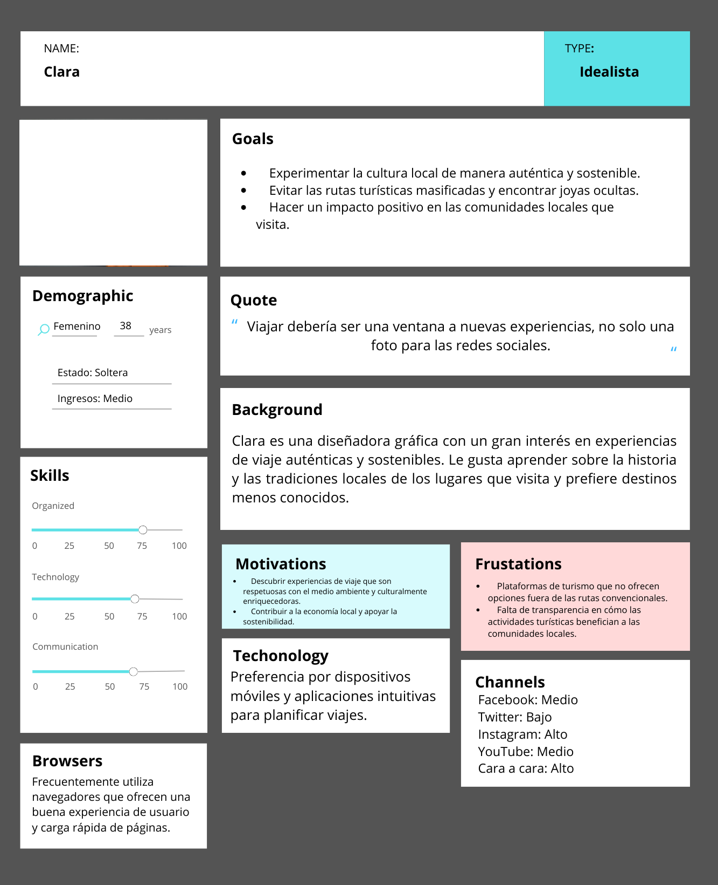
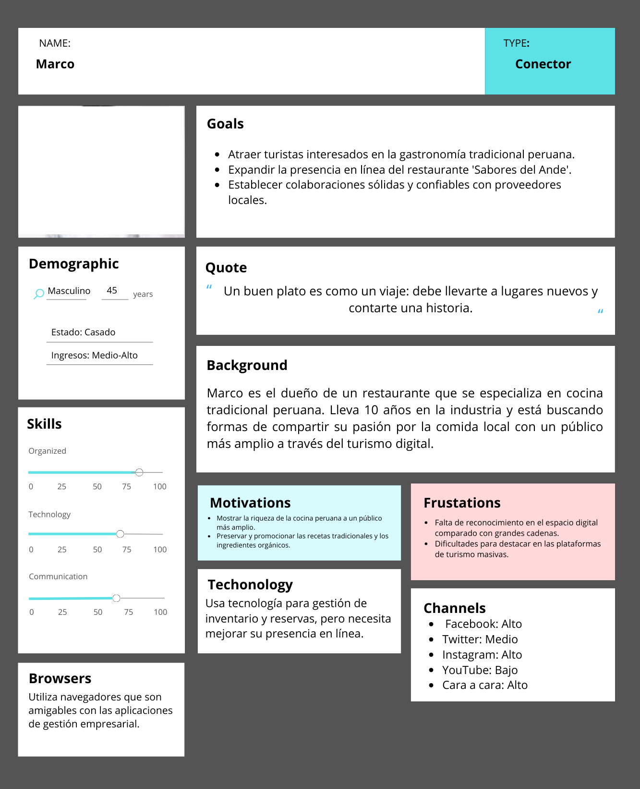
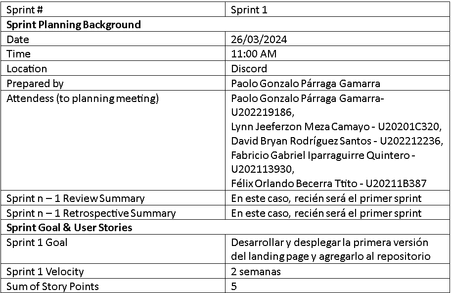
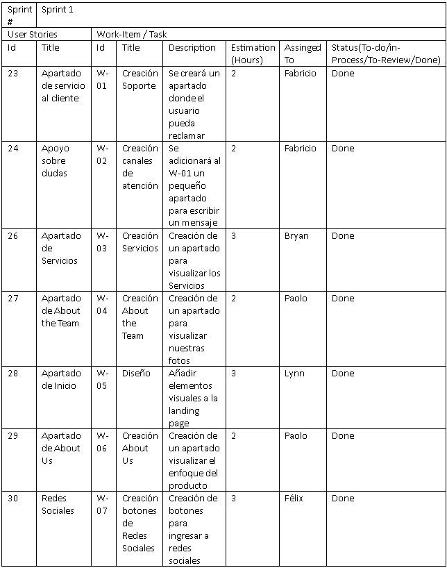

# **UNIVERSIDAD PERUANA DE CIENCIAS APLICADAS**

### SI730 Aplicaciones Web

## **"PerúVentura"**

### Profesor: Francisco José Cáceres Honores

## Integrantes:

- Lynn Jeeferzon Meza Camayo - **U20201C320**
- David Bryan Rodriguez Santos - **U202212236**
- Fabricio Gabriel Iparraguirre Quintero - **U202113930**
- Paolo Gonzalo Párraga Gamarra - **U202219186**
- Felix Orlando Becerra Ttito - **U20211B387**

## Registro de Versiones del Informe

<table>
  <tr>
    <th>Vension</th>
    <th>Fecha</th>
    <th>Autor</th>
    <th>Descripción de modificaión</th> 
  </tr>
  <tr>
    <td>version 0.1</td>
    <td>24/03/2024</td>
    <td>Lynn Jeeferzon Meza Camayo </td>
    <td>Formato del documento</td>
  </tr>
  <tr>
    <td>version 0.1</td>
    <td>25/03/2024</td>
    <td>Fabricio Gabriel Iparraguirre Quintero</td>
    <td>Modificación de la estructura del documento</td>
  </tr>
  <tr>
    <td>version 0.1</td>
    <td>26/03/2024</td>
    <td>Paolo Gonzalo Párraga Gamarra</td>
    <td>Modificación de los puntos del Capítulo 3 y Capítulo 4</td>
  </tr>
  <tr>
    <td>version 0.2</td>
    <td>01/04/2024</td>
    <td>Lynn Jeeferzon Meza Camayo</td>
    <td>Modificación de startup profile, descripcion de la Startup y antecedentes y problemáticas</td>
  </tr>
  
</table>

## Project Report Collaboration Insights 

Imforme: <https://github.com/Grupo-4-SW55-SYNTAXSQUAD/Reporte-Per-Ventura>

## Tabla de Contenido

- [**UNIVERSIDAD PERUANA DE CIENCIAS APLICADAS**](#universidad-peruana-de-ciencias-aplicadas)
    - [SI730 Aplicaciones Web](#si730-aplicaciones-web)
  - [**"PerúVentura"**](#perúventura)
    - [Profesor: Francisco José Cáceres Honores](#profesor-francisco-josé-cáceres-honores)
  - [Integrantes:](#integrantes)
  - [Registro de Versiones del Informe](#registro-de-versiones-del-informe)
  - [Project Report Collaboration Insights ](#project-report-collaboration-insights-)
  - [Tabla de Contenido](#tabla-de-contenido)
  - [Student Outcome](#student-outcome)
- [Capítulo I: Introducción](#capítulo-i-introducción)
- [1.1. Startup Profile](#11-startup-profile)
  - [1.1.1. Descripción de la Startup](#111-descripción-de-la-startup)
    - [1.1.2. Perfiles de integrantes del equipo](#112-perfiles-de-integrantes-del-equipo)
    - [1.2. Solution Profile](#12-solution-profile)
    - [1.2.1 Antecedentes y problemática](#121-antecedentes-y-problemática)
    - [1.2.2 Lean UX Process.](#122-lean-ux-process)
    - [1.2.2.1. Lean UX Problem Statements.](#1221-lean-ux-problem-statements)
    - [1.2.2.2. Lean UX Assumptions.](#1222-lean-ux-assumptions)
    - [1.2.2.3. Lean UX Hypothesis Statements.](#1223-lean-ux-hypothesis-statements)
    - [1.2.2.4. Lean UX Canvas.](#1224-lean-ux-canvas)
    - [1.3. Segmentos objetivo.](#13-segmentos-objetivo)
- [ Capítulo II: Requirements Elicitation \& Analysis](#-capítulo-ii-requirements-elicitation--analysis)
    - [2.1. Competidores.](#21-competidores)
    - [2.1.1. Análisis competitivo.](#211-análisis-competitivo)
    - [2.1.2. Estrategias y tácticas frente a competidores.](#212-estrategias-y-tácticas-frente-a-competidores)
    - [2.2. Entrevistas.](#22-entrevistas)
    - [2.2.1. Diseño de entrevistas.](#221-diseño-de-entrevistas)
    - [2.2.2. Registro de entrevistas.](#222-registro-de-entrevistas)
    - [2.2.3. Análisis de entrevistas.](#223-análisis-de-entrevistas)
    - [2.3. Needfinding.](#23-needfinding)
    - [2.3.1. User Personas.](#231-user-personas)
    - [2.3.2. User Task Matrix.](#232-user-task-matrix)
    - [2.3.3. User Journey Mapping.](#233-user-journey-mapping)
    - [2.3.4. Empathy Mapping.](#234-empathy-mapping)
    - [2.3.5. As-is Scenario Mapping.](#235-as-is-scenario-mapping)
    - [2.4. Ubiquitous Language.](#24-ubiquitous-language)
- [Capítulo III: Requirements Specification](#capítulo-iii-requirements-specification)
    - [3.1. To-Be Scenario Mapping.](#31-to-be-scenario-mapping)
    - [3.2. User Stories.](#32-user-stories)
    - [3.3. Impact Mapping.](#33-impact-mapping)
    - [3.4. Product Backlog.](#34-product-backlog)
- [Capítulo IV: Product Design](#capítulo-iv-product-design)
    - [4.1. Style Guidelines.](#41-style-guidelines)
    - [4.1.1. General Style Guidelines.](#411-general-style-guidelines)
    - [4.1.2. Web Style Guidelines.](#412-web-style-guidelines)
    - [4.2. Information Architecture.](#42-information-architecture)
    - [4.2.1. Organization Systems.](#421-organization-systems)
    - [4.2.2. Labeling Systems.](#422-labeling-systems)
    - [4.2.3. SEO Tags and Meta Tags](#423-seo-tags-and-meta-tags)
    - [4.2.4. Searching Systems.](#424-searching-systems)
    - [4.2.5. Navigation Systems.](#425-navigation-systems)
    - [4.3. Landing Page UI Design.](#43-landing-page-ui-design)
    - [4.3.1. Landing Page Wireframe.](#431-landing-page-wireframe)
    - [4.3.2. Landing Page Mock-up.](#432-landing-page-mock-up)
    - [4.4.3 Web Applications UX/UI Design.](#443-web-applications-uxui-design)
    - [4.4.1. Web Applications Wireframes.](#441-web-applications-wireframes)
    - [4.4.2. Web Applications Wireflow Diagrams.](#442-web-applications-wireflow-diagrams)
    - [4.4.2. Web Applications Mock-ups.](#442-web-applications-mock-ups)
    - [4.4.3. Web Applications User Flow Diagrams.](#443-web-applications-user-flow-diagrams)

    - [4.5. Web Applications Prototyping.](#45-web-applications-prototyping)
    - [4.6. Domain-Driven Software Architecture.](#46-domain-driven-software-architecture)
    - [4.6.1. Software Architecture Context Diagram.](#461-software-architecture-context-diagram)
    - [4.6.2. Software Architecture Container Diagrams.](#462-software-architecture-container-diagrams)
    - [4.6.3. Software Architecture Components Diagrams.](#463-software-architecture-components-diagrams)
    - [4.7. Software Object-Oriented Design.](#47-software-object-oriented-design)
    - [4.7.1. Class Diagrams.](#471-class-diagrams)
    - [4.7.2. Class Dictionary.](#472-class-dictionary)
    - [4.8. Database Design.](#48-database-design)
    - [4.8.1. Database Diagram.](#481-database-diagram)
- [Capítulo V: Product Implementation, Validation \& Deployment](#capítulo-v-product-implementation-validation--deployment)
  - [5.1. Software Configuration Management.](#51-software-configuration-management)
    - [5.1.1. Software Development Environment Configuration.](#511-software-development-environment-configuration)
    - [5.1.2. Source Code Management.](#512-source-code-management)
    - [5.1.3. Source Code Style Guide \& Conventions.](#513-source-code-style-guide--conventions)
    - [5.1.4. Software Deployment Configuration.](#514-software-deployment-configuration)
  - [5.2. Landing Page, Services \& Applications Implementation.](#52-landing-page-services--applications-implementation)
    - [5.2.1. Sprint 1](#521-sprint-1)
    - [5.2.1.1. Sprint Planning 1.](#5211-sprint-planning-1)
    - [5.2.1.2. Sprint Backlog 1.](#5212-sprint-backlog-1)
    - [5.2.1.3. Development Evidence for Sprint Review.](#5213-development-evidence-for-sprint-review)
    - [5.2.1.4. Testing Suite Evidence for Sprint Review.](#5214-testing-suite-evidence-for-sprint-review)
    - [5.2.1.5. Execution Evidence for Sprint Review.](#5215-execution-evidence-for-sprint-review)
    - [5.2.1.6. Services Documentation Evidence for Sprint Review.](#5216-services-documentation-evidence-for-sprint-review)
    - [5.2.1.7. Software Deployment Evidence for Sprint Review.](#5217-software-deployment-evidence-for-sprint-review)
    - [5.2.1.8. Team Collaboration Insights during Sprint.](#5218-team-collaboration-insights-during-sprint)
    - [5.2.2 Sprint 2](#522-sprint-2)
    - [5.2.2.1. Sprint Planning 2.](#5221-sprint-planning-2)
    - [5.2.2.2. Sprint Backlog 2.](#5222-sprint-backlog-2)
    - [5.2.2.3. Development Evidence for Sprint Review.](#5223-development-evidence-for-sprint-review)
    - [5.2.2.4. Testing Suite Evidence for Sprint Review.](#5224-testing-suite-evidence-for-sprint-review)
    - [5.2.2.5. Execution Evidence for Sprint Review.](#5225-execution-evidence-for-sprint-review)
    - [5.2.2.6. Services Documentation Evidence for Sprint Review.](#5226-services-documentation-evidence-for-sprint-review)
    - [5.2.2.7. Software Deployment Evidence for Sprint Review.](#5227-software-deployment-evidence-for-sprint-review)
    - [5.2.2.8. Team Collaboration Insights during Sprint.](#5228-team-collaboration-insights-during-sprint)
    - [5.2.3. Sprint 3](#523-sprint-3)
    - [5.2.3.1. Sprint Planning 3.](#5231-sprint-planning-3)
    - [5.2.3.2. Sprint Backlog 3.](#5232-sprint-backlog-3)
    - [5.2.3.3. Development Evidence for Sprint Review.](#5233-development-evidence-for-sprint-review)
    - [5.2.3.4. Testing Suite Evidence for Sprint Review.](#5234-testing-suite-evidence-for-sprint-review)
    - [5.2.3.5. Execution Evidence for Sprint Review.](#5235-execution-evidence-for-sprint-review)
    - [5.2.3.6. Services Documentation Evidence for Sprint Review.](#5236-services-documentation-evidence-for-sprint-review)
    - [5.2.3.7. Software Deployment Evidence for Sprint Review.](#5237-software-deployment-evidence-for-sprint-review)
    - [5.2.3.8. Team Collaboration Insights during Sprint.](#5238-team-collaboration-insights-during-sprint)
  - [5.3. Validation Interviews.](#53-validation-interviews)
    - [5.3.1. Diseño de Entrevistas.](#531-diseño-de-entrevistas)
    - [5.3.2. Registro de Entrevistas.](#532-registro-de-entrevistas)
    - [5.3.3. Evaluaciones según heurísticas.](#533-evaluaciones-según-heurísticas)
  - [5.4. Video About-the-Product.](#54-video-about-the-product)
  - [Conclusiones](#conclusiones)
  - [Conclusiones y recomendaciones.](#conclusiones-y-recomendaciones)
  - [Video About-the-Team.](#video-about-the-team)

## Student Outcome

<table>
    <tr>
        <th>Criterio Especifico</th>
        <th>Acciones Realizadas</th>
        <th>Conclusiones</th>
    </tr>
    <tr>
        <td>
            Participa en equipos   multidiciplinadoscon eficacia  
            eficiencia y objetividad,  en el marco de un proyecto en  
            soluciones de ingeniería  de software
        </td>
        <td>
            Lynn Jeeferzon Meza Camayo  
            <em>TB1</em> 
            Paolo Gonzalo Párraga Gamarra 
            <em>TB1</em> 
            David Bryan Rodriguez Santos  
            <em>TB1</em>
            <em>Se reliazó el capítulo 3, así comolos diagramas  de clases y de base de datos y el  sprint planning 1 y sprint backlog
        </td>
        <td>
        En conclusión, los elementos usados para la realización del tb1 fueron importantes como los sprint ayudaron a la eficacia del grupo.
        </td>
    </tr>
    <tr>
        <td>Conoce al menos un sector 
            empresarial o dominio de  
            aplicación de soluciones de  
            software.
        </td>
        <td>
            Lynn Jeeferzon Meza Camayo  
            <em>TB1</em> 
            Paolo Gonzalo Párraga Gamarra 
            <em>TB1</em> 
            David Bryan Rodriguez Santos  
            <em>TB1</em>
            <em>Se reliazó el capítulo 3, así comolos diagramas  de clases y de base de datos y el  sprint planning 1 y sprint backlog
        </td>
        <td>En conclusión, lo realizado a lo largo del trabajo fue algo crucial para conocer del sector empresairal al que apuntabamos y así aplicar soluciones de software efectivas.</td>
    </tr>
</table>

# Capítulo I: Introducción

# 1.1. Startup Profile

## 1.1.1. Descripción de la Startup
SyntaxSquad es un startup de desarrollo de software enfocados en crear soluciones Web innovadoras y efectivas. La empresa fue fundado por un grupo de estudiantes de ingeneria de software de la Universidad Peruana de Ciencias Aplicadas.

Desarrollamos sitios web que no solo visualmente atractivos, sino también del desarrollo de funcionalidades que facilitan a el uso a nuestros clientes. La empresa adopta un enfoque centrado en el cliente y trabaja estrechamente con ellos para comprender sus necesidades comerciales y desarrollar soluciones de software que satisfagan sus requisitos específicos.

SyntaxSquad brinda servicios que incluyen desarrollo de software personalizado, desarrollo de aplicaciones móviles y diseño de sitios web. La empresa utiliza tecnologías avanzadas y métodos flexibles para desarrollar soluciones de software escalables, confiables y eficientes. Además, SyntaxSquad brinda servicios de mantenimiento y soporte para garantizar el buen funcionamiento de las soluciones de software de los clientes a largo plazo. La empresa se compromete a mantenerse al tanto de las últimas tecnologías y tendencias del mercado y a proporcionar soluciones de software innovadoras y escalables para ayudar a los clientes a alcanzar sus objetivos comerciales.

### 1.1.2. Perfiles de integrantes del equipo

### 1.2. Solution Profile
### 1.2.1 Antecedentes y problemática

- **ANTECEDENTES**

El turismo en Perú ha crecido significativamente en las últimas décadas, especialmente en destinos populares como Machu Picchu, Cusco y el Valle Sagrado. Sin embargo, el auge del turismo también ha creado algunos problemas, como la congestión en sitios turísticos populares y la falta de distribución equitativa de los beneficios económicos entre las comunidades locales. Muchos viajeros a Perú buscan una experiencia más auténtica y significativa, pero a menudo tienen dificultades para encontrar actividades fuera del circuito turístico tradicional. Al mismo tiempo, las comunidades locales tienen un rico patrimonio cultural y conocimientos tradicionales que pueden ofrecer a los viajeros experiencias únicas, pero pueden enfrentar barreras para acceder y beneficiarse del mercado turístico de manera equitativa y sostenible.

La descripción del panorama turístico del Perú se basa en datos proporcionados por el Ministerio de Comercio Exterior y Turismo del Perú (MINCETUR) e informes y estudios del Instituto Nacional de Estadística e Información (INEI). 

En este contexto, existe la necesidad de una plataforma que facilite las conexiones entre los viajeros interesados ​​en experiencias auténticas y las comunidades locales que quieran compartir su cultura y tradiciones, al tiempo que promueva una industria turística más responsable y sostenible en el Perú.

- **PROBLEMÁTICA**

*TÉCNICA DE LAS 5W y 2H*

***What?***

***¿Cuál es el problema?*** 

El problema es que las comunidades locales carecen de acceso al mercado turístico y no pueden brindar experiencias auténticas a los viajeros que desean explorar la cultura y las tradiciones peruanas fuera de los destinos turísticos tradicionales. Esto crea una distribución desigual de los beneficios económicos del turismo y congestión en los sitios turísticos más famosos, afectando la protección del patrimonio cultural y natural del país.

***¿Cuál es la relación con la persona en cuestión?***

Los usuarios o turistas que buscar nuevos sitios culturales diferente de los más conocidos para poder visualizar nuevas costumbres como también reservaciones con anticipación. 

***When?*** 

***¿Cuándo sucede el problema?***

Sucede cuando los turistas intentan encontrar actividad 0 sitos turisticos del perú, pero en esa busqueda se encuentra con una saturacion de clientes o largas filas para dejar un reservación. Ademas, tienen dificultades por elegior que opcion ofrecida les gustaria, porque no sabia de antemano que existian varias opciones. Por ello, las personas optan por buscar algo que les facilite las opciones, ubicación y reservación del dicho  lugar o actividad. 

***¿Cuándo utiliza el cliente le producto?***

El usuario o turista podrá usarlo cuando desee saber múltiples opciones de actividades o sitios turístico, con el fin de buscar información y reservación del  lugar deseado.

***Where?*** 

***¿Dónde está el cliente cuando usa el producto?***

Los usuarios o turistas pueden utilizar el producto desde cualquier lugar con acceso a Internet. Puedes hacerlo en casa, en una cafetería, en un restaurante o en cualquier lugar donde tengas conexión a Internet. La plataforma en línea brinda a los clientes acceso y utiliza un servicio desde cualquier ubicación en la conexión a Internet.

¿Dónde surge el problema? 

Este problema surge en Perú, especialmente en áreas donde las comunidades locales tienen un rico patrimonio cultural y conocimientos tradicionales, pero luchan por acceder al mercado turístico y brindar a los viajeros una experiencia auténtica. Esto se evidencia por la falta de alternativas fuera de los destinos turísticos tradicionales, lo que limita las oportunidades de los viajeros de sumergirse en la cultura local y contribuir a la sostenibilidad de las comunidades locales.

***Who?*** 

***¿Quiénes están involucrados?***

Esta problemática tiene dos segmentos objetivos. En primer lugar, turistas interesados en experiencias auténticas y significativas en Perú. Por otro lado, Las tiendas y establecimientos que ofrecen productos o experiencias culturales, como por ejemplo serian artesanías, galerías de arte, etc. que buscan llegar a un público más amplio y diverso de viajeros.

***Why?*** 

***¿Cuál es la causa del problema?***

La causa del problema es la falta de acceso y visibilidad de las comunidades e instituciones locales que ofrecen productos culturales al mercado turístico. Esto puede deberse a una serie de factores, como la falta de recursos publicitarios y de marketing, el alcance limitado de las plataformas de reservas en línea y la competencia con destinos turísticos tradicionales más conocidos. Como resultado, a los viajeros les resulta difícil encontrar y reservar actividades auténticas y fuera de lo común, lo que limita su capacidad de explorar la cultura local y contribuir a la sostenibilidad de la comunidad.

***How?*** 

***¿En qué condiciones los clientes usan nuestros productos?*** 

Los clientes utilizan nuestros productos en condiciones de acceso a internet y desde cualquier ubicación con conexión disponible. Pueden acceder a la plataforma en línea a través de dispositivos como computadoras, teléfonos inteligentes o tabletas. Además, los clientes utilizan nuestros productos cuando están planificando sus viajes a Perú o mientras están en el país buscando actividades y experiencias culturales auténticas.

***¿Cómo prefieren los clientes acceder a nuestro producto?*** 

Los clientes prefieren acceder a nuestro producto a través de una plataforma en línea intuitiva y fácil de usar. Esto podría incluir un sitio web o una aplicación móvil que les permita buscar, explorar y reservar una variedad de experiencias culturales ofrecidas por tiendas y establecimientos en Perú. Además, los clientes pueden preferir recibir recomendaciones personalizadas y reseñas de otras personas que hayan participado en las experiencias, lo que les ayudaría a tomar decisiones informadas al seleccionar actividades para su viaje.

***¿Qué llevó al cliente a llegar a esta situación?*** 

La situación del cliente surge de la creciente demanda de experiencias auténticas y significativas por parte de los viajeros que visitan Perú. A medida que más personas buscan sumergirse en la cultura y las tradiciones locales durante sus viajes, se enfrentan a la limitada disponibilidad de opciones fuera de los destinos turísticos convencionales. Como resultado, los viajeros tienen dificultades para encontrar y reservar actividades auténticas, lo que los lleva a buscar soluciones que les permitan acceder más fácilmente a estas experiencias únicas durante su visita a Perú.

### 1.2.2 Lean UX Process.

### 1.2.2.1. Lean UX Problem Statements.

### 1.2.2.2. Lean UX Assumptions.

### 1.2.2.3. Lean UX Hypothesis Statements.

### 1.2.2.4. Lean UX Canvas.

### 1.3. Segmentos objetivo.

#  Capítulo II: Requirements Elicitation & Analysis

### 2.1. Competidores.

### 2.1.1. Análisis competitivo.
<table>
  <thead>
    <tr>
      <th colspan="4" style="text-align: center;">Competitive Analysis Landscape
      </th>
    </tr>
  </thead>
  <tbody>
    <tr>
      <th>¿Porque hacer este análisis?</th>
      <th colspan="3" style="text-align: center;">
        
¿Cómo identificar a nuestros principales competidores?

        
[agregar respuesta]

      </th>
    </tr>
    <tr>
      <th>
        Imagenes de Competidores
      </th>
      <td>[agregar respuesta]</td>
      <td>[agregar respuesta]</td>
      <td>[agregar respuesta]</td>
    </tr>
    <tr>
      <th>Overview</th>
      <td>[agregar respuesta]</td>
      <td>[agregar respuesta]</td>
      <td>[agregar respuesta]</td>
    </tr>
    <tr>
      <th>Ventajas de los competidores</th>
      <td>[agregar respuesta]</td>
      <td>[agregar respuesta]</td>
      <td>[agregar respuesta]</td>
    </tr>
    <tr>
      <th>Mercado Objetivo</th>
      <td>[agregar respuesta]</td>
      <td>[agregar respuesta]</td>
      <td>[agregar respuesta]</td>
    </tr>
    <tr>
      <th>Estrategias de Marketing</th>
      <td>[agregar respuesta]</td>
      <td>[agregar respuesta]</td>
      <td>[agregar respuesta]</td>
    </tr>
    <tr>
      <th>Precios y costos</th>
      <td>[agregar respuesta]</td>
      <td>[agregar respuesta]</td>
      <td>[agregar respuesta]</td>
    </tr>
  </tbody>
</table>

### 2.1.2. Estrategias y tácticas frente a competidores.

### 2.2. Entrevistas.

### 2.2.1. Diseño de entrevistas.

### 2.2.2. Registro de entrevistas.

### 2.2.3. Análisis de entrevistas.

### 2.3. Needfinding.

En esta sección, llevamos a cabo un análisis detallado de las entrevistas realizadas y la información recolectada correspondiente a nuestro segmento objetivo.

### 2.3.1. User Personas.

Para cada segmento objetivo, se crearon cinco perfiles de usuario (user personas) con el propósito de obtener un profundo entendimiento del cliente potencial, identificar sus características comunes y comprender el contexto específico de la problemática que se busca resolver.

### 2.3.2. User Task Matrix.

| USER TASK        | Segmento: Turista (Frecuencia)                    | Segmento: Turista (Importancia) | Segmento: Dueño de local (Frecuencia)    | Segmento: Dueño de local (Importancia) |
|------------------|-------------------------------------------------- |---------------------------------|------------------------------------------|----------------------------------------|
| Buscar experiencias auténticas |            Siempre                  |        Alto                     |           Siempre                        |             Alto                       |
| Reservar actividades culturales  |    A menudo                       |        Alto                     |           Siempre                        |             Alto                       | 
| Leer reseñas de otros viajeros |        Generalmente                 |        Alto                     |           Generalmente                   |             Alto                       |
| Publicar o buscar información en redes sociales/internet |   Siempre |        Alto                     |           A menudo                       |             Alto                       |
| Contactar con comunidades locales |       A veces                    |        Medio                    |           A menudo                       |             Alto                       |
| Planificar itinerarios sostenibles |      A menudo                   |        Alto                     |           Siempre                        |             Alto                       |
| Recibir recomendaciones personalizadas |   A menudo                  |        Alto                     |           A veces                        |             Medio                      |

### 2.3.3. User Journey Mapping.

En esta sección, detallamos el recorrido integral de nuestro segmento objetivo, examinando cuidadosamente la secuencia de pasos que tanto vendedores como proveedores deben seguir actualmente para alcanzar sus metas

#### Segmento Turista:

#### Segmento Dueño de Local:

### 2.3.4. Empathy Mapping.

Se desarrollaron mapas de empatía para cada uno de nuestros segmentos objetivos. Este proceso nos permitió no solo complementar sino también confirmar los detalles de los user personas de cada segmento. 

#### Segmento Turista:

#### Segmento Dueño de Local:

### 2.3.5. As-is Scenario Mapping.

#### Segmento Turista:

#### Segmento Dueño de Local:

En esta parte, mostramos un resumen de lo que hemos encontrado. Hacemos un mapa de cómo están las cosas ahora para nuestro grupo objetivo. Esto incluye una tabla que explica qué están haciendo, cómo lo hacen, qué piensan mientras lo hacen y cómo se sienten.

### 2.4. Ubiquitous Language.

El "Ubiquitous Language" es el  lenguaje común que es utilizado y entendido por todos los participantes de un proyecto, desde el equipo de desarrollo hasta los stakeholders y usuarios finales. Es crucial para la metodología de desarrollo de software Domain-Driven Design (DDD), ya que asegura que todos comprendan los términos y conceptos de la misma manera.

Viajero Auténtico: Un turista que busca experiencias culturales genuinas más allá de las atracciones principales.
Cultura Local: Tradiciones, arte, artesanías y conocimientos de las comunidades dentro de las regiones de Perú que son de interés para los viajeros auténticos.
Experiencia Auténtica: Una actividad turística que permite a los viajeros una inmersión significativa en la cultura y tradiciones locales.
Socio Local: Una tienda, artesano o institución cultural que ofrece productos o experiencias culturales a los viajeros.
Plataforma de Conexión: El producto de software (aplicación web o móvil) que conecta viajeros con experiencias auténticas.
Reserva Cultural: Un sistema para que los viajeros reserven y paguen por experiencias culturales a través de la Plataforma de Conexión.
Sostenibilidad Turística: Una forma de turismo en la que tanto los viajeros como las comunidades locales se benefician equitativamente, sin sacrificar el patrimonio cultural o natural.
Recomendación Personalizada: Una función de la plataforma que sugiere experiencias basadas en las preferencias e intereses del viajero.
Soporte Continuo: Servicios de mantenimiento y asistencia técnica para asegurar el funcionamiento óptimo de la Plataforma de Conexión.
Escala: La capacidad de la Plataforma de Conexión para manejar un número creciente de transacciones y usuarios sin comprometer el rendimiento.

# Capítulo III: Requirements Specification

### 3.1. To-Be Scenario Mapping.

Segmento objetivo 1: Turistas

Segmento objetivo 2: Dueños de local

### 3.2. User Stories.
<table>
  <tr>
    <th>Epic/ Story ID</th>
    <th>Titulo</th>
    <th>Descripción</th>
    <th>Criterios de Aceptación</th> 
    <th>Relacionado con (Epic ID)</th> 
  </tr>
  <tr>
    <td>US01</td>
    <td>Búsqueda y Reserva de Talleres</td>
    <td>Como turista, quiero poder buscar talleres de arte y cocina tradicional en Perú para poder reservar actividades auténticas ofrecidas por comunidades locales. </td>
    <td>
Escenario 1:
Dado que el turista desea buscar talleres 
Cuando el usuario busca "talleres de arte en Lima" en la aplicación
Entonces la aplicación muestra una lista de talleres de arte disponibles en Lima
Y el usuario puede ver detalles de cada taller, incluyendo la descripción, ubicación, horarios y precios

Escenario 2:
Dado que el usuario ha seleccionado un taller and está listo para reservar una actividad
Cuando el usuario selecciona una fecha and hora para la actividad
Entonces la aplicación confirma la reserva 
    </td>
    <td>EP01</td>
  </tr>
  <tr>
        <td>US02</td>
    <td>Promoción de Talleres</td>
    <td>Como dueño de un local, quiero poder promocionar mi taller en la aplicación para atraer turistas interesados en experiencias auténticas. </td>
    <td>
Escenario 1:
Dado una conexión a internet estable
Cuando el dueño del local accede a su cuenta en la aplicación
Entonces el dueño del local puede crear un perfil para su taller, incluyendo descripción, fotos, horarios and precios

Escenario 2:
Dado que el dueño del local ha recibido una reserva
Cuando el dueño del local accede a su cuenta en la aplicación
Entonces el dueño del local puede ver un resumen de las reservas realizadas
    </td>
    <td>EP02</td>
  </tr>
  <tr>
          <td>US03</td>
    <td>Gestión de Reservas para Talleres</td>
    <td>Como dueño de un local en Perú, quiero poder gestionar las reservas realizadas en mi taller de arte o cocina tradicional a través de la aplicación.</td>
    <td>
Escenario 1:
Dado que el usuario quiere gestionar sus reservas
Cuando el dueño del local accede a su cuenta en la aplicación
Entonces el dueño del local puede ver un registro de las reservas realizadas en su taller
and el dueño del local puede confirmar o rechazar las reservas según la disponibilidad de su taller
and el dueño del local puede comunicarse con los turistas a través de la aplicación para coordinar detalles adicionales

Escenario 2:
Dado que el dueño del local ha rechazado una reserva
Cuando el turista accede a la aplicación
Entonces el turista recibe notificaciones sobre la disponibilidad actualizada del taller
and el turista puede buscar and reservar otra actividad disponible en la aplicación
    </td>
    <td>EP02</td>
  </tr>
  <tr>
             <td>US04</td>
    <td>Recomendaciones Personalizadas de Talleres</td>
    <td>Como turista, quiero recibir recomendaciones personalizadas sobre talleres basadas en mis preferencias y ubicación.</td>
    <td>
Escenario 1:
Dado una conexión a internet estable
Cuando el usuario inicia sesión en la aplicación
Entonces la aplicación utiliza información sobre las preferencias del usuario y su ubicación para recomendar talleres relevantes
Y el usuario puede ver las recomendaciones personalizadas en su feed principal

Escenario 2:
Dado que el usuario ha participado en un taller
Cuando el usuario proporciona una reseña y calificación sobre la experiencia
Entonces la aplicación utiliza esta calificación para refinar las recomendaciones personalizadas
    </td>
    <td>EP01</td>
  </tr>
    <tr>
             <td>US05</td>
    <td>Evaluación de Reseñas y Calificaciones para Talleres</td>
    <td>Como turista, quiero poder ver reseñas y calificaciones de otros usuarios sobre los talleres para tomar decisiones informadas.</td>
    <td>
Escenario 1:
Dado que el turista quiere ver las opiniones de otros turistas
Cuando el usuario selecciona un taller en la aplicación
Entonces la aplicación muestra reseñas y calificaciones de otros usuarios sobre el taller
Y el usuario puede leer comentarios detallados sobre la experiencia de otros usuarios

Escenario 2:Dado que el usuario ha participado en un taller
Cuando el usuario accede a su cuenta en la aplicación
Entonces el usuario puede dejar una reseña y calificación sobre su experiencia en el taller
Y la aplicación muestra la reseña y calificación del usuario junto con las demás reseñas
    </td>
    <td>EP01</td>
  </tr>
    <tr>
             <td>US06</td>
    <td>Análisis de Popularidad y Estadísticas para Talleres</td>
    <td>Como dueño de un local, quiero poder acceder a estadísticas y análisis sobre la popularidad de mi taller en la aplicación.</td>
    <td>
Escenario 1:
Dado que el usuario quiere ver sus estadísticas
Cuando el dueño del local accede a su cuenta en la aplicación
Entonces el dueño del local puede ver estadísticas sobre la cantidad de visitas a su perfil y reservas realizadas.

Escenario 2:
Dado que el dueño del local ha realizado ajustes en su estrategia de marketing
Cuando el dueño del local accede a las estadísticas en la aplicación
Entonces el dueño del local puede comparar el rendimiento antes y después de los cambios.
    </td>
    <td>EP02</td>
  </tr>
    <tr>
             <td>US07</td>
    <td>Pago Seguro y Conveniente para Reservas de Talleres</td>
    <td>Como turista, quiero poder pagar de forma segura y conveniente por las reservas de talleres en Perú a través de la aplicación.</td>
    <td>
Escenario 1:
Dado que el usuario quiere poder pagar
Cuando el usuario realiza una reserva en la aplicación
Entonces la aplicación ofrece opciones de pago seguras and convenientes, como tarjeta de crédito, PayPal, u otros métodos confiables

Escenario 2:
Dado que el usuario ha completado una reserva
Cuando el usuario accede a su cuenta en la aplicación
Entonces el usuario puede solicitar recibos y facturas para sus pagos 
    </td>
    <td>EP01</td>
  </tr>
    <tr>
             <td>US08</td>
    <td>Recepción Segura de Pagos por Reservas en Talleres</td>
    <td>Como dueño de un local, quiero poder recibir pagos de forma segura por las reservas realizadas en mi taller para no tener dudas.</td>
    <td>
Escenario 1:
Dado que el dueño quiere recibir pagos de forma segura
Cuando el dueño del local accede a su cuenta en la aplicación
Entonces el dueño del local puede configurar opciones de pago seguras, como transferencia bancaria o PayPal
Y el dueño del local recibe notificaciones sobre pagos realizados por las reservas en su taller

Escenario 2:
Dado que el dueño del local ha recibido un pago por una reserva
Cuando el dueño del local accede a la aplicación
Entonces el dueño del local puede generar informes de ingresos and transacciones para su taller en un período específico
and el dueño del local puede descargar estos informes para su contabilidad and registros financieros 
    </td>
    <td>EP02</td>
  </tr>
    <tr>
             <td>US09</td>
    <td>Compartir Experiencias en Talleres de Arte</td>
    <td>Como turista, quiero poder compartir mis experiencias en los talleres de arte a través de la aplicación para inspirar a otros viajeros.</td>
    <td>
Escenario 1:
Dado que el usuario quiere compartir su experiencia
Cuando el usuario completa un taller en la aplicación
Entonces la aplicación ofrece la opción de compartir la experiencia a través de redes sociales u otros medios
Y el usuario puede agregar fotos, comentarios and calificaciones a su experiencia

Escenario 2:
Dado que el usuario ha compartido su experiencia en un taller
Cuando otros usuarios acceden a la aplicación
Entonces los demás usuarios pueden ver las publicaciones de experiencias en un feed dedicado a compartir vivencias y recomendaciones
    </td>
    <td>EP01</td>
  </tr>
    <tr>
             <td>US10</td>
    <td>Recepción de Comentarios y Calificaciones</td>
    <td>Como dueño de un local, quiero poder recibir comentarios y calificaciones de los turistas que han participado en mi taller para tener un feedback</td>
    <td>
Escenario 1:
Dado que el usuario quiere recibir un feedback
Cuando el dueño del local accede a su cuenta en la aplicación
Entonces el dueño del local puede ver comentarios and calificaciones dejados por los turistas que han participado en su taller
Y el dueño del local puede responder a los comentarios

Escenario 2:
Dado que el dueño del local ha respondido a un comentario de un turista
Cuando el turista accede a la aplicación
Entonces el turista recibe una notificación sobre la respuesta del dueño del local
    </td>
    <td>EP02</td>
  </tr>
    <tr>
             <td>US11</td>
    <td>Información de Comunidades Locales para Talleres</td>
    <td>Como turista, quiero poder acceder a información detallada sobre las comunidades locales que ofrecen talleres.</td>
    <td>
Escenario 1:
Dado que el usuario quiere información
Cuando el usuario selecciona una comunidad local en la aplicación
Entonces la aplicación muestra información detallada sobre la comunidad

Escenario 2:
Dado que el usuario ha explorado la información sobre una comunidad local
Cuando el usuario participa en un taller de esa comunidad
Entonces la aplicación proporciona la opción de realizar donaciones o contribuir al desarrollo sostenible de la comunidad
    </td>
    <td>EP03</td>
  </tr>
    <tr>
             <td>US12</td>
    <td>Destacar la Contribución de la Comunidad</td>
    <td>Como dueño de un local, quiero poder destacar la contribución de mi comunidad al turismo sostenible en la aplicación para atraer turistas.</td>
    <td>
Escenario 1:
Dado que el dueño quiere destacar
Cuando el dueño del local accede a su cuenta en la aplicación
Entonces el dueño del local puede agregar información sobre la contribución de su comunidad al turismo sostenible en su perfil

Escenario 2:
Dado que el dueño del local ha destacado la contribución de su comunidad 
Cuando los turistas acceden a la aplicación
Entonces los turistas pueden ver información destacada sobre las iniciativas sostenibles implementadas en el taller y la comunidad
    </td>
    <td>EP05</td>
  </tr>
    <tr>
             <td>US13</td>
    <td>Mapa Interactivo</td>
    <td>Como turista, quiero poder acceder a un mapa interactivo en la aplicación que muestre la ubicación de los talleres para planificar mi itinerario de viaje.</td>
    <td>
Escenario 1:
Dado una conexión a internet estable
Cuando el usuario accede a la sección de mapas en la aplicación
Entonces la aplicación muestra un mapa interactivo con marcadores que representan la ubicación de los talleres disponibles en Perú
Y el usuario puede hacer clic en un marcador para ver detalles del taller y reservar actividades desde el mapa

Escenario 2:
Dado que el usuario ha completado una reserva desde el mapa interactivo
Cuando el usuario accede a su cuenta en la aplicación
Entonces el usuario puede ver un resumen de sus reservas realizadas 
    </td>
    <td>EP03</td>
  </tr>
    <tr>
             <td>US14</td>
    <td>Disponibilidad para Actualizar Horarios del Taller</td>
    <td>Como dueño de un local, quiero poder actualizar la disponibilidad de mi taller en la aplicación para reflejar cambios en horarios.</td>
    <td>
Escenario 1:
Dado que el dueño quiere actualizar sus horarios
Cuando el dueño del local accede a su cuenta en la aplicación
Entonces el dueño del local puede editar la disponibilidad de su taller, incluyendo horarios and fechas de actividades

Escenario 2:
Dado que el dueño del local ha actualizado la disponibilidad de su taller
Cuando se realiza una reserva en un período actualizado
Entonces la aplicación notifica al dueño del local sobre la reserva 
    </td>
    <td>EP05</td>
  </tr>
    <tr>
             <td>US15</td>
    <td>Notificaciones de Ofertas Especiales y Eventos en Talleres</td>
    <td>Como turista, quiero poder recibir notificaciones sobre ofertas especiales y eventos en los talleres a través de la aplicación para estar informado sobre promociones</td>
    <td>
Escenario 1:
Dado que el turista quiere recibir notificaciones
Cuando el usuario activa las notificaciones en la aplicación
Entonces la aplicación envía notificaciones sobre ofertas especiales and eventos en talleres cercanos

Escenario 2:
Dado que el usuario ha desactivado las notificaciones
Cuando el usuario accede a la aplicación
Entonces el usuario no podrá recibir más notificaciones 
    </td>
    <td>EP03</td>
  </tr>
    <tr>
             <td>US16</td>
    <td>Creación y Gestión de Ofertas Especiales y Eventos</td>
    <td>Como dueño de un local, quiero poder crear y gestionar ofertas especiales y eventos en mi taller para atraer turistas.</td>
    <td>
Escenario 1:
Dado que el dueño quiere notificar sobre ofertas
Cuando el dueño del local accede a su cuenta en la aplicación
Entonces el dueño del local puede crear ofertas especiales and eventos, incluyendo descripción, fechas

Escenario 2:
Dado que el dueño del local ha creado una oferta especial o evento
Cuando la oferta especial o evento está activa
Entonces la aplicación destaca la promoción en áreas relevantes para atraer la atención de los turistas
    </td>
    <td>EP05</td>
  </tr>
    <tr>
             <td>US17</td>
    <td>Acceso a Información para Llegar a los Talleres</td>
    <td>Como turista, quiero poder acceder a información práctica sobre cómo llegar a los talleres para estar presente en el tiempo indicado.</td>
    <td>
Escenario 1:
Dado una conexión a internet estable
Cuando el usuario selecciona un taller en la aplicación
Entonces la aplicación muestra información detallada sobre cómo llegar al taller, incluyendo direcciones
    </td>
    <td>EP03</td>
  </tr>
    <tr>
             <td>US18</td>
    <td>Notificaciones automáticas para consultas de taller</td>
    <td>Como dueño de un local, quiero poder recibir notificaciones sobre consultas de los turistas interesados en participar en mi taller para informar a posibles clientes.</td>
    <td>
Escenario 1:
Dado que el dueño quiere ser notificado de mensajes entrantes 
Cuando el dueño del local accede a su cuenta en la aplicación
Entonces el dueño del local recibe notificaciones sobre consultas 
Y el dueño del local puede responder a las consultas

Escenario 2:
Dado que el dueño del local ha respondido a una consulta o mensaje
Cuando el turista accede a la aplicación
Entonces el turista recibe una notificación sobre la respuesta del dueño del local
    </td>
    <td>EP05</td>
  </tr>
    <tr>
             <td>US19</td>
    <td>Agregar contenido multimedia</td>
    <td>Como turista, quiero poder acceder a contenido multimedia en la aplicación, como fotos y videos, que muestren las experiencias ofrecidas en los talleres para tener una mejor vista sobre el taller.</td>
    <td>
Escenario 1:
Dado que el turista desea ver contenido multimedia
Cuando el usuario navega por la aplicación
Entonces la aplicación muestra contenido multimedia atractivo que presenta las experiencias en los talleres
Y el usuario puede ver fotos and videos sobre el taller

Escenario 2:
Dado que el usuario ha participado en un taller
Cuando el usuario accede a la aplicación
Entonces la aplicación ofrece la opción de compartir sus propias fotos y videos de la experiencia en el taller
    </td>
    <td>EP03</td>
  </tr>
    <tr>
             <td>US20</td>
    <td>Compartir información del taller</td>
    <td>Como dueño de un local, quiero poder compartir contenido multimedia, como fotos y videos, que muestren las experiencias en mi taller para atraer turistas.</td>
    <td>
Escenario 1:
Dado que el dueño desea compartir más información sobre su taller
Cuando el dueño del local accede a su cuenta en la aplicación
Entonces el dueño del local puede agregar and gestionar contenido multimedia que presente las experiencias en su taller

Escenario 2:
Dado que el dueño del local ha compartido contenido multimedia
Cuando los turistas acceden a la aplicación
Entonces los turistas pueden ver el contenido multimedia cuando entren a la descripción del taller
    </td>
    <td>EP05</td>
  </tr>
    <tr>
             <td>US21</td>
    <td>Información de medidas de seguridad en talleres</td>
    <td>Como turista, quiero poder acceder a información sobre medidas de seguridad implementados en los talleres en el Perú a través de la aplicación para cumplir con las reglas sanitarias.</td>
    <td>
Escenario 1:
Dado que el turista desea saber sobre normativas
Cuando el usuario selecciona un taller en la aplicación
Entonces la aplicación muestra información detallada sobre las medidas de seguridad y protocolos sanitarios implementados en el taller

Escenario 2:
Dado que el usuario ha participado en un taller
Cuando el usuario accede a la aplicación
Entonces la aplicación ofrece la opción de proporcionar retroalimentación sobre la efectividad de las medidas de seguridad 
    </td>
    <td>EP04</td>
  </tr>
    <tr>
             <td>US22</td>
    <td>Inclusión de medidas de seguridad en talleres</td>
    <td>Como dueño de un local, quiero poder informar sobre medidas de seguridad y protocolos sanitarios implementados en mi taller para generar confianza en los turistas.</td>
    <td>
Escenario 1:
Dado que el dueño quiere informar
Cuando el dueño del local accede a su cuenta en la aplicación
Entonces el dueño del local puede agregar información detallada sobre las medidas de seguridad and protocolos sanitarios implementados en su taller

Escenario 2:
Dado que el dueño del local ha actualizado las medidas de seguridad and protocolos sanitarios
Cuando se realizan reservas en el taller
Entonces la aplicación notifica a los turistas sobre las actualizaciones en las prácticas de seguridad
    </td>
    <td>EP04</td>
  </tr>
    <tr>
             <td>US23</td>
    <td>Apartado de servicio al cliente</td>
    <td>Como turista, quiero poder acceder a un servicio de atención al cliente en la aplicación para recibir asistencia y soporte</td>
    <td>
Escenario 1:
Dado que el turista quiere un servicio de soporte 
Cuando el usuario necesita asistencia durante su experiencia en un taller
Entonces la aplicación ofrece un servicio de atención al cliente accesible desde la aplicación llamado “Atención al cliente”
Y el usuario puede recibir asistencia and soporte

Escenario 2:
Dado que el usuario ha recibido asistencia a través del servicio de atención al cliente
Cuando el usuario completa su experiencia en el taller
Entonces la aplicación ofrece la opción de proporcionar retroalimentación sobre la calidad del servicio de atención al cliente
    </td>
    <td>EP04</td>
  </tr>
    <tr>
             <td>US24</td>
    <td>Apoyo sobre dudas </td>
    <td>Como dueño de un local, quiero poder acceder a un servicio de atención al cliente en la aplicación para recibir asistencia y soporte en la gestión de mi taller</td>
    <td>
Escenario 1:
Dado que el dueño necesita soporte
Cuando el dueño del local necesita asistencia en la gestión de su taller
Entonces la aplicación ofrece un servicio de atención al cliente accesible desde la aplicación

Escenario 2:
Dado que el dueño del local ha recibido asistencia a través del servicio de atención al cliente
Cuando el dueño del local completa la interacción
Entonces la aplicación ofrece la opción de proporcionar retroalimentación sobre la calidad del servicio de atención al cliente
    </td>
    <td>EP04</td>
  </tr>
    <tr>
             <td>US25</td>
    <td>Alojamientos cercanos al taller</td>
    <td>Como turista, quiero poder acceder a información sobre opciones de alojamiento cercanas a los talleres para facilitar la planificación de mi viaje.</td>
    <td>
Escenario 1:
Dado una conexión a internet estable
Cuando el usuario busca información sobre un taller en la aplicación
Entonces la aplicación muestra opciones de alojamiento cercanas

Escenario 2:
Dado que el usuario ha seleccionado un taller and necesita alojamiento cercano
Cuando el usuario accede a la información sobre alojamiento en la aplicación
Entonces la aplicación ofrece la opción de reservar alojamiento directamente desde la aplicación
    </td>
    <td>EP04</td>
  </tr>
    <tr>
             <td>US26</td>
    <td>Apartado de Servicios</td>
    <td>Como turista, quiero tener acceso a un apartado de Servicios para poder saber que ofrece el aplicativo junto a una pequeña descripción.</td>
    <td>
Escenario 1:
Dado que el turista desea saber sobre los servicios
Cando esté en el pantalla pricipal y de click sobre "Servicios"
Entonces se le llevará a donde están y brindrará una pequeña descripcion sobre qué hace cada cosa.

Escenario 2:
Dado que el usuario está en otro apartado diferente al inicial
Cuando el usuario acceda a la barra principal
Entonces podrá encontrar ingresar a Servicios y ver la descipción de estos.
    </td>
    <td>EP06</td>
  </tr>
             <td>US27</td>
    <td>Apartado de About the Team</td>
    <td>Como turista, quiero acceder a una sección de "Acerca de nosotros" para conocer a los creadores del aplicativo junto a una foto de ellos</td>
    <td>
Escenario 1:
Dado que el usuario está interesado en conocer a los creadores del aplicativo
Cuando accede a la sección de "About the Team" desde la pantalla principal
Entonces se mostrará información sobre los creadores del aplicativo, incluyendo sus nombres y una foto de ellos.

Escenario 2:
Dado que el usaurio está en Servicios
Cuando el usuario acceda al menú princiapl o vaya al final de la página
Entonces podrá encontrar la sección que le llevará a About the Team
    </td>
    <td>EP06</td>
  </tr>
  </tr>
             <td>US28</td>
    <td>Apartado de Inicio</td>
    <td>Como usuario, quiero poder visualizar una pantalla de inicio agradable a la vista y fácil de interactuar para que gane mi interés de usarla</td>
    <td>
Escenario 1:
Dado que  el usuario quiere una interfaz agradable a la vista
Cuando ingrese al aplicativo podrá visualizar cada apartado que ofrece
Entonces podrá navegar por el aplicativo y valorar si es de s interés.

Escenario 2:
Dado que el usuario encuentra nuestra página web
Cuando abre el enlace par aingresar 
Entonces se le mostrará cada apartado que hay, entre otras funcionalidades
    </td>
    <td>EP06</td>
  </tr>
  </tr>
             <td>US29</td>
    <td>Apartado de About Us</td>
    <td>Como turista, quiero saber sobre qué trata el aplicativo de una mejor forma por medio de una descripción corta y concisa para saber si puede serme de utilidad</td>
    <td>
Escenario 1:
Dado que el usuario desea conocer sobr ele aplicativo
Cuando accede a la sección de "About Us" desde la pantalla principal
Entonces se mostrará una pequeña información sobre el aplicativo, así como un botón que lo llevará a una de nuestras redes sociales principales.

Escenario 2:
Dado que el usaurio accede a About us por medio del final de la página
Cuando le de clic al apartado de About Us ubicado ahí
Entonces lo llevará a una descipción del aplicativo y así saber si es de su interés.
    </td>
    <td>EP06</td>
  </tr>
 </tr>
             <td>US30</td>
    <td>Redes Sociales</td>
    <td>Como usuario, quiero saber si el aplicativo cuenta con algún botón que me lleve a alguna red social para tener una mejor interacción con el equipo que hizo el aplicativo</td>
    <td>
Escenario 1:
Dado que el usuario desea saber si tenemos redes sociales
Cuando se encuentre en la pantlla inicial 
Entonces podrá visualizar nuestras redes sociales

Escenario 2:
Dado que el usuario desea saber si tenemos redes sociales
Cuando se encuentre en la sección de About Us o Contacto
Entonces podrá visualizar una de nuestras redes sociales
    </td>
    <td>EP06</td>
  </tr>
</table>

### 3.3. Impact Mapping.

### 3.4. Product Backlog.
<table>
  <tr>
    <th># Orden</th>
    <th>User Story Id</th>
    <th>Titulo</th>
    <th>Descripción</th> 
    <th>Story points (1/2/3/5/8)</th>
    <th>Priority</th>
  </tr>
  <tr>
    <td>1</td>
    <td>US01</td>
    <td>úsqueda y Reserva de Talleres</td>
    <td>Como turista, quiero poder buscar talleres de arte y cocina tradicional en Perú para poder reservar actividades auténticas ofrecidas por comunidades locales.</td>
    <td>5</td>
    <td>Alta</td>
  </tr>
  <tr>
    <td>2</td>
    <td>US02</td>
    <td>Promoción de Talleres</td>
    <td>Como dueño de un local, quiero poder promocionar mi taller en la aplicación para atraer turistas interesados en experiencias auténticas.</td>
    <td>3</td>
    <td>Alta</td>
  </tr>
  <tr>
    <td>3</td>
    <td>US03</td>
    <td>Gestión de Reservas para Talleres</td>
    <td>Como dueño de un local en Perú, quiero poder gestionar las reservas realizadas en mi taller de arte o cocina tradicional a través de la aplicación.</td>
    <td>1</td>
    <td>Media</td>
  </tr>
  <tr>
  <td>4</td>
    <td>US04</td>
    <td>Recomendaciones Personalizadas de Talleres</td>
    <td>Como turista, quiero recibir recomendaciones personalizadas sobre talleres basadas en mis preferencias y ubicación.</td>
    <td>3</td>
    <td>Media</td>
  </tr>
  <tr>
  <td>5</td>
    <td>US05</td>
    <td>Evaluación de Reseñas y Calificaciones para Talleres</td>
    <td>Como turista, quiero poder ver reseñas y calificaciones de otros usuarios sobre los talleres para tomar decisiones informadas.</td>
    <td>1</td>
    <td>Media</td>
  </tr>
  <tr>
  <td>6</td>
    <td>US06</td>
    <td>Análisis de Popularidad y Estadísticas para Talleres</td>
    <td>Como dueño de un local, quiero poder acceder a estadísticas y análisis sobre la popularidad de mi taller en la aplicación.</td>
    <td>3</td>
    <td>Baja</td>
  </tr>
  <tr>
  <td>7</td>
    <td>US07</td>
    <td>Pago Seguro y Conveniente para Reservas de Talleres</td>
    <td>Como turista, quiero poder pagar de forma segura y conveniente por las reservas de talleres en Perú a través de la aplicación.</td>
    <td>3</td>
    <td>Alta</td>
  </tr>
  <tr>
  <td>8</td>
    <td>US08</td>
    <td>Recepción Segura de Pagos por Reservas en Talleres</td>
    <td>Como dueño de un local, quiero poder recibir pagos de forma segura por las reservas realizadas en mi taller para no tener dudas.</td>
    <td>3</td>
    <td>Media</td>
  </tr>
  <tr>
  <td>9</td>
    <td>US09</td>
    <td>Compartir Experiencias en Talleres de Arte</td>
    <td>Como turista, quiero poder compartir mis experiencias en los talleres de arte a través de la aplicación para inspirar a otros viajeros.</td>
    <td>1</td>
    <td>Media</td>
  </tr>
  <tr>
  <td>10</td>
    <td>US10</td>
    <td>Recepción de Comentarios y Calificaciones</td>
    <td>Como dueño de un local, quiero poder recibir comentarios y calificaciones de los turistas que han participado en mi taller para tener un feedback.</td>
    <td>3</td>
    <td>Media</td>
  </tr>
  <tr>
  <td>11</td>
    <td>US11</td>
    <td>Información de Comunidades Locales para Talleres</td>
    <td>Como turista, quiero poder acceder a información detallada sobre las comunidades locales que ofrecen talleres.</td>
    <td>2</td>
    <td>Baja</td>
  </tr>
  <tr>
  <td>12</td>
    <td>US12</td>
    <td>Destacar la Contribución de la Comunidad</td>
    <td>Como dueño de un local, quiero poder destacar la contribución de mi comunidad al turismo sostenible en la aplicación para atraer turistas.</td>
    <td>2</td>
    <td>Baja</td>
  </tr>
  <tr>
  <td>13</td>
    <td>US13</td>
    <td>Mapa Interactivo</td>
    <td>Como turista, quiero poder acceder a un mapa interactivo en la aplicación que muestre la ubicación de los talleres para planificar mi itinerario de viaje.</td>
    <td>3</td>
    <td>Alta</td>
  </tr>
  <tr>
  <td>14</td>
    <td>US14</td>
    <td>Disponibilidad para Actualizar Horarios del Taller</td>
    <td>Como dueño de un local, quiero poder actualizar la disponibilidad de mi taller en la aplicación para reflejar cambios en horarios.</td>
    <td>3</td>
    <td>Alta</td>
  </tr>
  <tr>
  <td>15</td>
    <td>US15</td>
    <td>Notificaciones de Ofertas Especiales y Eventos en Talleres</td>
    <td>Como turista, quiero poder recibir notificaciones sobre ofertas especiales y eventos en los talleres a través de la aplicación para estar informado sobre promociones.</td>
    <td>3</td>
    <td>Media</td>
  </tr>
  <tr>
  <td>16</td>
    <td>US16</td>
    <td>Creación y Gestión de Ofertas Especiales y Eventos</td>
    <td>Como dueño de un local, quiero poder crear y gestionar ofertas especiales y eventos en mi taller para atraer turistas.</td>
    <td>3</td>
    <td>Media</td>
  </tr>
  <tr>
  <td>17</td>
    <td>US17</td>
    <td>Acceso a Información para Llegar a los Talleres</td>
    <td>Como turista, quiero poder acceder a información práctica sobre cómo llegar a los talleres para estar presente en el tiempo indicado.</td>
    <td>2</td>
    <td>Media</td>
  </tr>
  <tr>
  <td>18</td>
    <td>US18</td>
    <td>Notificaciones automáticas para consultas de taller</td>
    <td>Como dueño de un local, quiero poder recibir notificaciones sobre consultas de los turistas interesados en participar en mi taller para informar a posibles clientes.</td>
    <td>2</td>
    <td>Media</td>
  </tr>
  <tr>
  <td>19</td>
    <td>US19</td>
    <td>Agregar contenido multimedia</td>
    <td>Como turista, quiero poder acceder a contenido multimedia en la aplicación, como fotos y videos, que muestren las experiencias ofrecidas en los talleres para tener una mejor vista sobre el taller.</td>
    <td>2</td>
    <td>Baja</td>
  </tr>
  <tr>
  <td>20</td>
    <td>US20</td>
    <td>Compartir información del taller</td>
    <td>Como dueño de un local, quiero poder compartir contenido multimedia, como fotos y videos, que muestren las experiencias en mi taller para atraer turistas.</td>
    <td>1</td>
    <td>Baja</td>
  </tr>
  <tr>
  <td>21</td>
    <td>US21</td>
    <td>Información de medidas de seguridad en talleres</td>
    <td>Como turista, quiero poder acceder a información sobre medidas de seguridad implementados en los talleres en el Perú a través de la aplicación para cumplir con las reglas sanitarias.</td>
    <td>3</td>
    <td>Media</td>
  </tr>
  <tr>
  <td>22</td>
    <td>US22</td>
    <td>Inclusión de medidas de seguridad en talleres</td>
    <td>Como dueño de un local, quiero poder informar sobre medidas de seguridad y protocolos sanitarios implementados en mi taller para generar confianza en los turistas.</td>
    <td>3</td>
    <td>Media</td>
  </tr>
  <tr>
  <td>23</td>
    <td>US23</td>
    <td>Apartado de servicio al cliente</td>
    <td>Como turista, quiero poder acceder a un servicio de atención al cliente en la aplicación para recibir asistencia y soporte.</td>
    <td>2</td>
    <td>Alta</td>
  </tr>
  <tr>
  <td>24</td>
    <td>US24</td>
    <td>Apoyo sobre dudas </td>
    <td>Como dueño de un local, quiero poder acceder a un servicio de atención al cliente en la aplicación para recibir asistencia y soporte en la gestión de mi taller.</td>
    <td>2</td>
    <td>Alta</td>
  </tr>
  <tr>
  <td>25</td>
    <td>US25</td>
    <td>Alojamientos cercanos al taller</td>
    <td>Como turista, quiero poder acceder a información sobre opciones de alojamiento cercanas a los talleres para facilitar la planificación de mi viaje.</td>
    <td>3</td>
    <td>Media</td>
  </tr>
  <td>26</td>
    <td>US26</td>
    <td>Apartado de Servicios</td>
    <td>Como turista, quiero tener acceso a un apartado de Servicios para poder saber que ofrece el aplicativo junto a una pequeña descripción.</td>
    <td>3</td>
    <td>Media</td>
  </tr>
  </tr>
    <td>27</td>
    <td>US27</td>
    <td>Apartado de About the Team</td>
    <td>Como turista, quiero acceder a una sección de "Acerca de nosotros" para conocer a los creadores del aplicativo junto a una foto de ellos.</td>
    <td>3</td>
    <td>Media</td>
  </tr>
    <td>28</td>
    <td>US28</td>
    <td>Apartado de Inicio</td>
    <td>Como usuario, quiero poder visualizar una pantalla de inicio agradable a la vista y fácil de interactuar para que gane mi interés de usarla.</td>
    <td>3</td>
    <td>Media</td>
  </tr>
    <td>29</td>
    <td>US29</td>
    <td>Apartado de About Us</td>
    <td>Como turista, quiero saber sobre qué trata el aplicativo de una mejor forma por medio de una descripción corta y concisa para saber si puede serme de utilidad.</td>
    <td>3</td>
    <td>Media</td>
  </tr>
    </tr>
    <td>30</td>
    <td>US30</td>
    <td>Redes Sociales</td>
    <td>Como usuario, quiero saber si el aplicativo cuenta con algún botón que me lleve a alguna red social para tener una mejor interacción con el equipo que hizo el aplicativo.</td>
    <td>3</td>
    <td>Media</td>
  </tr>
</table>

### 3.3. Impact Mapping.

### 3.4. Product Backlog.
<table>
  <tr>
    <th># Orden</th>
    <th>User Story Id</th>
    <th>Titulo</th>
    <th>Descripción</th> 
    <th>Story points (1/2/3/5/8)</th>
    <th>Priority</th>
  </tr>
  <tr>
    <td>1</td>
    <td>US01</td>
    <td>úsqueda y Reserva de Talleres</td>
    <td>Como turista, quiero poder buscar talleres de arte y cocina tradicional en Perú para poder reservar actividades auténticas ofrecidas por comunidades locales.</td>
    <td>5</td>
    <td>Alta</td>
  </tr>
  <tr>
    <td>2</td>
    <td>US02</td>
    <td>Promoción de Talleres</td>
    <td>Como dueño de un local, quiero poder promocionar mi taller en la aplicación para atraer turistas interesados en experiencias auténticas.</td>
    <td>3</td>
    <td>Alta</td>
  </tr>
  <tr>
    <td>3</td>
    <td>US03</td>
    <td>Gestión de Reservas para Talleres</td>
    <td>Como dueño de un local en Perú, quiero poder gestionar las reservas realizadas en mi taller de arte o cocina tradicional a través de la aplicación.</td>
    <td>1</td>
    <td>Media</td>
  </tr>
  <tr>
  <td>4</td>
    <td>US04</td>
    <td>Recomendaciones Personalizadas de Talleres</td>
    <td>Como turista, quiero recibir recomendaciones personalizadas sobre talleres basadas en mis preferencias y ubicación.</td>
    <td>3</td>
    <td>Media</td>
  </tr>
  <tr>
  <td>5</td>
    <td>US05</td>
    <td>Evaluación de Reseñas y Calificaciones para Talleres</td>
    <td>Como turista, quiero poder ver reseñas y calificaciones de otros usuarios sobre los talleres para tomar decisiones informadas.</td>
    <td>1</td>
    <td>Media</td>
  </tr>
  <tr>
  <td>6</td>
    <td>US06</td>
    <td>Análisis de Popularidad y Estadísticas para Talleres</td>
    <td>Como dueño de un local, quiero poder acceder a estadísticas y análisis sobre la popularidad de mi taller en la aplicación.</td>
    <td>3</td>
    <td>Baja</td>
  </tr>
  <tr>
  <td>7</td>
    <td>US07</td>
    <td>Pago Seguro y Conveniente para Reservas de Talleres</td>
    <td>Como turista, quiero poder pagar de forma segura y conveniente por las reservas de talleres en Perú a través de la aplicación.</td>
    <td>3</td>
    <td>Alta</td>
  </tr>
  <tr>
  <td>8</td>
    <td>US08</td>
    <td>Recepción Segura de Pagos por Reservas en Talleres</td>
    <td>Como dueño de un local, quiero poder recibir pagos de forma segura por las reservas realizadas en mi taller para no tener dudas.</td>
    <td>3</td>
    <td>Media</td>
  </tr>
  <tr>
  <td>9</td>
    <td>US09</td>
    <td>Compartir Experiencias en Talleres de Arte</td>
    <td>Como turista, quiero poder compartir mis experiencias en los talleres de arte a través de la aplicación para inspirar a otros viajeros.</td>
    <td>1</td>
    <td>Media</td>
  </tr>
  <tr>
  <td>10</td>
    <td>US10</td>
    <td>Recepción de Comentarios y Calificaciones</td>
    <td>Como dueño de un local, quiero poder recibir comentarios y calificaciones de los turistas que han participado en mi taller para tener un feedback.</td>
    <td>3</td>
    <td>Media</td>
  </tr>
  <tr>
  <td>11</td>
    <td>US11</td>
    <td>Información de Comunidades Locales para Talleres</td>
    <td>Como turista, quiero poder acceder a información detallada sobre las comunidades locales que ofrecen talleres.</td>
    <td>2</td>
    <td>Baja</td>
  </tr>
  <tr>
  <td>12</td>
    <td>US12</td>
    <td>Destacar la Contribución de la Comunidad</td>
    <td>Como dueño de un local, quiero poder destacar la contribución de mi comunidad al turismo sostenible en la aplicación para atraer turistas.</td>
    <td>2</td>
    <td>Baja</td>
  </tr>
  <tr>
  <td>13</td>
    <td>US13</td>
    <td>Mapa Interactivo</td>
    <td>Como turista, quiero poder acceder a un mapa interactivo en la aplicación que muestre la ubicación de los talleres para planificar mi itinerario de viaje.</td>
    <td>3</td>
    <td>Alta</td>
  </tr>
  <tr>
  <td>14</td>
    <td>US14</td>
    <td>Disponibilidad para Actualizar Horarios del Taller</td>
    <td>Como dueño de un local, quiero poder actualizar la disponibilidad de mi taller en la aplicación para reflejar cambios en horarios.</td>
    <td>3</td>
    <td>Alta</td>
  </tr>
  <tr>
  <td>15</td>
    <td>US15</td>
    <td>Notificaciones de Ofertas Especiales y Eventos en Talleres</td>
    <td>Como turista, quiero poder recibir notificaciones sobre ofertas especiales y eventos en los talleres a través de la aplicación para estar informado sobre promociones.</td>
    <td>3</td>
    <td>Media</td>
  </tr>
  <tr>
  <td>16</td>
    <td>US16</td>
    <td>Creación y Gestión de Ofertas Especiales y Eventos</td>
    <td>Como dueño de un local, quiero poder crear y gestionar ofertas especiales y eventos en mi taller para atraer turistas.</td>
    <td>3</td>
    <td>Media</td>
  </tr>
  <tr>
  <td>17</td>
    <td>US17</td>
    <td>Acceso a Información para Llegar a los Talleres</td>
    <td>Como turista, quiero poder acceder a información práctica sobre cómo llegar a los talleres para estar presente en el tiempo indicado.</td>
    <td>2</td>
    <td>Media</td>
  </tr>
  <tr>
  <td>18</td>
    <td>US18</td>
    <td>Notificaciones automáticas para consultas de taller</td>
    <td>Como dueño de un local, quiero poder recibir notificaciones sobre consultas de los turistas interesados en participar en mi taller para informar a posibles clientes.</td>
    <td>2</td>
    <td>Media</td>
  </tr>
  <tr>
  <td>19</td>
    <td>US19</td>
    <td>Agregar contenido multimedia</td>
    <td>Como turista, quiero poder acceder a contenido multimedia en la aplicación, como fotos y videos, que muestren las experiencias ofrecidas en los talleres para tener una mejor vista sobre el taller.</td>
    <td>2</td>
    <td>Baja</td>
  </tr>
  <tr>
  <td>20</td>
    <td>US20</td>
    <td>Compartir información del taller</td>
    <td>Como dueño de un local, quiero poder compartir contenido multimedia, como fotos y videos, que muestren las experiencias en mi taller para atraer turistas.</td>
    <td>1</td>
    <td>Baja</td>
  </tr>
  <tr>
  <td>21</td>
    <td>US21</td>
    <td>Información de medidas de seguridad en talleres</td>
    <td>Como turista, quiero poder acceder a información sobre medidas de seguridad implementados en los talleres en el Perú a través de la aplicación para cumplir con las reglas sanitarias.</td>
    <td>3</td>
    <td>Media</td>
  </tr>
  <tr>
  <td>22</td>
    <td>US22</td>
    <td>Inclusión de medidas de seguridad en talleres</td>
    <td>Como dueño de un local, quiero poder informar sobre medidas de seguridad y protocolos sanitarios implementados en mi taller para generar confianza en los turistas.</td>
    <td>3</td>
    <td>Media</td>
  </tr>
  <tr>
  <td>23</td>
    <td>US23</td>
    <td>Apartado de servicio al cliente</td>
    <td>Como turista, quiero poder acceder a un servicio de atención al cliente en la aplicación para recibir asistencia y soporte.</td>
    <td>2</td>
    <td>Alta</td>
  </tr>
  <tr>
  <td>24</td>
    <td>US24</td>
    <td>Apoyo sobre dudas </td>
    <td>Como dueño de un local, quiero poder acceder a un servicio de atención al cliente en la aplicación para recibir asistencia y soporte en la gestión de mi taller.</td>
    <td>2</td>
    <td>Alta</td>
  </tr>
  <tr>
  <td>25</td>
    <td>US25</td>
    <td>Alojamientos cercanos al taller</td>
    <td>Como turista, quiero poder acceder a información sobre opciones de alojamiento cercanas a los talleres para facilitar la planificación de mi viaje.</td>
    <td>3</td>
    <td>Media</td>
  </tr>
  <td>26</td>
    <td>US26</td>
    <td>Apartado de Servicios</td>
    <td>Como turista, quiero tener acceso a un apartado de Servicios para poder saber que ofrece el aplicativo junto a una pequeña descripción.</td>
    <td>3</td>
    <td>Media</td>
  </tr>
  </tr>
    <td>27</td>
    <td>US27</td>
    <td>Apartado de About the Team</td>
    <td>Como turista, quiero acceder a una sección de "Acerca de nosotros" para conocer a los creadores del aplicativo junto a una foto de ellos.</td>
    <td>3</td>
    <td>Media</td>
  </tr>
    <td>28</td>
    <td>US28</td>
    <td>Apartado de Inicio</td>
    <td>Como usuario, quiero poder visualizar una pantalla de inicio agradable a la vista y fácil de interactuar para que gane mi interés de usarla.</td>
    <td>3</td>
    <td>Media</td>
  </tr>
    <td>29</td>
    <td>US29</td>
    <td>Apartado de About Us</td>
    <td>Como turista, quiero saber sobre qué trata el aplicativo de una mejor forma por medio de una descripción corta y concisa para saber si puede serme de utilidad.</td>
    <td>3</td>
    <td>Media</td>
  </tr>
    </tr>
    <td>30</td>
    <td>US30</td>
    <td>Redes Sociales</td>
    <td>Como usuario, quiero saber si el aplicativo cuenta con algún botón que me lleve a alguna red social para tener una mejor interacción con el equipo que hizo el aplicativo.</td>
    <td>3</td>
    <td>Media</td>
  </tr>
</table>

#  Capítulo IV: Product Design

### 4.1. Style Guidelines.

### 4.1.1. General Style Guidelines.

### 4.1.2. Web Style Guidelines.

### 4.2. Information Architecture.

### 4.2.1. Organization Systems.

### 4.2.2. Labeling Systems.

### 4.2.3. SEO Tags and Meta Tags

### 4.2.4. Searching Systems.

### 4.2.5. Navigation Systems.

### 4.3. Landing Page UI Design.

### 4.3.1. Landing Page Wireframe.

### 4.3.2. Landing Page Mock-up.

### 4.4.3 Web Applications UX/UI Design.

### 4.4.1. Web Applications Wireframes.

### 4.4.2. Web Applications Wireflow Diagrams.

### 4.4.2. Web Applications Mock-ups.

### 4.4.3. Web Applications User Flow Diagrams.

En Peruventura, la sección "Servicios" se detalla los siguientes pasos clave:
El usuario inicia en la página de inicio de PerúVentura.

Servicios: Selecciona la sección de "Servicios" para explorar las actividades turísticas disponibles.

Buscar y Filtrar Actividades: Utiliza herramientas de búsqueda para encontrar actividades que se alineen con sus preferencias.

Comunicación con Anfitriones: Si es necesario, el usuario puede contactar a los anfitriones para obtener más detalles.

Detalles y Reserva: Consulta la información completa de la actividad y, si está conforme, procede a realizar una reserva.

Confirmación: Finaliza el proceso al completar la reserva y recibir una confirmación

### 4.5. Web Applications Prototyping.

### 4.6. Domain-Driven Software Architecture.

En esta parte se mostrara tres niveles del modelo C4 para proporcionar una visión más clara y enfocada del desarrollo de la aplicacion en curso.

### 4.6.1. Software Architecture Context Diagram.

Nuestro diagrama de contexto muestra las interacciones clave de PeruVentura, estableciendo relaciones fundamentales con 
sus principales grupos de usuarios: turistas y propietarios de establecimientos. Además, se destaca su conexión con dos 
sistemas externos para su funcionamiento. El primero, el sistema 'Workshop System', almacena información detallada 
sobre los talleres. El segundo, denominado 'Workshop Recommendation System', se encarga de sugerir talleres a los turistas
basándose en sus preferencias personales, utilizando para ello los datos recopilados en el primer sistema mencionado.

### 4.6.2. Software Architecture Container Diagrams.

El diagrama revela la estructura del proyecto, destacando la conexión entre la aplicación web, con el landing page. El dueño de local/turista hace una interacción se realiza a través de peticiones API que permiten el registro o la búsqueda de talleres, subrayando la funcionalidad clave dentro del esquema de arquitectura de contenedores.

### 4.6.3. Software Architecture Components Diagrams.

Este diagrama detalla los componentes de software implicados en las operaciones realizadas tanto por los propietarios de talleres como por los usuarios. Ilustra cómo se procesan las solicitudes para buscar y publicar talleres, mostrando las interacciones y flujos de datos entre los diferentes componentes del sistema.

### 4.7. Software Object-Oriented Design.

### 4.7.1. Class Diagrams.

### 4.7.2. Class Dictionary.

- **Clase usuario_Turista**

<table>
  <tr>
    <th>Atributo</th>
    <th>Descripción</th>
    <th >Método</th>
  </tr>
  <tr>
    <td>
      nombre
    </td>
    <td>
      Nombre del Turista 
    </td>
    <td rowspan="8">buscarTaller(string) 
    verDetallesTaller(string) 
    reservar(string) 
    pagar(string) 
    editarPerfil() 
    comparitrExp()
    </td>
  </tr>
  <tr>
    <td>correoElectrónico</td>
    <td>El correo electrónico del turista, cuando se registró</td> 
   
  </tr>
  <tr>
    <td>contraseña</td>
    <td>La contraseña con la cual se registró el usuario</td> 
  </tr>
  <tr>
    <td>ubicación</td>
    <td>La actual del usuario</td> 
  </tr>
  <tr>
    <td>intereses</td>
    <td>Un arreglo que contiene los interese del usuario</td> 
  </tr>
  <tr>
    <td>historial_de_Reservas</td>
    <td>Un arreglo de objetos tipo Reserva</td> 
  </tr>
  <tr>
    <td>tipoReserva</td>
    <td>Para saber si el usuario reservó un alojamiento o un taller</td>
  </tr>
</table>

- **Clase usuario_Duenio_Local**

<table>
  <tr>
    <th>Atributo</th>
    <th>Descripción</th>
    <th>Método</th>
  </tr>
  <tr>
    <td>
      nombre
    </td>
    <td>
      Nombre del Turista 
    </td>
    <td rowspan="8">buscarTaller(string) 
    verDetallesTaller(string) 
    reservar(string) 
    pagar(string) 
    mostrarTaller(taller) 
    enviarPromocion() 
    editarPerfil() 
    comparitrExp()
    </td>
  </tr>
  <tr>
    <td>correoElectrónico</td>
    <td>El correo electrónico del turista, cuando se registró</td> 
   
  </tr>
  <tr>
    <td>contraseña</td>
    <td>La contraseña con la cual se registró el usuario</td> 
  </tr>
  <tr>
    <td>ubicación</td>
    <td>La actual del usuario</td> 
  </tr>
  <tr>
    <td>intereses</td>
    <td>Un arreglo que contiene los interese del usuario</td> 
  </tr>
  <tr>
    <td>historial_de_Reservas</td>
    <td>Un arreglo de objetos tipo Reserva</td> 
  </tr>
  <tr>
    <td>nombreTaller</td>
    <td>Nombre del taller del que es dueño(a)</td>
  </tr>
</table>

- **Clase taller**

<table>
  <tr>
    <th>Atributo</th>
    <th>Descripción</th>
    <th>Método</th>
  </tr>
  <tr>
    <td>
      nombre
    </td>
    <td>
      Nombre del taller
    </td>
    <td rowspan="10">verinformacionTaller() 
    setNombreTaller() 
    getNombreTaller() 
    verEstadísticas() 
    cantReservas(reserva) 
    verComunidad(comunidad) 
    enviarNotifiacion(usuario_Duenio_Local*) 
    </td>
  </tr>
  <tr>
    <td>descripcion</td>
    <td>Una descripción corta de lo que trata el taller</td> 
   
  </tr>
  <tr>
    <td>ubiación</td>
    <td>Ubiacion del taller</td> 
  </tr>
  <tr>
    <td>categoria</td>
    <td>La catagoria del taller (cocina, cerámica,etc)</td> 
  </tr>
  <tr>
    <td>horario</td>
    <td>Horario de apertura y cierre del local</td> 
  </tr>
  <tr>
    <td>precio</td>
    <td>Precio de la reserva</td> 
  </tr>
  <tr>
    <td>cupo_máximo_</td>
    <td>Límite de cuántas reservas pueden haber</td>
  </tr>
    <tr>
    <td>medidas_de_seguridad</td>
    <td>Las medidas que tiene el local para sehuir con las relgas sanitarias</td>
  </tr>
    <tr>
    <td>propietario</td>
    <td>Mostrará el dueño del taller</td>
  </tr>
      <tr>
    <td>comunidad</td>
    <td>Mostrará la comuniadd a la que pertenece el local</td>
  </tr>
</table>

- **Clase alojamiento**

<table>
  <tr>
    <th>Atributo</th>
    <th>Descripción</th>
    <th>Método</th>
  </tr>
  <tr>
    <td>
      nombre
    </td>
    <td>
      Nombre del establecimiento donde descansará el usuario
    </td>
    <td rowspan="8">verInformacion() 
    </td>
  </tr>
  <tr>
    <td>descripcion</td>
    <td>Una descripción corta del alojamiento</td> 
   
  </tr>
  <tr>
    <td>ubiación</td>
    <td>Ubiacion del alojamiento</td> 
  </tr>
  <tr>
    <td>tipo</td>
    <td>El tipo de alojmaineto(hotel, hostal, etc)</td> 
  </tr>
  <tr>
    <td>servicios</td>
    <td>Los servicios que ofrece el alojamiento</td> 
  </tr>
  <tr>
    <td>precio</td>
    <td>Precio del alojamiento</td> 
  </tr>

</table>

- **Clase comunidad**

<table>
  <tr>
    <th>Atributo</th>
    <th>Descripción</th>
    <th>Método</th>
  </tr>
  <tr>
    <td>
      nombre
    </td>
    <td>
      Nombre de la comunidad
    </td>
    <td rowspan="8">verInformacion() 
    </td>
  </tr>
  <tr>
    <td>descripcion</td>
    <td>Una descripción corta de la comunidad</td> 
   
  </tr>
  <tr>
    <td>ubiación</td>
    <td>Ubiacion de la comunidad</td> 
  </tr>
  <tr>
    <td>cultura</td>
    <td>Un poco de información de su cultura</td> 
  </tr>

</table>

- **Clase reserva**

<table>
  <tr>
    <th>Atributo</th>
    <th>Descripción</th>
    <th>Método</th>
  </tr>
  <tr>
    <td>
      fecha
    </td>
    <td>
      La fecha donde se hizo la reserva
    </td>
    <td rowspan="8">confirmarReserva() 
    cancelarReserva()
    </td>
  </tr>
  <tr>
    <td>hora</td>
    <td>Hora donde se hizo la reserva</td> 
   
  </tr>
  <tr>
    <td>usuario</td>
    <td>EL usuario que hizo la reserva</td> 
  </tr>
  <tr>
    <td>estado</td>
    <td>El estado de la reserva</td> 
  </tr>

</table>

- **Clase pago**

<table>
  <tr>
    <th>Atributo</th>
    <th>Descripción</th>
    <th>Método</th>
  </tr>
  <tr>
    <td>
      monto
    </td>
    <td>
      El precio a pagar
    </td>
    <td rowspan="8">realizarPago(bool) 
    confirmarPago() 
    mostrarReserva()
    </td>
  </tr>
  <tr>
    <td>fecha</td>
    <td>fecha donde se realizó el pago</td> 
   
  </tr>
  <tr>
    <td>tipo_pago</td>
    <td>Si el pago fue hecho por tarjeta o Paypal</td> 
  </tr>
  <tr>
    <td>estado</td>
    <td>El estado del pago</td> 
  </tr>
  <tr>
    <td>reserva</td>
    <td>Objeto reserva</td> 
  </tr>
</table>

### 4.8. Database Design.

### 4.8.1. Database Diagram.

# Capítulo V: Product Implementation, Validation & Deployment

## 5.1. Software Configuration Management.

### 5.1.1. Software Development Environment Configuration.

### 5.1.2. Source Code Management.

### 5.1.3. Source Code Style Guide & Conventions.

### 5.1.4. Software Deployment Configuration.

## 5.2. Landing Page, Services & Applications Implementation.

### 5.2.1. Sprint 1

### 5.2.1.1. Sprint Planning 1.

### 5.2.1.2. Sprint Backlog 1.
En esta sección se mostrará el objetivo principal del sprint

link: https://trello.com/invite/b/AEWJNjeU/ATTI790e2fb751a1c4d5f5d2495f57b9fe9dFE2326E9/sprint-backlog-peruventura

### 5.2.1.3. Development Evidence for Sprint Review.
### 5.2.1.4. Testing Suite Evidence for Sprint Review.

### 5.2.1.5. Execution Evidence for Sprint Review.

### 5.2.1.6. Services Documentation Evidence for Sprint Review.

En este sprint, nos centramos en la implementación y mejora de los servicios que permiten la interacción de los usuarios turistas y dueños de locales con la plataforma PerúVentura. Los endpoints específicos se han diseñado para soportar las operaciones definidas en las clases usuario_turista, usuario_dueño_local, taller, alojamiento, comunidad, reserva y pago.

Endpoints y métodos asociados:

    Usuario turista:
        GET /api/talleres: Busca talleres según los intereses del usuario turista.
        GET /api/talleres/{id}/detalles: Visualiza detalles de un taller específico.
        POST /api/reservas: Realiza una reserva en un taller.
        POST /api/pagos: Procesa un pago de reserva.
        PUT /api/usuarios/turista/perfil: Permite al turista editar su perfil.
        POST /api/experiencias/compartir: Comparte una experiencia de taller.

    Usuario dueño de local:
        GET /api/talleres/mios: Muestra talleres del dueño local.
        POST /api/talleres/promocion: Envía una promoción de un taller.
        PUT /api/usuarios/duenio_local/perfil: Edita el perfil del dueño del local.

    Taller:
        GET /api/taller/{nombre}/informacion: Devuelve información sobre un taller específico.
        GET /api/taller/{nombre}/estadisticas: Muestra estadísticas de reservas y visitas.
        POST /api/taller/notificaciones: Envía notificaciones a los usuarios.

    Alojamiento:
        GET /api/alojamientos/{nombre}: Muestra información de un alojamiento específico.

    Comunidad:
        GET /api/comunidades/{nombre}: Ofrece información sobre una comunidad específica.

    Reserva:
        PUT /api/reservas/{id}/confirmar: Confirma una reserva realizada.
        DELETE /api/reservas/{id}/cancelar: Cancela una reserva existente.

    Pago:
        POST /api/pagos/realizar: Inicia el proceso de pago.
        GET /api/pagos/{id}/estado: Consulta el estado de un pago.
        
### 5.2.1.7. Software Deployment Evidence for Sprint Review.

### 5.2.1.8. Team Collaboration Insights during Sprint.

### 5.2.2 Sprint 2

### 5.2.2.1. Sprint Planning 2.

### 5.2.2.2. Sprint Backlog 2.

### 5.2.2.3. Development Evidence for Sprint Review.

### 5.2.2.4. Testing Suite Evidence for Sprint Review.

### 5.2.2.5. Execution Evidence for Sprint Review.

### 5.2.2.6. Services Documentation Evidence for Sprint Review.

### 5.2.2.7. Software Deployment Evidence for Sprint Review.

### 5.2.2.8. Team Collaboration Insights during Sprint.

### 5.2.3. Sprint 3

### 5.2.3.1. Sprint Planning 3.

### 5.2.3.2. Sprint Backlog 3.

### 5.2.3.3. Development Evidence for Sprint Review.

### 5.2.3.4. Testing Suite Evidence for Sprint Review.

### 5.2.3.5. Execution Evidence for Sprint Review.

### 5.2.3.6. Services Documentation Evidence for Sprint Review.

### 5.2.3.7. Software Deployment Evidence for Sprint Review.

### 5.2.3.8. Team Collaboration Insights during Sprint.

## 5.3. Validation Interviews.

### 5.3.1. Diseño de Entrevistas.

### 5.3.2. Registro de Entrevistas.

### 5.3.3. Evaluaciones según heurísticas.

## 5.4. Video About-the-Product.

## Conclusiones

## Conclusiones y recomendaciones.

## Video About-the-Team.
