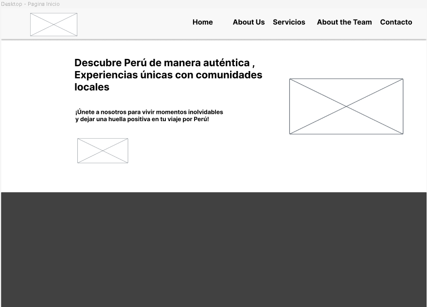
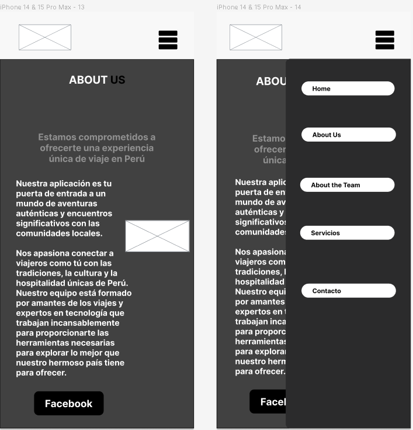
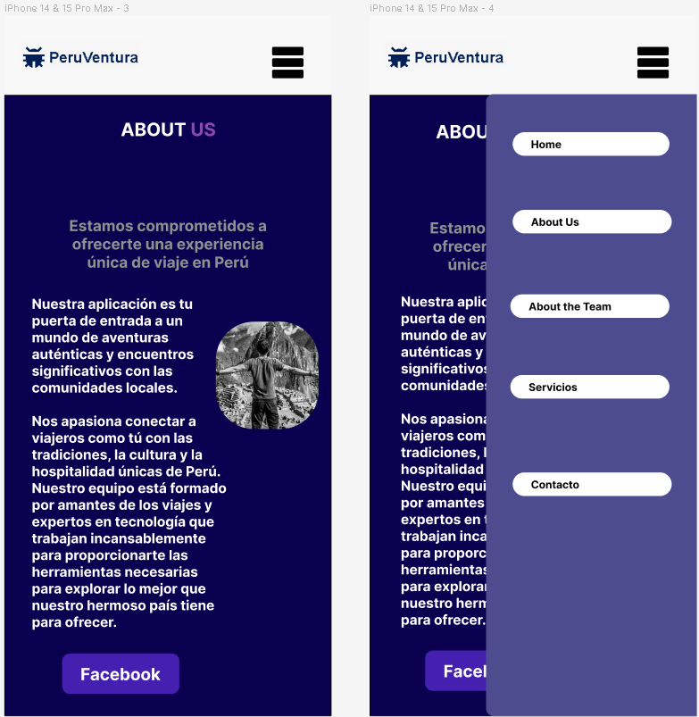
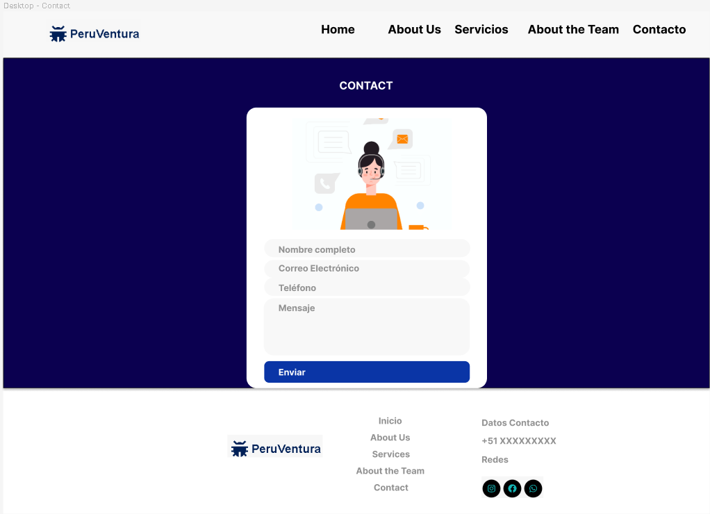

# <span style="color:red">**UNIVERSIDAD PERUANA DE CIENCIAS APLICADAS**</span>

<p align="center">
    <strong>Universidad Peruana de Ciencias Aplicadas</strong><br>
    <br></img><br>
    <br>
    <strong>Ingeniería de Software - 202401</strong><br>
    <br>
    <strong>SI730 - Aplicaciones Web - SW55</strong><br>  
    <br>
    <strong>Profesor: Francisco José Cáceres Honores</strong><br>
    <br> <strong>INFORME DE TRABAJO FINAL - TB1 </strong> 
</p>
<p align="center">
    <strong>Startup: SyntaxSquad </strong><br>
    <strong>Producto:  PerúVentura </strong>
</p>

<h3 align="center" >Team Members:</h3>
<div>
    <table align="center">
        <tr>
            <th style="text-align:center;">Member</th>
            <th style="text-align:center;">Code</th>
        </tr>
        <tr>
            <td>Lynn Jeeferzon Meza Camayo</td>
            <td>U20201C320</td>
        </tr>
        <tr>
            <td>David Bryan Rodriguez Santos</td>
            <td>U202212236</td>
        </tr>
        <tr>
            <td>Fabricio Gabriel Iparraguirre Quintero</td>
            <td>U202113930</td>
        </tr>
        <tr>
            <td>Párraga Gamarra, Paolo Gonzalo</td>
            <td>U202219186</td>
        </tr>
        <tr>
            <td>Felix Orlando Becerra Tito</td>
            <td>U20211B387</td>
        </tr>
    </table>
</div>
<br>

## <span style="color:red">Registro de Versiones del Informe</span>

<table>
  <tr>
    <th>Vension</th>
    <th>Fecha</th>
    <th>Autor</th>
    <th>Descripción de modificaión</th> 
  </tr>
  <tr>
    <td>version 0.1</td>
    <td>24/03/2024</td>
    <td>Lynn Jeeferzon Meza Camayo </td>
    <td>Formato del documento</td>
  </tr>
  <tr>
    <td>version 0.1</td>
    <td>25/03/2024</td>
    <td>Fabricio Gabriel Iparraguirre Quintero</td>
    <td>Modificación en el capitulo 2 y el capitulo 5, y algunas del capitulo 4</td>
  </tr>
  <tr>
    <td>version 0.1</td>
    <td>26/03/2024</td>
    <td>Paolo Gonzalo Párraga Gamarra</td>
    <td>Modificación de los puntos del Capítulo 3 y Capítulo 4</td>
  </tr>
  <tr>
    <td>version 0.2</td>
    <td>01/04/2024</td>
    <td>Lynn Jeeferzon Meza Camayo</td>
    <td>Modificación de startup profile, descripcion de la Startup y antecedentes y problemáticas</td>
  </tr>
</table>

## <span style="color:red">Project Report Collaboration Insights </span>


Imforme: <https://github.com/Grupo-4-SW55-SYNTAXSQUAD/Reporte-Per-Ventura>

Landing Page: <https://grupo-4-sw55-syntaxsquad.github.io/Landing-page/>

## <span style="color:red">Tabla de Contenido</span>

- [**UNIVERSIDAD PERUANA DE CIENCIAS APLICADAS**](#universidad-peruana-de-ciencias-aplicadas)
  - [SI730 Aplicaciones Web](#si730-aplicaciones-web)
  - [**"PerúVentura"**](#perúventura)
    - [Profesor: Francisco José Cáceres Honores](#profesor-francisco-josé-cáceres-honores)
  - [Integrantes:](#integrantes)
  - [Registro de Versiones del Informe](#registro-de-versiones-del-informe)
  - [Project Report Collaboration Insights ](#project-report-collaboration-insights-)
  - [Tabla de Contenido](#tabla-de-contenido)
  - [Student Outcome](#student-outcome)
- [Capítulo I: Introducción](#capítulo-i-introducción)
- [1.1. Startup Profile](#11-startup-profile)
  - [1.1.1. Descripción de la Startup](#111-descripción-de-la-startup)
    - [1.1.2. Perfiles de integrantes del equipo](#112-perfiles-de-integrantes-del-equipo)
- [](#)
- [](#-1)
  - [1.2. Solution Profile](#12-solution-profile)
  - [1.2.1 Antecedentes y problemática](#121-antecedentes-y-problemática)
  - [1.2.2 Lean UX Process.](#122-lean-ux-process)
  - [1.2.2.1. Lean UX Problem Statements.](#1221-lean-ux-problem-statements)
  - [1.2.2.2. Lean UX Assumptions.](#1222-lean-ux-assumptions)
  - [1.2.2.3. Lean UX Hypothesis Statements.](#1223-lean-ux-hypothesis-statements)
  - [1.2.2.4. Lean UX Canvas.](#1224-lean-ux-canvas)
  - [1.3. Segmentos objetivo.](#13-segmentos-objetivo)
- [ Capítulo II: Requirements Elicitation \& Analysis](#-capítulo-ii-requirements-elicitation--analysis)
  - [2.1. Competidores.](#21-competidores)
  - [2.1.1. Análisis competitivo.](#211-análisis-competitivo)
  - [2.1.2. Estrategias y tácticas frente a competidores.](#212-estrategias-y-tácticas-frente-a-competidores)
  - [2.2. Entrevistas.](#22-entrevistas)
  - [2.2.1. Diseño de entrevistas.](#221-diseño-de-entrevistas)
  - [2.2.2. Registro de entrevistas.](#222-registro-de-entrevistas)
  - [2.2.3. Análisis de entrevistas.](#223-análisis-de-entrevistas)
  - [2.3. Needfinding.](#23-needfinding)
  - [2.3.1. User Personas.](#231-user-personas)
  - [2.3.2. User Task Matrix.](#232-user-task-matrix)
  - [2.3.3. User Journey Mapping.](#233-user-journey-mapping)
  - [2.3.4. Empathy Mapping.](#234-empathy-mapping)
  - [2.3.5. As-is Scenario Mapping.](#235-as-is-scenario-mapping)
  - [2.4. Ubiquitous Language.](#24-ubiquitous-language)
- [Capítulo III: Requirements Specification](#capítulo-iii-requirements-specification)
    - [3.1. To-Be Scenario Mapping.](#31-to-be-scenario-mapping)
    - [3.2. User Stories.](#32-user-stories)
    - [3.3. Impact Mapping.](#33-impact-mapping)
    - [3.4. Product Backlog.](#34-product-backlog)
- [Capítulo IV: Product Design](#capítulo-iv-product-design)
    - [4.1. Style Guidelines.](#41-style-guidelines)
    - [4.1.1. General Style Guidelines.](#411-general-style-guidelines)
    - [4.1.2. Web Style Guidelines.](#412-web-style-guidelines)
    - [4.2. Information Architecture.](#42-information-architecture)
    - [4.2.1. Organization Systems.](#421-organization-systems)
    - [4.2.2. Labeling Systems.](#422-labeling-systems)
    - [4.2.3. SEO Tags and Meta Tags](#423-seo-tags-and-meta-tags)
    - [4.2.4. Searching Systems.](#424-searching-systems)
    - [4.2.5. Navigation Systems.](#425-navigation-systems)
    - [4.3. Landing Page UI Design.](#43-landing-page-ui-design)
    - [4.3.1. Landing Page Wireframe.](#431-landing-page-wireframe)
    - [4.3.2. Landing Page Mock-up.](#432-landing-page-mock-up)
    - [4.4.3 Web Applications UX/UI Design.](#443-web-applications-uxui-design)
    - [4.4.1. Web Applications Wireframes.](#441-web-applications-wireframes)
    - [4.4.2. Web Applications Wireflow Diagrams.](#442-web-applications-wireflow-diagrams)
    - [4.4.2. Web Applications Mock-ups.](#442-web-applications-mock-ups)
    - [4.4.3. Web Applications User Flow Diagrams.](#443-web-applications-user-flow-diagrams)


    - [4.5. Web Applications Prototyping.](#45-web-applications-prototyping)
    - [4.6. Domain-Driven Software Architecture.](#46-domain-driven-software-architecture)
    - [4.6.1. Software Architecture Context Diagram.](#461-software-architecture-context-diagram)
    - [4.6.2. Software Architecture Container Diagrams.](#462-software-architecture-container-diagrams)
    - [4.6.3. Software Architecture Components Diagrams.](#463-software-architecture-components-diagrams)
    - [4.7. Software Object-Oriented Design.](#47-software-object-oriented-design)
    - [4.7.1. Class Diagrams.](#471-class-diagrams)
    - [4.7.2. Class Dictionary.](#472-class-dictionary)
    - [4.8. Database Design.](#48-database-design)
    - [4.8.1. Database Diagram.](#481-database-diagram)
  - [3.1. To-Be Scenario Mapping.](#31-to-be-scenario-mapping)
  - [3.2. User Stories.](#32-user-stories)
  - [3.3. Impact Mapping.](#33-impact-mapping)
  - [3.4. Product Backlog.](#34-product-backlog)
- [ Capítulo IV: Product Design](#-capítulo-iv-product-design)
  - [4.1. Style Guidelines.](#41-style-guidelines)
  - [4.1.1. General Style Guidelines.](#411-general-style-guidelines)
  - [4.1.2. Web Style Guidelines.](#412-web-style-guidelines)
  - [4.2. Information Architecture.](#42-information-architecture)
  - [4.2.1. Organization Systems.](#421-organization-systems)
  - [4.2.2. Labeling Systems.](#422-labeling-systems)
  - [4.2.3. SEO Tags and Meta Tags](#423-seo-tags-and-meta-tags)
  - [4.2.4. Searching Systems.](#424-searching-systems)
  - [4.2.5. Navigation Systems.](#425-navigation-systems)
  - [4.3. Landing Page UI Design.](#43-landing-page-ui-design)
  - [4.3.1. Landing Page Wireframe.](#431-landing-page-wireframe)
  - [4.3.2. Landing Page Mock-up.](#432-landing-page-mock-up)
  - [4.4 Web Applications UX/UI Design.](#44-web-applications-uxui-design)
  - [4.4.1. Web Applications Wireframes.](#441-web-applications-wireframes)
  - [4.4.2. Web Applications Wireflow Diagrams.](#442-web-applications-wireflow-diagrams)
  - [4.4.2. Web Applications Mock-ups.](#442-web-applications-mock-ups)
  - [4.4.3. Web Applications User Flow Diagrams.](#443-web-applications-user-flow-diagrams)
  - [4.5. Web Applications Prototyping.](#45-web-applications-prototyping)
  - [4.6. Domain-Driven Software Architecture.](#46-domain-driven-software-architecture)
  - [4.6.1. Software Architecture Context Diagram.](#461-software-architecture-context-diagram)
  - [4.6.2. Software Architecture Container Diagrams.](#462-software-architecture-container-diagrams)
  - [4.6.3. Software Architecture Components Diagrams.](#463-software-architecture-components-diagrams)
  - [4.7. Software Object-Oriented Design.](#47-software-object-oriented-design)
  - [4.7.1. Class Diagrams.](#471-class-diagrams)
  - [4.7.2. Class Dictionary.](#472-class-dictionary)
  - [4.8. Database Design.](#48-database-design)
  - [4.8.1. Database Diagram.](#481-database-diagram)
- [Capítulo V: Product Implementation, Validation \& Deployment](#capítulo-v-product-implementation-validation--deployment)
  - [5.1. Software Configuration Management.](#51-software-configuration-management)
    - [5.1.1. Software Development Environment Configuration.](#511-software-development-environment-configuration)
    - [5.1.2. Source Code Management.](#512-source-code-management)
    - [5.1.3. Source Code Style Guide \& Conventions.](#513-source-code-style-guide--conventions)
    - [5.1.4. Software Deployment Configuration.](#514-software-deployment-configuration)
  - [5.2. Landing Page, Services \& Applications Implementation.](#52-landing-page-services--applications-implementation)
    - [5.2.1. Sprint 1](#521-sprint-1)
    - [5.2.1.1. Sprint Planning 1.](#5211-sprint-planning-1)
    - [5.2.1.2. Sprint Backlog 1.](#5212-sprint-backlog-1)
    - [5.2.1.3. Development Evidence for Sprint Review.](#5213-development-evidence-for-sprint-review)
    - [5.2.1.4. Testing Suite Evidence for Sprint Review.](#5214-testing-suite-evidence-for-sprint-review)
    - [5.2.1.5. Execution Evidence for Sprint Review.](#5215-execution-evidence-for-sprint-review)
    - [5.2.1.6. Services Documentation Evidence for Sprint Review.](#5216-services-documentation-evidence-for-sprint-review)
    - [5.2.1.7. Software Deployment Evidence for Sprint Review.](#5217-software-deployment-evidence-for-sprint-review)
    - [5.2.1.8. Team Collaboration Insights during Sprint.](#5218-team-collaboration-insights-during-sprint)
    - [5.2.2 Sprint 2](#522-sprint-2)
    - [5.2.2.1. Sprint Planning 2.](#5221-sprint-planning-2)
    - [5.2.2.2. Sprint Backlog 2.](#5222-sprint-backlog-2)
    - [5.2.2.3. Development Evidence for Sprint Review.](#5223-development-evidence-for-sprint-review)
    - [5.2.2.4. Testing Suite Evidence for Sprint Review.](#5224-testing-suite-evidence-for-sprint-review)
    - [5.2.2.5. Execution Evidence for Sprint Review.](#5225-execution-evidence-for-sprint-review)
    - [5.2.2.6. Services Documentation Evidence for Sprint Review.](#5226-services-documentation-evidence-for-sprint-review)
    - [5.2.2.7. Software Deployment Evidence for Sprint Review.](#5227-software-deployment-evidence-for-sprint-review)
    - [5.2.2.8. Team Collaboration Insights during Sprint.](#5228-team-collaboration-insights-during-sprint)
    - [5.2.3. Sprint 3](#523-sprint-3)
    - [5.2.3.1. Sprint Planning 3.](#5231-sprint-planning-3)
    - [5.2.3.2. Sprint Backlog 3.](#5232-sprint-backlog-3)
    - [5.2.3.3. Development Evidence for Sprint Review.](#5233-development-evidence-for-sprint-review)
    - [5.2.3.4. Testing Suite Evidence for Sprint Review.](#5234-testing-suite-evidence-for-sprint-review)
    - [5.2.3.5. Execution Evidence for Sprint Review.](#5235-execution-evidence-for-sprint-review)
    - [5.2.3.6. Services Documentation Evidence for Sprint Review.](#5236-services-documentation-evidence-for-sprint-review)
    - [5.2.3.7. Software Deployment Evidence for Sprint Review.](#5237-software-deployment-evidence-for-sprint-review)
    - [5.2.3.8. Team Collaboration Insights during Sprint.](#5238-team-collaboration-insights-during-sprint)
  - [5.3. Validation Interviews.](#53-validation-interviews)
    - [5.3.1. Diseño de Entrevistas.](#531-diseño-de-entrevistas)
    - [5.3.2. Registro de Entrevistas.](#532-registro-de-entrevistas)
    - [5.3.3. Evaluaciones según heurísticas.](#533-evaluaciones-según-heurísticas)
  - [5.4. Video About-the-Product.](#54-video-about-the-product)
  - [Conclusiones](#conclusiones)
  - [Conclusiones y recomendaciones.](#conclusiones-y-recomendaciones)
  - [Video About-the-Team.](#video-about-the-team)

## <span style="color:red">Student Outcome</span>

<table>
    <tr>
        <th>Criterio Especifico</th>
        <th>Acciones Realizadas</th>
        <th>Conclusiones</th>
    </tr>
    <tr>
        <td>
            Participa en equipos <br> multidiciplinadoscon eficacia <br>
            eficiencia y objetividad,<br> en el marco de un proyecto en <br>
            soluciones de ingeniería<br> de software
        </td>
        <td>
            Lynn Jeeferzon Meza Camayo <br>
            <em>TB1</em><br>
            <em>Se implemento los antecedentes y problematcias, para identificar nuestra propuesta. Creando los Style Guidelines para la implementacion y desarrollo de nuestro aplicativo y       
            landing page.<br><br>
            Paolo Gonzalo Párraga Gamarra<br>
            <em>TB1</em><br>
            <em>Se reliazó el capítulo 3, así comolos diagramas <br>de clases y de base de datos y el <br>sprint planning 1 y sprint backlog<br><br>
            David Bryan Rodriguez Santos <br>
            <em>TB1</em>
            <em>Se realizó la segunda mitad del capítulo 2 entre estos fueron: User Persona, As-Is Scenario Mapping, etc. El diseño de componentes tambien fue realizado. <br>de clases y de base de datos y el <br>sprint planning 1 y sprint backlog<br><br>
          Fabricio Gabriel Iparraguirre Quintero<br>
          <em> TB1</em>
          <ul>
          <li>Analisis Competitivo</li>
          <li>Estrategias y tácticas frente a competidores.</li>
          <li> Diseño de entrevistas.</li>
          <li>Analisis de Entrevistas</li>
          <li>Web Applications Prototyping</li>
          <li>SEO Tags and Meta Tags</li>
          <li>Software Development Environment Configuration</li>
          <li>Source Code Management.</li>
          <li>Source Code Style Guide & Conventions.</li>
          </ul>
            Felix Orlando Becerra Tito <br>
            <em>TB1</em>
            <em>Se realizó los elementos del primer capítulo, ya sea lean ux assumptions o canvas. Así mismo, se realizaron los puntos del apartado 4.2 <br><br>
        </td>
        <td>
        En conclusión, los elementos usados para la realización del tb1 fueron importantes como los sprint ayudaron a la eficacia del grupo.
        </td>
    </tr>
    <tr>
        <td>Conoce al menos un sector<br>
            empresarial o dominio de <br>
            aplicación de soluciones de <br>
            software.
        </td>
       <td>
            Lynn Jeeferzon Meza Camayo <br>
            <em>TB1</em><br>
            <em>Se implemento los antecedentes y problematcias, para identificar nuestra propuesta. Creando los Style Guidelines para la implementacion y desarrollo de nuestro aplicativo y       
            landing page.<br><br>
            Paolo Gonzalo Párraga Gamarra<br>
            <em>TB1</em><br>
            <em>Se reliazó el capítulo 3, así comolos diagramas <br>de clases y de base de datos y el <br>sprint planning 1 y sprint backlog<br><br>
            David Bryan Rodriguez Santos <br>
            <em>TB1</em>
            <em>Se realizó la segunda mitad del capítulo 2 entre estos fueron: User Persona, As-Is Scenario Mapping, etc. El diseño de componentes tambien fue realizado. <br>de clases y de base de datos y el <br>sprint planning 1 y sprint backlog<br><br>
          Fabricio Gabriel Iparraguirre Quintero<br>
          <em> TB1</em>
          <ul>
          <li>Analisis Competitivo</li>
          <li>Estrategias y tácticas frente a competidores.</li>
          <li> Diseño de entrevistas.</li>
          <li>Analisis de Entrevistas</li>
          <li>Web Applications Prototyping</li>
          <li>SEO Tags and Meta Tags</li>
          <li>Software Development Environment Configuration</li>
          <li>Source Code Management.</li>
          <li>Source Code Style Guide & Conventions.</li>
          </ul>
                      Felix Orlando Becerra Tito <br>
            <em>TB1</em>
            <em>Se realizó los elementos del primer capítulo, ya sea lean ux assumptions o canvas. Así mismo, se realizaron los puntos del apartado 4.2 <br><br>
        </td>
        <td>En conclusión, lo realizado a lo largo del trabajo fue algo crucial para conocer del sector empresairal al que apuntabamos y así aplicar soluciones de software efectivas.</td>
    </tr>
</table>

# <span id="capítulo-introducción" style="color:red">Capítulo I: Introducción</span>

# <span id="11-startup-profile" style="color:red">1.1. Startup Profile</span>

## <span id="111-descripción-de-la-startup" style="color:red">1.1.1. Descripción de la Startup</span>

SyntaxSquad es un startup de desarrollo de software enfocados en crear soluciones Web innovadoras y efectivas. La empresa fue fundado por un grupo de estudiantes de ingeneria de software de la Universidad Peruana de Ciencias Aplicadas.

Desarrollamos sitios web que no solo visualmente atractivos, sino también del desarrollo de funcionalidades que facilitan a el uso a nuestros clientes. La empresa adopta un enfoque centrado en el cliente y trabaja estrechamente con ellos para comprender sus necesidades comerciales y desarrollar soluciones de software que satisfagan sus requisitos específicos.

SyntaxSquad brinda servicios que incluyen desarrollo de software personalizado, desarrollo de aplicaciones móviles y diseño de sitios web. La empresa utiliza tecnologías avanzadas y métodos flexibles para desarrollar soluciones de software escalables, confiables y eficientes. Además, SyntaxSquad brinda servicios de mantenimiento y soporte para garantizar el buen funcionamiento de las soluciones de software de los clientes a largo plazo. La empresa se compromete a mantenerse al tanto de las últimas tecnologías y tendencias del mercado y a proporcionar soluciones de software innovadoras y escalables para ayudar a los clientes a alcanzar sus objetivos comerciales.

### <span id="112-perfiles-de-integrantes-del-equipo">1.1.2. Perfiles de integrantes del equipo</span>


#
#

#
#

#
#

#
#


### <span id="12-solution-profile">1.2. Solution Profile</span>

### <span id="121-antecedentes-y-problemática">1.2.1 Antecedentes y problemática</span>

- **ANTECEDENTES**

El turismo en Perú ha crecido significativamente en las últimas décadas, especialmente en destinos populares como Machu Picchu, Cusco y el Valle Sagrado. Sin embargo, el auge del turismo también ha creado algunos problemas, como la congestión en sitios turísticos populares y la falta de distribución equitativa de los beneficios económicos entre las comunidades locales. Muchos viajeros a Perú buscan una experiencia más auténtica y significativa, pero a menudo tienen dificultades para encontrar actividades fuera del circuito turístico tradicional. Al mismo tiempo, las comunidades locales tienen un rico patrimonio cultural y conocimientos tradicionales que pueden ofrecer a los viajeros experiencias únicas, pero pueden enfrentar barreras para acceder y beneficiarse del mercado turístico de manera equitativa y sostenible.

La descripción del panorama turístico del Perú se basa en datos proporcionados por el Ministerio de Comercio Exterior y Turismo del Perú (MINCETUR) e informes y estudios del Instituto Nacional de Estadística e Información (INEI).

En este contexto, existe la necesidad de una plataforma que facilite las conexiones entre los viajeros interesados ​​en experiencias auténticas y las comunidades locales que quieran compartir su cultura y tradiciones, al tiempo que promueva una industria turística más responsable y sostenible en el Perú.

- **PROBLEMÁTICA**

_TÉCNICA DE LAS 5W y 2H_

**_What?_**

**_¿Cuál es el problema?_**

El problema es que las comunidades locales carecen de acceso al mercado turístico y no pueden brindar experiencias auténticas a los viajeros que desean explorar la cultura y las tradiciones peruanas fuera de los destinos turísticos tradicionales. Esto crea una distribución desigual de los beneficios económicos del turismo y congestión en los sitios turísticos más famosos, afectando la protección del patrimonio cultural y natural del país.

**_¿Cuál es la relación con la persona en cuestión?_**

Los usuarios o turistas que buscar nuevos sitios culturales diferente de los más conocidos para poder visualizar nuevas costumbres como también reservaciones con anticipación.

**_When?_**

**_¿Cuándo sucede el problema?_**

Sucede cuando los turistas intentan encontrar actividad 0 sitos turisticos del perú, pero en esa busqueda se encuentra con una saturacion de clientes o largas filas para dejar un reservación. Ademas, tienen dificultades por elegior que opcion ofrecida les gustaria, porque no sabia de antemano que existian varias opciones. Por ello, las personas optan por buscar algo que les facilite las opciones, ubicación y reservación del dicho lugar o actividad.

**_¿Cuándo utiliza el cliente le producto?_**

El usuario o turista podrá usarlo cuando desee saber múltiples opciones de actividades o sitios turístico, con el fin de buscar información y reservación del lugar deseado.

**_Where?_**

**_¿Dónde está el cliente cuando usa el producto?_**

Los usuarios o turistas pueden utilizar el producto desde cualquier lugar con acceso a Internet. Puedes hacerlo en casa, en una cafetería, en un restaurante o en cualquier lugar donde tengas conexión a Internet. La plataforma en línea brinda a los clientes acceso y utiliza un servicio desde cualquier ubicación en la conexión a Internet.

¿Dónde surge el problema?

Este problema surge en Perú, especialmente en áreas donde las comunidades locales tienen un rico patrimonio cultural y conocimientos tradicionales, pero luchan por acceder al mercado turístico y brindar a los viajeros una experiencia auténtica. Esto se evidencia por la falta de alternativas fuera de los destinos turísticos tradicionales, lo que limita las oportunidades de los viajeros de sumergirse en la cultura local y contribuir a la sostenibilidad de las comunidades locales.

**_Who?_**

**_¿Quiénes están involucrados?_**

Esta problemática tiene dos segmentos objetivos. En primer lugar, turistas interesados en experiencias auténticas y significativas en Perú. Por otro lado, Las tiendas y establecimientos que ofrecen productos o experiencias culturales, como por ejemplo serian artesanías, galerías de arte, etc. que buscan llegar a un público más amplio y diverso de viajeros.

**_Why?_**

**_¿Cuál es la causa del problema?_**

La causa del problema es la falta de acceso y visibilidad de las comunidades e instituciones locales que ofrecen productos culturales al mercado turístico. Esto puede deberse a una serie de factores, como la falta de recursos publicitarios y de marketing, el alcance limitado de las plataformas de reservas en línea y la competencia con destinos turísticos tradicionales más conocidos. Como resultado, a los viajeros les resulta difícil encontrar y reservar actividades auténticas y fuera de lo común, lo que limita su capacidad de explorar la cultura local y contribuir a la sostenibilidad de la comunidad.

**_How?_**

**_¿En qué condiciones los clientes usan nuestros productos?_**

Los clientes utilizan nuestros productos en condiciones de acceso a internet y desde cualquier ubicación con conexión disponible. Pueden acceder a la plataforma en línea a través de dispositivos como computadoras, teléfonos inteligentes o tabletas. Además, los clientes utilizan nuestros productos cuando están planificando sus viajes a Perú o mientras están en el país buscando actividades y experiencias culturales auténticas.

**_¿Cómo prefieren los clientes acceder a nuestro producto?_**

Los clientes prefieren acceder a nuestro producto a través de una plataforma en línea intuitiva y fácil de usar. Esto podría incluir un sitio web o una aplicación móvil que les permita buscar, explorar y reservar una variedad de experiencias culturales ofrecidas por tiendas y establecimientos en Perú. Además, los clientes pueden preferir recibir recomendaciones personalizadas y reseñas de otras personas que hayan participado en las experiencias, lo que les ayudaría a tomar decisiones informadas al seleccionar actividades para su viaje.

**_¿Qué llevó al cliente a llegar a esta situación?_**

La situación del cliente surge de la creciente demanda de experiencias auténticas y significativas por parte de los viajeros que visitan Perú. A medida que más personas buscan sumergirse en la cultura y las tradiciones locales durante sus viajes, se enfrentan a la limitada disponibilidad de opciones fuera de los destinos turísticos convencionales. Como resultado, los viajeros tienen dificultades para encontrar y reservar actividades auténticas, lo que los lleva a buscar soluciones que les permitan acceder más fácilmente a estas experiencias únicas durante su visita a Perú.

**How much?**

**_¿Cuál es la magnitud del problema?_**

El crecimiento del turismo ha llevado a una congestión en destinos populares como Machu Picchu y Cusco. Esto puede afectar negativamente la experiencia del viajero y la calidad de vida de las comunidades locales. Los viajeros a menudo buscan experiencias auténticas y significativas, pero pueden enfrentar dificultades para encontrar actividades fuera del circuito turístico tradicional. Por ello, existe la necesidad clara de una plataforma que facilite las conexiones entre los viajeros interesados ​​en experiencias auténticas y las comunidades locales dispuestas a compartir su cultura y tradiciones. Esta plataforma también debe promover una industria turística más responsable y sostenible en el Perú.

### <span id="122-lean-ux-process">1.2.2 Lean UX Process.</span>

<hr><p>El mercado actual de aplicaciones de viajes se centra en ofrecer información estándar sobre destinos turísticos populares, sin destacar las experiencias únicas y auténticas que pueden ofrecer las comunidades locales en Perú. Las aplicaciones existentes no facilitan a los viajeros la búsqueda y reserva de actividades culturales específicas, como talleres de arte y cocina tradicional, organizadas por comunidades locales. Además, la falta de opciones para interactuar con los lugareños y contribuir al turismo sostenible limita la experiencia de viaje de los usuarios.</p><p>Nuestro nuevo producto “Per-Ventura “solucionará los problemas antes mencionados dando nuevas maneras de conocer el Perú a los usuarios que abarcan nuestra aplicación, tanto para personas extranjeras como locales. El segmento inicial que estamos tomando en consideración son los extranjeros, ya que creemos que son los que más se pueden perder de las experiencias únicas de las comunidades locales del país.</p>

### <span id="1221-lean-ux-problem-statements">1.2.2.1. Lean UX Problem Statements.</span>

<p style="text-align:center;">BUSINESS ASSUMPTIONS </p>
<ol>
<li>Los viajeros están interesados en experiencias auténticas y únicas ofrecidas por comunidades locales en Perú.</li>
<li>Hay una demanda de una plataforma que facilite la búsqueda y reserva de actividades culturales específicas en Perú.</li>
<li>Los viajeros estarán dispuestos a utilizar una aplicación que les permita interactuar con los lugareños y contribuir al turismo sostenible en Perú.</li>
<li>La publicidad en línea y las asociaciones con organizaciones turísticas serán efectivas para promocionar nuestra aplicación.</li>
<li>Las empresas locales estarán interesadas en promocionar sus actividades a través de nuestra plataforma para llegar a una audiencia comprometida con el turismo sostenible.</li>
</ol>

### <span id="1222-lean-ux-assumptions">1.2.2.2. Lean UX Assumptions.</span>

<p style="text-align:center;">USER ASSUMPTIONS </p>
<ol>
<li>Los viajeros que buscan experiencias culturales autenticas en Peru son el principal publico objetivo.</li>
<li>Nuestra aplicación resolverá la dificultad de encontrar y reservar actividades culturales especificas en Peru.</li>
<li>Los usuarios utilizaran nuestra aplicación principalmente antes y durante su viaje a Perú para descubrir y reservar actividades culturales autenticas.</li>
<li>La aplicación será accesible a través de dispositivos móviles con conexión a internet, lo que facilitará su uso durante los viajes.</li>
</ol>

### <span id="1223-lean-ux-hypothesis-statements">1.2.2.3. Lean UX Hypothesis Statements.</span>

<li>Creemos que tendremos éxito si los viajeros pueden encontrar y reservar fácilmente actividades culturales auténticas en Perú, como talleres de arte y cocina tradicional, a través de nuestra plataforma.</li>          <li>Creemos que lograremos la monetización si los viajeros utilizan las funciones Premium de nuestra aplicación para acceder a experiencias exclusivas y servicios adicionales.</li>                                                    <li>Creemos que nuestros usuarios estarán satisfechos si experimentan una mayor interacción con las comunidades locales y una conexión más profunda con la cultura peruana a través de nuestra aplicación.</li>

### <span id="1224-lean-ux-canvas">1.2.2.4. Lean UX Canvas.</span>


### <span id="13-segmentos-objetivo">1.3. Segmentos objetivo.</span>

## Turistas en Perú

Este segmento está compuesto por turistas que visitan Perú con el objetivo principal de explorar su rica cultura y patrimonio. Están interesados en sumergirse en las tradiciones, la historia, la gastronomía y las artes del país.

## Dueños de locales peruanos

Este segmento comprende dueños de locales peruanos buscando más reconocimiento a sus negocios ante los turistas.

# <span id="-capítulo-ii-requirements-elicitation--analysis" style="color:red"> Capítulo II: Requirements Elicitation & Analysis</span>

### <span id="21-competidores">2.1. Competidores.</span>

### <span id="211-análisis-competitivo">2.1.1. Análisis competitivo.</span>

<table>
  <thead>
    <tr>
      <th colspan="4" style="text-align: center;">Competitive Analysis Landscape
      </th>
    </tr>
  </thead>
  <tbody>
    <tr>
      <th>¿Porque hacer este análisis?</th>
      <th colspan="3" style="text-align: center;">
        <p style="border-bottom: 1px solid #30363d; background-color:#161b22;">¿Como identificar a nuestros competidores?</p>
        <p>El objetivo es proporcionar a las comunidades locales un turismo donde muestren su cultura contribuyendo al turismo sostenible.</p>
      </th>
    </tr>
    <tr>
      <th>
        Imagenes de Competidores
      </th>
      <td></td>
      <td></td>
      <td></td>
    </tr>
    <tr>
      <th>Overview</th>
      <td>HolaPlace es una plataforma que conecta a los turistas con los locales, permitiendo a estos vivir experiencias únicas. Ofrece alojamiento en terrazas y espacios privados para eventos.</td>
      <td>Booking es una plataforma de reservas elegantes que comercializa hoteles basándose en las valoraciones de los clientes, así como en el precio del alojamiento proporcionado por el propietario.</td>
      <td>TripAdvisor, es una plataforma que recoge opiniones en torno a ciertos negocios del sector turístico, como hoteles, restaurantes, bares, discotecas, etc.</td>
    </tr>
    <tr>
      <th>Ventajas de los competidores</th>
      <td>Las a tener en cuenta serian la gran variedad de espacios, organización de eventos personalizados, servicios complementarios y plataforma Tecnológica Integrada</td>
      <td>las ventajas a considerar seria la amplia variedad de alojamientos, acumilación de millas, reconocimiento global y variedad de formas de pago</td>
      <td>Las ventajas de Tripadvisor, son las cantidad opiniones y valoración reales, la facil navegación y busqueda de información, la amplia base de datos y la planificación de viajes personalizada.</td>
    </tr>
    <tr>
      <th>Mercado Objetivo</th>
      <td>HolaPlace, su mercado objetivo principal incluye turistas internacionales, viajeros de negocios, viajeros nacionales, anfitriones de alojamientos, anfitriones de experiencias, agencias de viajes y organizaciones de turismo.</td>
      <td>Booking, su mercado objetivo es amplio e incluye turistas, viajeros de negocios y nacionales, así como hoteles, hostales, propietarios de apartamentos y casas de vacaciones, y organizadores de experiencias.</td>
      <td>TripAdvisor, su mercado objetivo se centra en los turistas que buscan información y opiniones sobre negocios del sector turístico, como hoteles, restaurantes, bares, discotecas, etc.</td>
    </tr>
    <tr>
      <th>Estrategias de Marketing</th>
      <td>HolaPlace utiliza estrategias de publicidad en línea como anuncios pagados en motores de busqueda (SEM), marketing de contenidos y marketing de influencers. Además, también se enfocan en la participación en eventos y ferias turísticas, colaboraciones con influencers y bloggers de viajes, y promoción a través de redes sociales y campañas de correo electrónico.</td>
      <td>Booking combina estas estrategias de marketing de manera efectiva para llegar a una audiencia global de viajeros y mantener su posición como líder en la industria de reservas de viajes en línea. Además, utilizan técnicas de personalización y recomendación basadas en el historial de búsqueda y preferencias de los usuarios para ofrecer promociones personalizadas.</td>
      <td> TripAdvisor implementa una estrategia de marketing integral de manera que combina contenido valioso como marketing digital y el marketing tradicional, enfocado en la experiencia del usuario, monitoreo y análisis, e innovación para alcanzar a su público objetivo, fortaleciendo su posicionamiento en la industria y lograr un crecimiento sostenible.</td>
    </tr>
    <tr>
      <th>Precios y costos</th>
      <td>En HolaPlace, los precios varían según los espacios y servicios que elijas. SuperSpace suele ser de los más caros, rondando los 1500€, mientras que las terrazas privadas tienen un precio aproximado de 290€.</td>
      <td>En booking, se cobra una comision por anfitriones los porcentajes varias de 10% a 25%, ademas del costo de Payments By booking.com que cobra el procesamiento bancario que ronda de 1.1% y el 3.1% dependiendo del pais.</td>
      <td>En Tripadvisor, los rangos de precios se precisan mediante símbolos de dólar. ($) indica un rango de precios bajo, ($$) indica un rango de precios moderado, y ($$$) indica un rango de precios altos.</td>
    </tr>
  </tbody>
</table>

### <span id="212-estrategias-y-tácticas-frente-a-competidores">2.1.2. Estrategias y tácticas frente a competidores.</span>

1. **Estrategias de intermediación**: Se aplicarán estrategias para competir contra los competidores, como facilitar las transacciones entre turistas y locales y ofreciendo diversos servicios.

2. **Precios competitivos**: Se establecerán precios competitivos y flexibles para atraer a los turistas , al mismo tiempo que se garantiza una ganancia justa para los locales. Se ofrecerán descuentos y promociones especiales para fomentar la fidelidad de los turistas así atrayendo a nuevos clientes.

3. **Alianzas estratégicas**: Se realizarán alianzas con diversos establecimientos para ofrecer una amplia gama de servicios a los turistas y asi poder satisfacer sus necesidades y preferencias.

4. **Estrategias de promoción**: Se agregará estrategias de promoción para poder competir con los competidores, como las campañas publicitarias en redes sociales, motores de búsqueda, blogs y foros, con el objetivo de aumentar la visibilidad de la aplicación web y atraer a más turistas y locales.

5. **Estrategias de marketing digital**: Se implementarán estrategias de marketing digital que conlleva a técnicas de SEO, marketing de contenidos y email marketing, entre otras, para llegar a un público más amplio y generar interés en la aplicación web.

6. **Tácticas de fidelización de clientes**: La fidelización de clientes se dará por medio de programas de recompensas, descuentos exclusivos y atención al cliente personalizada, con el objetivo de mantener a los turistas y locales satisfechos y fomentar la repetición de transacciones.

### <span id="22-entrevistas">2.2. Entrevistas.</span>

### <span id="221-diseño-de-entrevistas">2.2.1. Diseño de entrevistas.</span>

Este aspecto es relevante para recopilar informacion tanto de los turistas como de los locales, para asi poder saber sus necesidades y preferencias.

#### 1. **Entrevistas a turistas**:

##### a) Preguntas Principales:

- ¿Cuáles son los principales motivos por los que usted usaría el servicio de asesoramiento?
- ¿Cuál o cuáles son los problemas que mayor dificultad tiene a la hora de aprender?
- ¿Ha contratado alguna vez algún profesor particular para poder ayudarlo con sus estudios?
- ¿Qué opinas de una web donde puedes encontrar asesores para poder aprender los temas que se te dificultan?

##### b) Preguntas Complementarias:

- ¿Cuántos años tiene?
- ¿En qué ciclo esta?
- ¿Cuántas horas al día estudia?
- ¿Cuáles son los cursos que mejor se te dan?
- ¿Usas algún método para estudiar o solo apuntes y grabaciones?
- ¿Te cuesta aprender los temas que se enseñan en las clases?

#### 2. **Entrevistas a locales**:

##### a) Preguntas Principales:

- ¿ya ha dictado clases particulares antes?
- ¿Cuántos años de experiencia tiene en su ámbito laboral?
- ¿Considera difícil el dictado de clases particulares?
- ¿Qué características le gustaría que tuviera nuestra aplicacion?
- ¿Qué opina de que usted pueda poner su tarifa por sus servicios?
- ¿Considera una ventaja para usted que luego de sus servicios sus estudiantes puedan ponerle calificación por su trabajo?
- ¿Cree que sería más ordenado el tener un horario impuesto por usted, para que los estudiantes separen su tiempo?

##### b) Preguntas Complementarias:

- ¿Cuántos años tiene?
- ¿Cuál es su ocupación?
- ¿Cuál es su estado civil?
- ¿Cuáles son los dispositivos que más usa para comunicarse?
- ¿Qué curso has enseñado?

### <span id="222-registro-de-entrevistas">2.2.2. Registro de entrevistas.</span>

Dennis Castañeda Vilcapoma

* Sexo: Masculino 
* Edad: 23 años
* Distrito donde vive: Lima

* Link: [Click para ver la entrevista](https://upcedupe-my.sharepoint.com/:v:/g/personal/u20201c320_upc_edu_pe/EfD9tmVBWAxNsYdglvDr2G8BMGfs0Tn2AJw1Kz6vJ-s7VA?nav=eyJyZWZlcnJhbEluZm8iOnsicmVmZXJyYWxBcHAiOiJTdHJlYW1XZWJBcHAiLCJyZWZlcnJhbFZpZXciOiJTaGFyZURpYWxvZy1MaW5rIiwicmVmZXJyYWxBcHBQbGF0Zm9ybSI6IldlYiIsInJlZmVycmFsTW9kZSI6InZpZXcifX0%3D&e=rGbIAp)

* Momento en el que inicia: 0:00
* Duracion: 7:34
* Entrevistador: Lynn Jeeferzon Meza Camayo
  
Resumen:

El entrevistado, Dennis Castañeda Vilcapoma, de 23 años es un estudiante de Ingeneria Civil, Le gusta realizar turismo por Perú a actividades extremas y caminatas a largo tiempo. Nos cuenta que lo importa de realizar turismo es llevarse la experiencia única que uno quiere en cada viaje. Todos lo viajes que realizo fue por recomendaciones que se realiza en amistades y familiares, como tambien la recomendaciones de agencias. Los dificultades que tuvo al realizar un viaje fue que al buscar con un prosupuesto una agencia que tenga hospedaje, cupo y fecha requerida, no sale el monto que quieren y buscar nuevas agencias toma tiempo y solo realizan con los que le recomendaron.

### Dueños de local:

Santiago García


● Sexo: Masculino

● Edad: 23 años

● Distrito en el que vive: Lima

● Link: [Click para ver entrevista](https://upcedupe-my.sharepoint.com/:v:/g/personal/u202219186_upc_edu_pe/EVx2O6Iqc81NmzOtsv444kUB7pNpc12PIx7EvZ2rJ43AoQ?e=1u9sRu&nav=eyJyZWZlcnJhbEluZm8iOnsicmVmZXJyYWxBcHAiOiJTdHJlYW1XZWJBcHAiLCJyZWZlcnJhbFZpZXciOiJTaGFyZURpYWxvZy1MaW5rIiwicmVmZXJyYWxBcHBQbGF0Zm9ybSI6IldlYiIsInJlZmVycmFsTW9kZSI6InZpZXcifSwicGxheWJhY2tPcHRpb25zIjp7fX0%3D)

● Momento en el que inicia: 0:00

● Duración: 6:34

● Entrevistador: Párraga Gamarra Paolo Gonzalo

Resumen:

El entrevistado, Santiago García, de 23 años ha sido emprendedor por un año con su local que fue abierto gracias a un préstamo. En esta entrevista nos cuenta que su local ha ido bien, ya que la forma de promocionarse dieron frutos. Sin embargo, recalca que no han sido sus mejores experiencias y estaría de acuerdo con una plataforma que le ayude a promocionarse y sea fácil de usar. Además de brindarle estrategias para que pueda promocionarse mejor.

### <span id="223-análisis-de-entrevistas">2.2.3. Análisis de entrevistas.</span>

#### **Analisis de la entrevista de Dennis Castañeda Vilcapoma**
##### Cuando piensas en viajar a Perú, ¿qué tipo de experiencias estás buscando y por qué?

- Le gusta conocer nuevas culturas y tradiciones.

##### ¿Cómo decides qué actividades o destinos visitar? ¿Qué factores influyen más en tu decisión?

- Le gusta visitar lugares turísticos y conocer la historia de cada lugar, ademas de que le gusta caminar largas distancias y tener aventuras.

##### ¿Qué desafíos o dificultades has enfrentado al intentar reservar experiencias turísticas auténticas en Perú?

- Depende del presuspuesto que la persoa desea gastar, algunos buscan una sola agencia que les ofrezca todo lo que necesitan, pero suelen acabarse los cupo o las fechas no son buenas.

##### ¿Qué características consideras esenciales en una plataforma en línea para la reserva de actividades turísticas?

- Deben facilitar la busqueda de lugares turisticos, tener una buena interfaz y que sea facil de usar, ademas de que tenga una buena reputacion.

##### ¿Cómo valoras la importancia de interactuar con la cultura local y las comunidades cuando viajas?

- Cree que la experiencia que cada persona se lleva, porque a los locales le gusta el respeto a ellos y su cultura

##### ¿Qué tan importante es para ti que tu visita tenga un impacto positivo en la comunidad local?

- Cree que la comunidad local se siente agradecida con los turistas que visitan su lugar, ya que les ayuda a crecer economicamente.

##### ¿Qué tipo de información buscas antes de reservar una experiencia turística y cómo prefieres recibirla?

- Se suele guirar por recomendaciones de amigos o familiares, y si no busca en internet y lee comentarios de otras personas que ya han visitado el lugar.

##### ¿Tienes alguna preferencia o expectativa específica respecto a la autenticidad y la sostenibilidad de las actividades turísticas que eliges?

- Considera que en su preferencia seria el lugar el ambiente, lugares alejados de la ciudad, en las cordilleras o nevados.

#### **Analisis de la entrevista de Dennis Castañeda Vilcapoma**
##### Cuando piensas en viajar a Perú, ¿qué tipo de experiencias estás buscando y por qué?

- Le gusta conocer nuevas culturas y tradiciones.

##### ¿Cómo decides qué actividades o destinos visitar? ¿Qué factores influyen más en tu decisión?

- Le gusta visitar lugares turísticos y conocer la historia de cada lugar, ademas de que le gusta caminar largas distancias y tener aventuras.

##### ¿Qué desafíos o dificultades has enfrentado al intentar reservar experiencias turísticas auténticas en Perú?

- Depende del presuspuesto que la persoa desea gastar, algunos buscan una sola agencia que les ofrezca todo lo que necesitan, pero suelen acabarse los cupo o las fechas no son buenas.

##### ¿Qué características consideras esenciales en una plataforma en línea para la reserva de actividades turísticas?

- Deben facilitar la busqueda de lugares turisticos, tener una buena interfaz y que sea facil de usar, ademas de que tenga una buena reputacion.

##### ¿Cómo valoras la importancia de interactuar con la cultura local y las comunidades cuando viajas?

- Cree que la experiencia que cada persona se lleva, porque a los locales le gusta el respeto a ellos y su cultura

##### ¿Qué tan importante es para ti que tu visita tenga un impacto positivo en la comunidad local?

- Cree que la comunidad local se siente agradecida con los turistas que visitan su lugar, ya que les ayuda a crecer economicamente.

##### ¿Qué tipo de información buscas antes de reservar una experiencia turística y cómo prefieres recibirla?

- Se suele guirar por recomendaciones de amigos o familiares, y si no busca en internet y lee comentarios de otras personas que ya han visitado el lugar.

##### ¿Tienes alguna preferencia o expectativa específica respecto a la autenticidad y la sostenibilidad de las actividades turísticas que eliges?

- Considera que en su preferencia seria el lugar el ambiente, lugares alejados de la ciudad, en las cordilleras o nevados.

### <span id="23-needfinding">2.3. Needfinding.</span>

En esta sección, llevamos a cabo un análisis detallado de las entrevistas realizadas y la información recolectada correspondiente a nuestro segmento objetivo.

### <span id="231-user-personas">2.3.1. User Personas.</span>

Para cada segmento objetivo, se crearon cinco perfiles de usuario (user personas) con el propósito de obtener un profundo entendimiento del cliente potencial, identificar sus características comunes y comprender el contexto específico de la problemática que se busca resolver.


### <span id="232-user-task-matrix">2.3.2. User Task Matrix.</span>

| USER TASK                                                | Segmento: Turista (Frecuencia) | Segmento: Turista (Importancia) | Segmento: Dueño de local (Frecuencia) | Segmento: Dueño de local (Importancia) |
| -------------------------------------------------------- | ------------------------------ | ------------------------------- | ------------------------------------- | -------------------------------------- |
| Buscar experiencias auténticas                           | Siempre                        | Alto                            | Siempre                               | Alto                                   |
| Reservar actividades culturales                          | A menudo                       | Alto                            | Siempre                               | Alto                                   |
| Leer reseñas de otros viajeros                           | Generalmente                   | Alto                            | Generalmente                          | Alto                                   |
| Publicar o buscar información en redes sociales/internet | Siempre                        | Alto                            | A menudo                              | Alto                                   |
| Contactar con comunidades locales                        | A veces                        | Medio                           | A menudo                              | Alto                                   |
| Planificar itinerarios sostenibles                       | A menudo                       | Alto                            | Siempre                               | Alto                                   |
| Recibir recomendaciones personalizadas                   | A menudo                       | Alto                            | A veces                               | Medio                                  |

### <span id="233-user-journey-mapping">2.3.3. User Journey Mapping.</span>

En esta sección, detallamos el recorrido integral de nuestro segmento objetivo, examinando cuidadosamente la secuencia de pasos que tanto vendedores como proveedores deben seguir actualmente para alcanzar sus metas

#### Segmento Turista:


#### Segmento Dueño de Local:


### <span id="234-empathy-mapping">2.3.4. Empathy Mapping.</span>

Se desarrollaron mapas de empatía para cada uno de nuestros segmentos objetivos. Este proceso nos permitió no solo complementar sino también confirmar los detalles de los user personas de cada segmento.

#### Segmento Turista:


#### Segmento Dueño de Local:


### <span id="235-as-is-scenario-mapping">2.3.5. As-is Scenario Mapping.</span>

#### Segmento Turista:


#### Segmento Dueño de Local:


En esta parte, mostramos un resumen de lo que hemos encontrado. Hacemos un mapa de cómo están las cosas ahora para nuestro grupo objetivo. Esto incluye una tabla que explica qué están haciendo, cómo lo hacen, qué piensan mientras lo hacen y cómo se sienten.

### <span id="24-ubiquitous-language">2.4. Ubiquitous Language.</span>

El "Ubiquitous Language" es el lenguaje común que es utilizado y entendido por todos los participantes de un proyecto, desde el equipo de desarrollo hasta los stakeholders y usuarios finales. Es crucial para la metodología de desarrollo de software Domain-Driven Design (DDD), ya que asegura que todos comprendan los términos y conceptos de la misma manera.

Viajero Auténtico: Un turista que busca experiencias culturales genuinas más allá de las atracciones principales.
Cultura Local: Tradiciones, arte, artesanías y conocimientos de las comunidades dentro de las regiones de Perú que son de interés para los viajeros auténticos.
Experiencia Auténtica: Una actividad turística que permite a los viajeros una inmersión significativa en la cultura y tradiciones locales.
Socio Local: Una tienda, artesano o institución cultural que ofrece productos o experiencias culturales a los viajeros.
Plataforma de Conexión: El producto de software (aplicación web o móvil) que conecta viajeros con experiencias auténticas.
Reserva Cultural: Un sistema para que los viajeros reserven y paguen por experiencias culturales a través de la Plataforma de Conexión.
Sostenibilidad Turística: Una forma de turismo en la que tanto los viajeros como las comunidades locales se benefician equitativamente, sin sacrificar el patrimonio cultural o natural.
Recomendación Personalizada: Una función de la plataforma que sugiere experiencias basadas en las preferencias e intereses del viajero.
Soporte Continuo: Servicios de mantenimiento y asistencia técnica para asegurar el funcionamiento óptimo de la Plataforma de Conexión.
Escala: La capacidad de la Plataforma de Conexión para manejar un número creciente de transacciones y usuarios sin comprometer el rendimiento.

# <span id="capítulo-iii-requirements-specification">Capítulo III: Requirements Specification</span>

### <span id="31-to-be-scenario-mapping">3.1. To-Be Scenario Mapping.</span>

Segmento objetivo 1: Turistas


Segmento objetivo 2: Dueños de local


### <span id="32-user-stories">3.2. User Stories.</span>

<table>
  <tr>
    <th>Epic/ Story ID</th>
    <th>Titulo</th>
    <th>Descripción</th>
    <th>Criterios de Aceptación</th> 
    <th>Relacionado con (Epic ID)</th> 
  </tr>
  <tr>
    <td>US01</td>
    <td>Búsqueda y Reserva de Talleres</td>
    <td>Como turista, quiero poder buscar talleres de arte y cocina tradicional en Perú para poder reservar actividades auténticas ofrecidas por comunidades locales. </td>
    <td>
Escenario 1:
Dado que el turista desea buscar talleres 
Cuando el usuario busca "talleres de arte en Lima" en la aplicación
Entonces la aplicación muestra una lista de talleres de arte disponibles en Lima
Y el usuario puede ver detalles de cada taller, incluyendo la descripción, ubicación, horarios y precios

Escenario 2:
Dado que el usuario ha seleccionado un taller and está listo para reservar una actividad
Cuando el usuario selecciona una fecha and hora para la actividad
Entonces la aplicación confirma la reserva
</td>
<td>EP01</td>

  </tr>
  <tr>
        <td>US02</td>
    <td>Promoción de Talleres</td>
    <td>Como dueño de un local, quiero poder promocionar mi taller en la aplicación para atraer turistas interesados en experiencias auténticas. </td>
    <td>
Escenario 1:
Dado una conexión a internet estable
Cuando el dueño del local accede a su cuenta en la aplicación
Entonces el dueño del local puede crear un perfil para su taller, incluyendo descripción, fotos, horarios and precios

Escenario 2:
Dado que el dueño del local ha recibido una reserva
Cuando el dueño del local accede a su cuenta en la aplicación
Entonces el dueño del local puede ver un resumen de las reservas realizadas
</td>
<td>EP02</td>

  </tr>
  <tr>
          <td>US03</td>
    <td>Gestión de Reservas para Talleres</td>
    <td>Como dueño de un local en Perú, quiero poder gestionar las reservas realizadas en mi taller de arte o cocina tradicional a través de la aplicación.</td>
    <td>
Escenario 1:
Dado que el usuario quiere gestionar sus reservas
Cuando el dueño del local accede a su cuenta en la aplicación
Entonces el dueño del local puede ver un registro de las reservas realizadas en su taller
and el dueño del local puede confirmar o rechazar las reservas según la disponibilidad de su taller
and el dueño del local puede comunicarse con los turistas a través de la aplicación para coordinar detalles adicionales

Escenario 2:
Dado que el dueño del local ha rechazado una reserva
Cuando el turista accede a la aplicación
Entonces el turista recibe notificaciones sobre la disponibilidad actualizada del taller
and el turista puede buscar and reservar otra actividad disponible en la aplicación
</td>
<td>EP02</td>

  </tr>
  <tr>
             <td>US04</td>
    <td>Recomendaciones Personalizadas de Talleres</td>
    <td>Como turista, quiero recibir recomendaciones personalizadas sobre talleres basadas en mis preferencias y ubicación.</td>
    <td>
Escenario 1:
Dado una conexión a internet estable
Cuando el usuario inicia sesión en la aplicación
Entonces la aplicación utiliza información sobre las preferencias del usuario y su ubicación para recomendar talleres relevantes
Y el usuario puede ver las recomendaciones personalizadas en su feed principal

Escenario 2:
Dado que el usuario ha participado en un taller
Cuando el usuario proporciona una reseña y calificación sobre la experiencia
Entonces la aplicación utiliza esta calificación para refinar las recomendaciones personalizadas
</td>
<td>EP01</td>

  </tr>
    <tr>
             <td>US05</td>
    <td>Evaluación de Reseñas y Calificaciones para Talleres</td>
    <td>Como turista, quiero poder ver reseñas y calificaciones de otros usuarios sobre los talleres para tomar decisiones informadas.</td>
    <td>
Escenario 1:
Dado que el turista quiere ver las opiniones de otros turistas
Cuando el usuario selecciona un taller en la aplicación
Entonces la aplicación muestra reseñas y calificaciones de otros usuarios sobre el taller
Y el usuario puede leer comentarios detallados sobre la experiencia de otros usuarios

Escenario 2:Dado que el usuario ha participado en un taller
Cuando el usuario accede a su cuenta en la aplicación
Entonces el usuario puede dejar una reseña y calificación sobre su experiencia en el taller
Y la aplicación muestra la reseña y calificación del usuario junto con las demás reseñas
</td>
<td>EP01</td>

  </tr>
    <tr>
             <td>US06</td>
    <td>Análisis de Popularidad y Estadísticas para Talleres</td>
    <td>Como dueño de un local, quiero poder acceder a estadísticas y análisis sobre la popularidad de mi taller en la aplicación.</td>
    <td>
Escenario 1:
Dado que el usuario quiere ver sus estadísticas
Cuando el dueño del local accede a su cuenta en la aplicación
Entonces el dueño del local puede ver estadísticas sobre la cantidad de visitas a su perfil y reservas realizadas.

Escenario 2:
Dado que el dueño del local ha realizado ajustes en su estrategia de marketing
Cuando el dueño del local accede a las estadísticas en la aplicación
Entonces el dueño del local puede comparar el rendimiento antes y después de los cambios.
</td>
<td>EP02</td>

  </tr>
    <tr>
             <td>US07</td>
    <td>Pago Seguro y Conveniente para Reservas de Talleres</td>
    <td>Como turista, quiero poder pagar de forma segura y conveniente por las reservas de talleres en Perú a través de la aplicación.</td>
    <td>
Escenario 1:
Dado que el usuario quiere poder pagar
Cuando el usuario realiza una reserva en la aplicación
Entonces la aplicación ofrece opciones de pago seguras and convenientes, como tarjeta de crédito, PayPal, u otros métodos confiables

Escenario 2:
Dado que el usuario ha completado una reserva
Cuando el usuario accede a su cuenta en la aplicación
Entonces el usuario puede solicitar recibos y facturas para sus pagos
</td>
<td>EP01</td>

  </tr>
    <tr>
             <td>US08</td>
    <td>Recepción Segura de Pagos por Reservas en Talleres</td>
    <td>Como dueño de un local, quiero poder recibir pagos de forma segura por las reservas realizadas en mi taller para no tener dudas.</td>
    <td>
Escenario 1:
Dado que el dueño quiere recibir pagos de forma segura
Cuando el dueño del local accede a su cuenta en la aplicación
Entonces el dueño del local puede configurar opciones de pago seguras, como transferencia bancaria o PayPal
Y el dueño del local recibe notificaciones sobre pagos realizados por las reservas en su taller

Escenario 2:
Dado que el dueño del local ha recibido un pago por una reserva
Cuando el dueño del local accede a la aplicación
Entonces el dueño del local puede generar informes de ingresos and transacciones para su taller en un período específico
and el dueño del local puede descargar estos informes para su contabilidad and registros financieros
</td>
<td>EP02</td>

  </tr>
    <tr>
             <td>US09</td>
    <td>Compartir Experiencias en Talleres de Arte</td>
    <td>Como turista, quiero poder compartir mis experiencias en los talleres de arte a través de la aplicación para inspirar a otros viajeros.</td>
    <td>
Escenario 1:
Dado que el usuario quiere compartir su experiencia
Cuando el usuario completa un taller en la aplicación
Entonces la aplicación ofrece la opción de compartir la experiencia a través de redes sociales u otros medios
Y el usuario puede agregar fotos, comentarios and calificaciones a su experiencia

Escenario 2:
Dado que el usuario ha compartido su experiencia en un taller
Cuando otros usuarios acceden a la aplicación
Entonces los demás usuarios pueden ver las publicaciones de experiencias en un feed dedicado a compartir vivencias y recomendaciones
</td>
<td>EP01</td>

  </tr>
    <tr>
             <td>US10</td>
    <td>Recepción de Comentarios y Calificaciones</td>
    <td>Como dueño de un local, quiero poder recibir comentarios y calificaciones de los turistas que han participado en mi taller para tener un feedback</td>
    <td>
Escenario 1:
Dado que el usuario quiere recibir un feedback
Cuando el dueño del local accede a su cuenta en la aplicación
Entonces el dueño del local puede ver comentarios and calificaciones dejados por los turistas que han participado en su taller
Y el dueño del local puede responder a los comentarios

Escenario 2:
Dado que el dueño del local ha respondido a un comentario de un turista
Cuando el turista accede a la aplicación
Entonces el turista recibe una notificación sobre la respuesta del dueño del local
</td>
<td>EP02</td>

  </tr>
    <tr>
             <td>US11</td>
    <td>Información de Comunidades Locales para Talleres</td>
    <td>Como turista, quiero poder acceder a información detallada sobre las comunidades locales que ofrecen talleres.</td>
    <td>
Escenario 1:
Dado que el usuario quiere información
Cuando el usuario selecciona una comunidad local en la aplicación
Entonces la aplicación muestra información detallada sobre la comunidad

Escenario 2:
Dado que el usuario ha explorado la información sobre una comunidad local
Cuando el usuario participa en un taller de esa comunidad
Entonces la aplicación proporciona la opción de realizar donaciones o contribuir al desarrollo sostenible de la comunidad
</td>
<td>EP03</td>

  </tr>
    <tr>
             <td>US12</td>
    <td>Destacar la Contribución de la Comunidad</td>
    <td>Como dueño de un local, quiero poder destacar la contribución de mi comunidad al turismo sostenible en la aplicación para atraer turistas.</td>
    <td>
Escenario 1:
Dado que el dueño quiere destacar
Cuando el dueño del local accede a su cuenta en la aplicación
Entonces el dueño del local puede agregar información sobre la contribución de su comunidad al turismo sostenible en su perfil

Escenario 2:
Dado que el dueño del local ha destacado la contribución de su comunidad
Cuando los turistas acceden a la aplicación
Entonces los turistas pueden ver información destacada sobre las iniciativas sostenibles implementadas en el taller y la comunidad
</td>
<td>EP05</td>

  </tr>
    <tr>
             <td>US13</td>
    <td>Mapa Interactivo</td>
    <td>Como turista, quiero poder acceder a un mapa interactivo en la aplicación que muestre la ubicación de los talleres para planificar mi itinerario de viaje.</td>
    <td>
Escenario 1:
Dado una conexión a internet estable
Cuando el usuario accede a la sección de mapas en la aplicación
Entonces la aplicación muestra un mapa interactivo con marcadores que representan la ubicación de los talleres disponibles en Perú
Y el usuario puede hacer clic en un marcador para ver detalles del taller y reservar actividades desde el mapa

Escenario 2:
Dado que el usuario ha completado una reserva desde el mapa interactivo
Cuando el usuario accede a su cuenta en la aplicación
Entonces el usuario puede ver un resumen de sus reservas realizadas
</td>
<td>EP03</td>

  </tr>
    <tr>
             <td>US14</td>
    <td>Disponibilidad para Actualizar Horarios del Taller</td>
    <td>Como dueño de un local, quiero poder actualizar la disponibilidad de mi taller en la aplicación para reflejar cambios en horarios.</td>
    <td>
Escenario 1:
Dado que el dueño quiere actualizar sus horarios
Cuando el dueño del local accede a su cuenta en la aplicación
Entonces el dueño del local puede editar la disponibilidad de su taller, incluyendo horarios and fechas de actividades

Escenario 2:
Dado que el dueño del local ha actualizado la disponibilidad de su taller
Cuando se realiza una reserva en un período actualizado
Entonces la aplicación notifica al dueño del local sobre la reserva
</td>
<td>EP05</td>

  </tr>
    <tr>
             <td>US15</td>
    <td>Notificaciones de Ofertas Especiales y Eventos en Talleres</td>
    <td>Como turista, quiero poder recibir notificaciones sobre ofertas especiales y eventos en los talleres a través de la aplicación para estar informado sobre promociones</td>
    <td>
Escenario 1:
Dado que el turista quiere recibir notificaciones
Cuando el usuario activa las notificaciones en la aplicación
Entonces la aplicación envía notificaciones sobre ofertas especiales and eventos en talleres cercanos

Escenario 2:
Dado que el usuario ha desactivado las notificaciones
Cuando el usuario accede a la aplicación
Entonces el usuario no podrá recibir más notificaciones
</td>
<td>EP03</td>

  </tr>
    <tr>
             <td>US16</td>
    <td>Creación y Gestión de Ofertas Especiales y Eventos</td>
    <td>Como dueño de un local, quiero poder crear y gestionar ofertas especiales y eventos en mi taller para atraer turistas.</td>
    <td>
Escenario 1:
Dado que el dueño quiere notificar sobre ofertas
Cuando el dueño del local accede a su cuenta en la aplicación
Entonces el dueño del local puede crear ofertas especiales and eventos, incluyendo descripción, fechas

Escenario 2:
Dado que el dueño del local ha creado una oferta especial o evento
Cuando la oferta especial o evento está activa
Entonces la aplicación destaca la promoción en áreas relevantes para atraer la atención de los turistas
</td>
<td>EP05</td>

  </tr>
    <tr>
             <td>US17</td>
    <td>Acceso a Información para Llegar a los Talleres</td>
    <td>Como turista, quiero poder acceder a información práctica sobre cómo llegar a los talleres para estar presente en el tiempo indicado.</td>
    <td>
Escenario 1:
Dado una conexión a internet estable
Cuando el usuario selecciona un taller en la aplicación
Entonces la aplicación muestra información detallada sobre cómo llegar al taller, incluyendo direcciones
    </td>
    <td>EP03</td>
  </tr>
    <tr>
             <td>US18</td>
    <td>Notificaciones automáticas para consultas de taller</td>
    <td>Como dueño de un local, quiero poder recibir notificaciones sobre consultas de los turistas interesados en participar en mi taller para informar a posibles clientes.</td>
    <td>
Escenario 1:
Dado que el dueño quiere ser notificado de mensajes entrantes 
Cuando el dueño del local accede a su cuenta en la aplicación
Entonces el dueño del local recibe notificaciones sobre consultas 
Y el dueño del local puede responder a las consultas

Escenario 2:
Dado que el dueño del local ha respondido a una consulta o mensaje
Cuando el turista accede a la aplicación
Entonces el turista recibe una notificación sobre la respuesta del dueño del local
</td>
<td>EP05</td>

  </tr>
    <tr>
             <td>US19</td>
    <td>Agregar contenido multimedia</td>
    <td>Como turista, quiero poder acceder a contenido multimedia en la aplicación, como fotos y videos, que muestren las experiencias ofrecidas en los talleres para tener una mejor vista sobre el taller.</td>
    <td>
Escenario 1:
Dado que el turista desea ver contenido multimedia
Cuando el usuario navega por la aplicación
Entonces la aplicación muestra contenido multimedia atractivo que presenta las experiencias en los talleres
Y el usuario puede ver fotos and videos sobre el taller

Escenario 2:
Dado que el usuario ha participado en un taller
Cuando el usuario accede a la aplicación
Entonces la aplicación ofrece la opción de compartir sus propias fotos y videos de la experiencia en el taller
</td>
<td>EP03</td>

  </tr>
    <tr>
             <td>US20</td>
    <td>Compartir información del taller</td>
    <td>Como dueño de un local, quiero poder compartir contenido multimedia, como fotos y videos, que muestren las experiencias en mi taller para atraer turistas.</td>
    <td>
Escenario 1:
Dado que el dueño desea compartir más información sobre su taller
Cuando el dueño del local accede a su cuenta en la aplicación
Entonces el dueño del local puede agregar and gestionar contenido multimedia que presente las experiencias en su taller

Escenario 2:
Dado que el dueño del local ha compartido contenido multimedia
Cuando los turistas acceden a la aplicación
Entonces los turistas pueden ver el contenido multimedia cuando entren a la descripción del taller
</td>
<td>EP05</td>

  </tr>
    <tr>
             <td>US21</td>
    <td>Información de medidas de seguridad en talleres</td>
    <td>Como turista, quiero poder acceder a información sobre medidas de seguridad implementados en los talleres en el Perú a través de la aplicación para cumplir con las reglas sanitarias.</td>
    <td>
Escenario 1:
Dado que el turista desea saber sobre normativas
Cuando el usuario selecciona un taller en la aplicación
Entonces la aplicación muestra información detallada sobre las medidas de seguridad y protocolos sanitarios implementados en el taller

Escenario 2:
Dado que el usuario ha participado en un taller
Cuando el usuario accede a la aplicación
Entonces la aplicación ofrece la opción de proporcionar retroalimentación sobre la efectividad de las medidas de seguridad
</td>
<td>EP04</td>

  </tr>
    <tr>
             <td>US22</td>
    <td>Inclusión de medidas de seguridad en talleres</td>
    <td>Como dueño de un local, quiero poder informar sobre medidas de seguridad y protocolos sanitarios implementados en mi taller para generar confianza en los turistas.</td>
    <td>
Escenario 1:
Dado que el dueño quiere informar
Cuando el dueño del local accede a su cuenta en la aplicación
Entonces el dueño del local puede agregar información detallada sobre las medidas de seguridad and protocolos sanitarios implementados en su taller

Escenario 2:
Dado que el dueño del local ha actualizado las medidas de seguridad and protocolos sanitarios
Cuando se realizan reservas en el taller
Entonces la aplicación notifica a los turistas sobre las actualizaciones en las prácticas de seguridad
</td>
<td>EP04</td>

  </tr>
    <tr>
             <td>US23</td>
    <td>Apartado de servicio al cliente</td>
    <td>Como turista, quiero poder acceder a un servicio de atención al cliente en la aplicación para recibir asistencia y soporte</td>
    <td>
Escenario 1:
Dado que el turista quiere un servicio de soporte 
Cuando el usuario necesita asistencia durante su experiencia en un taller
Entonces la aplicación ofrece un servicio de atención al cliente accesible desde la aplicación llamado “Atención al cliente”
Y el usuario puede recibir asistencia and soporte

Escenario 2:
Dado que el usuario ha recibido asistencia a través del servicio de atención al cliente
Cuando el usuario completa su experiencia en el taller
Entonces la aplicación ofrece la opción de proporcionar retroalimentación sobre la calidad del servicio de atención al cliente
</td>
<td>EP04</td>

  </tr>
    <tr>
             <td>US24</td>
    <td>Apoyo sobre dudas </td>
    <td>Como dueño de un local, quiero poder acceder a un servicio de atención al cliente en la aplicación para recibir asistencia y soporte en la gestión de mi taller</td>
    <td>
Escenario 1:
Dado que el dueño necesita soporte
Cuando el dueño del local necesita asistencia en la gestión de su taller
Entonces la aplicación ofrece un servicio de atención al cliente accesible desde la aplicación

Escenario 2:
Dado que el dueño del local ha recibido asistencia a través del servicio de atención al cliente
Cuando el dueño del local completa la interacción
Entonces la aplicación ofrece la opción de proporcionar retroalimentación sobre la calidad del servicio de atención al cliente
</td>
<td>EP04</td>

  </tr>
    <tr>
             <td>US25</td>
    <td>Alojamientos cercanos al taller</td>
    <td>Como turista, quiero poder acceder a información sobre opciones de alojamiento cercanas a los talleres para facilitar la planificación de mi viaje.</td>
    <td>
Escenario 1:
Dado una conexión a internet estable
Cuando el usuario busca información sobre un taller en la aplicación
Entonces la aplicación muestra opciones de alojamiento cercanas

Escenario 2:
Dado que el usuario ha seleccionado un taller and necesita alojamiento cercano
Cuando el usuario accede a la información sobre alojamiento en la aplicación
Entonces la aplicación ofrece la opción de reservar alojamiento directamente desde la aplicación
</td>
<td>EP04</td>

  </tr>
    <tr>
             <td>US26</td>
    <td>Apartado de Servicios</td>
    <td>Como turista, quiero tener acceso a un apartado de Servicios para poder saber que ofrece el aplicativo junto a una pequeña descripción.</td>
    <td>
Escenario 1:
Dado que el turista desea saber sobre los servicios
Cando esté en el pantalla pricipal y de click sobre "Servicios"
Entonces se le llevará a donde están y brindrará una pequeña descripcion sobre qué hace cada cosa.

Escenario 2:
Dado que el usuario está en otro apartado diferente al inicial
Cuando el usuario acceda a la barra principal
Entonces podrá encontrar ingresar a Servicios y ver la descipción de estos.
</td>
<td>EP06</td>

  </tr>
             <td>US27</td>
    <td>Apartado de About the Team</td>
    <td>Como turista, quiero acceder a una sección de "Acerca de nosotros" para conocer a los creadores del aplicativo junto a una foto de ellos</td>
    <td>
Escenario 1:
Dado que el usuario está interesado en conocer a los creadores del aplicativo
Cuando accede a la sección de "About the Team" desde la pantalla principal
Entonces se mostrará información sobre los creadores del aplicativo, incluyendo sus nombres y una foto de ellos.

Escenario 2:
Dado que el usaurio está en Servicios
Cuando el usuario acceda al menú princiapl o vaya al final de la página
Entonces podrá encontrar la sección que le llevará a About the Team
</td>
<td>EP06</td>

  </tr>
  </tr>
             <td>US28</td>
    <td>Apartado de Inicio</td>
    <td>Como usuario, quiero poder visualizar una pantalla de inicio agradable a la vista y fácil de interactuar para que gane mi interés de usarla</td>
    <td>
Escenario 1:
Dado que  el usuario quiere una interfaz agradable a la vista
Cuando ingrese al aplicativo podrá visualizar cada apartado que ofrece
Entonces podrá navegar por el aplicativo y valorar si es de s interés.

Escenario 2:
Dado que el usuario encuentra nuestra página web
Cuando abre el enlace par aingresar
Entonces se le mostrará cada apartado que hay, entre otras funcionalidades
</td>
<td>EP06</td>

  </tr>
  </tr>
             <td>US29</td>
    <td>Apartado de About Us</td>
    <td>Como turista, quiero saber sobre qué trata el aplicativo de una mejor forma por medio de una descripción corta y concisa para saber si puede serme de utilidad</td>
    <td>
Escenario 1:
Dado que el usuario desea conocer sobr ele aplicativo
Cuando accede a la sección de "About Us" desde la pantalla principal
Entonces se mostrará una pequeña información sobre el aplicativo, así como un botón que lo llevará a una de nuestras redes sociales principales.

Escenario 2:
Dado que el usaurio accede a About us por medio del final de la página
Cuando le de clic al apartado de About Us ubicado ahí
Entonces lo llevará a una descipción del aplicativo y así saber si es de su interés.
</td>
<td>EP06</td>

  </tr>
 </tr>
             <td>US30</td>
    <td>Redes Sociales</td>
    <td>Como usuario, quiero saber si el aplicativo cuenta con algún botón que me lleve a alguna red social para tener una mejor interacción con el equipo que hizo el aplicativo</td>
    <td>
Escenario 1:
Dado que el usuario desea saber si tenemos redes sociales
Cuando se encuentre en la pantlla inicial 
Entonces podrá visualizar nuestras redes sociales

Escenario 2:
Dado que el usuario desea saber si tenemos redes sociales
Cuando se encuentre en la sección de About Us o Contacto
Entonces podrá visualizar una de nuestras redes sociales
</td>
<td>EP06</td>

  </tr>
</table>

### <span id="33-impact-mapping">3.3. Impact Mapping.</span>


### <span id="34-product-backlog">3.4. Product Backlog.</span>

<table>
  <tr>
    <th># Orden</th>
    <th>User Story Id</th>
    <th>Titulo</th>
    <th>Descripción</th> 
    <th>Story points (1/2/3/5/8)</th>
    <th>Priority</th>
  </tr>
  <tr>
    <td>1</td>
    <td>US01</td>
    <td>úsqueda y Reserva de Talleres</td>
    <td>Como turista, quiero poder buscar talleres de arte y cocina tradicional en Perú para poder reservar actividades auténticas ofrecidas por comunidades locales.</td>
    <td>5</td>
    <td>Alta</td>
  </tr>
  <tr>
    <td>2</td>
    <td>US02</td>
    <td>Promoción de Talleres</td>
    <td>Como dueño de un local, quiero poder promocionar mi taller en la aplicación para atraer turistas interesados en experiencias auténticas.</td>
    <td>3</td>
    <td>Alta</td>
  </tr>
  <tr>
    <td>3</td>
    <td>US03</td>
    <td>Gestión de Reservas para Talleres</td>
    <td>Como dueño de un local en Perú, quiero poder gestionar las reservas realizadas en mi taller de arte o cocina tradicional a través de la aplicación.</td>
    <td>1</td>
    <td>Media</td>
  </tr>
  <tr>
  <td>4</td>
    <td>US04</td>
    <td>Recomendaciones Personalizadas de Talleres</td>
    <td>Como turista, quiero recibir recomendaciones personalizadas sobre talleres basadas en mis preferencias y ubicación.</td>
    <td>3</td>
    <td>Media</td>
  </tr>
  <tr>
  <td>5</td>
    <td>US05</td>
    <td>Evaluación de Reseñas y Calificaciones para Talleres</td>
    <td>Como turista, quiero poder ver reseñas y calificaciones de otros usuarios sobre los talleres para tomar decisiones informadas.</td>
    <td>1</td>
    <td>Media</td>
  </tr>
  <tr>
  <td>6</td>
    <td>US06</td>
    <td>Análisis de Popularidad y Estadísticas para Talleres</td>
    <td>Como dueño de un local, quiero poder acceder a estadísticas y análisis sobre la popularidad de mi taller en la aplicación.</td>
    <td>3</td>
    <td>Baja</td>
  </tr>
  <tr>
  <td>7</td>
    <td>US07</td>
    <td>Pago Seguro y Conveniente para Reservas de Talleres</td>
    <td>Como turista, quiero poder pagar de forma segura y conveniente por las reservas de talleres en Perú a través de la aplicación.</td>
    <td>3</td>
    <td>Alta</td>
  </tr>
  <tr>
  <td>8</td>
    <td>US08</td>
    <td>Recepción Segura de Pagos por Reservas en Talleres</td>
    <td>Como dueño de un local, quiero poder recibir pagos de forma segura por las reservas realizadas en mi taller para no tener dudas.</td>
    <td>3</td>
    <td>Media</td>
  </tr>
  <tr>
  <td>9</td>
    <td>US09</td>
    <td>Compartir Experiencias en Talleres de Arte</td>
    <td>Como turista, quiero poder compartir mis experiencias en los talleres de arte a través de la aplicación para inspirar a otros viajeros.</td>
    <td>1</td>
    <td>Media</td>
  </tr>
  <tr>
  <td>10</td>
    <td>US10</td>
    <td>Recepción de Comentarios y Calificaciones</td>
    <td>Como dueño de un local, quiero poder recibir comentarios y calificaciones de los turistas que han participado en mi taller para tener un feedback.</td>
    <td>3</td>
    <td>Media</td>
  </tr>
  <tr>
  <td>11</td>
    <td>US11</td>
    <td>Información de Comunidades Locales para Talleres</td>
    <td>Como turista, quiero poder acceder a información detallada sobre las comunidades locales que ofrecen talleres.</td>
    <td>2</td>
    <td>Baja</td>
  </tr>
  <tr>
  <td>12</td>
    <td>US12</td>
    <td>Destacar la Contribución de la Comunidad</td>
    <td>Como dueño de un local, quiero poder destacar la contribución de mi comunidad al turismo sostenible en la aplicación para atraer turistas.</td>
    <td>2</td>
    <td>Baja</td>
  </tr>
  <tr>
  <td>13</td>
    <td>US13</td>
    <td>Mapa Interactivo</td>
    <td>Como turista, quiero poder acceder a un mapa interactivo en la aplicación que muestre la ubicación de los talleres para planificar mi itinerario de viaje.</td>
    <td>3</td>
    <td>Alta</td>
  </tr>
  <tr>
  <td>14</td>
    <td>US14</td>
    <td>Disponibilidad para Actualizar Horarios del Taller</td>
    <td>Como dueño de un local, quiero poder actualizar la disponibilidad de mi taller en la aplicación para reflejar cambios en horarios.</td>
    <td>3</td>
    <td>Alta</td>
  </tr>
  <tr>
  <td>15</td>
    <td>US15</td>
    <td>Notificaciones de Ofertas Especiales y Eventos en Talleres</td>
    <td>Como turista, quiero poder recibir notificaciones sobre ofertas especiales y eventos en los talleres a través de la aplicación para estar informado sobre promociones.</td>
    <td>3</td>
    <td>Media</td>
  </tr>
  <tr>
  <td>16</td>
    <td>US16</td>
    <td>Creación y Gestión de Ofertas Especiales y Eventos</td>
    <td>Como dueño de un local, quiero poder crear y gestionar ofertas especiales y eventos en mi taller para atraer turistas.</td>
    <td>3</td>
    <td>Media</td>
  </tr>
  <tr>
  <td>17</td>
    <td>US17</td>
    <td>Acceso a Información para Llegar a los Talleres</td>
    <td>Como turista, quiero poder acceder a información práctica sobre cómo llegar a los talleres para estar presente en el tiempo indicado.</td>
    <td>2</td>
    <td>Media</td>
  </tr>
  <tr>
  <td>18</td>
    <td>US18</td>
    <td>Notificaciones automáticas para consultas de taller</td>
    <td>Como dueño de un local, quiero poder recibir notificaciones sobre consultas de los turistas interesados en participar en mi taller para informar a posibles clientes.</td>
    <td>2</td>
    <td>Media</td>
  </tr>
  <tr>
  <td>19</td>
    <td>US19</td>
    <td>Agregar contenido multimedia</td>
    <td>Como turista, quiero poder acceder a contenido multimedia en la aplicación, como fotos y videos, que muestren las experiencias ofrecidas en los talleres para tener una mejor vista sobre el taller.</td>
    <td>2</td>
    <td>Baja</td>
  </tr>
  <tr>
  <td>20</td>
    <td>US20</td>
    <td>Compartir información del taller</td>
    <td>Como dueño de un local, quiero poder compartir contenido multimedia, como fotos y videos, que muestren las experiencias en mi taller para atraer turistas.</td>
    <td>1</td>
    <td>Baja</td>
  </tr>
  <tr>
  <td>21</td>
    <td>US21</td>
    <td>Información de medidas de seguridad en talleres</td>
    <td>Como turista, quiero poder acceder a información sobre medidas de seguridad implementados en los talleres en el Perú a través de la aplicación para cumplir con las reglas sanitarias.</td>
    <td>3</td>
    <td>Media</td>
  </tr>
  <tr>
  <td>22</td>
    <td>US22</td>
    <td>Inclusión de medidas de seguridad en talleres</td>
    <td>Como dueño de un local, quiero poder informar sobre medidas de seguridad y protocolos sanitarios implementados en mi taller para generar confianza en los turistas.</td>
    <td>3</td>
    <td>Media</td>
  </tr>
  <tr>
  <td>23</td>
    <td>US23</td>
    <td>Apartado de servicio al cliente</td>
    <td>Como turista, quiero poder acceder a un servicio de atención al cliente en la aplicación para recibir asistencia y soporte.</td>
    <td>2</td>
    <td>Alta</td>
  </tr>
  <tr>
  <td>24</td>
    <td>US24</td>
    <td>Apoyo sobre dudas </td>
    <td>Como dueño de un local, quiero poder acceder a un servicio de atención al cliente en la aplicación para recibir asistencia y soporte en la gestión de mi taller.</td>
    <td>2</td>
    <td>Alta</td>
  </tr>
  <tr>
  <td>25</td>
    <td>US25</td>
    <td>Alojamientos cercanos al taller</td>
    <td>Como turista, quiero poder acceder a información sobre opciones de alojamiento cercanas a los talleres para facilitar la planificación de mi viaje.</td>
    <td>3</td>
    <td>Media</td>
  </tr>
  <td>26</td>
    <td>US26</td>
    <td>Apartado de Servicios</td>
    <td>Como turista, quiero tener acceso a un apartado de Servicios para poder saber que ofrece el aplicativo junto a una pequeña descripción.</td>
    <td>3</td>
    <td>Media</td>
  </tr>
  </tr>
    <td>27</td>
    <td>US27</td>
    <td>Apartado de About the Team</td>
    <td>Como turista, quiero acceder a una sección de "Acerca de nosotros" para conocer a los creadores del aplicativo junto a una foto de ellos.</td>
    <td>3</td>
    <td>Media</td>
  </tr>
    <td>28</td>
    <td>US28</td>
    <td>Apartado de Inicio</td>
    <td>Como usuario, quiero poder visualizar una pantalla de inicio agradable a la vista y fácil de interactuar para que gane mi interés de usarla.</td>
    <td>3</td>
    <td>Media</td>
  </tr>
    <td>29</td>
    <td>US29</td>
    <td>Apartado de About Us</td>
    <td>Como turista, quiero saber sobre qué trata el aplicativo de una mejor forma por medio de una descripción corta y concisa para saber si puede serme de utilidad.</td>
    <td>3</td>
    <td>Media</td>
  </tr>
    </tr>
    <td>30</td>
    <td>US30</td>
    <td>Redes Sociales</td>
    <td>Como usuario, quiero saber si el aplicativo cuenta con algún botón que me lleve a alguna red social para tener una mejor interacción con el equipo que hizo el aplicativo.</td>
    <td>3</td>
    <td>Media</td>
  </tr>
</table>


# <span id="capítulo-iv-product-design" style="color:red"> Capítulo IV: Product Design</span>

### <span id="41-style-guidelines">4.1. Style Guidelines.</span>

### <span id="411-general-style-guidelines">4.1.1. General Style Guidelines.</span>

- Overview:

PerúVentura es una plataforma digital que tiene como objetivo principal conectar a los viajeros con las diversas aventuras que ofrece el hermoso país de Perú. Esta aplicación está diseñada para proporcionar una experiencia de viaje única y emocionante, permitiendo a los usuarios descubrir, reservar y disfrutar de una amplia gama de actividades aventureras, culturales y turísticas en todo el territorio peruano.

- Brand Name

SyntaxSquad decidío nombrar a la idea de la solucion a la problematica como "PerúVentura".

- Typography:

La tipografia asigna para el proyecto es "Poppins".


- Colors:

  

- Spacing:

Los niveles de espacios definidos son de 4px hasta 80px.


- Bottons


### <span id="412-web-style-guidelines">4.1.2. Web Style Guidelines.</span>

PerúVentura se creará tanto para web como para dispositivos móviles, por lo que utilizaremos Web Responsive Design, diseñado para presentar información en cualquier dispositivo sin cambiar el contenido para mejorar la experiencia del usuario.

- Medidas para Web responsive

  - Móvil pequeño: 360 x 640 px

  - Móvil medio: 375 x 667 px

  - Smartphone grande: 720 x 1280 px

  - Ordenador portátil medio: 1366 x 768 px

  - Ordenador de escritorio medio: 1440 x 900 px

  - PC de escritorio grande: 1920 x 1080 px


Aplicaremos un patrón Z a la interfaz, que resaltará nuestro logo o marca en la esquina superior izquierda, marcando el inicio de la interacción del usuario. Luego, la navegación se desplazará hacia la derecha y mostrará las opciones disponibles, como Acerca de, Reservar sesión o el área de Configuración. Luego, el usuario se desplaza hacia abajo verticalmente para continuar interactuando con el contenido de la aplicación. Finalmente, el camino conduce a la esquina inferior derecha, donde podrás acceder a nuestras redes sociales e información de contacto.


link de figma: https://www.figma.com/file/BfzCppVfeK0kuuAicPUJCp/Style-Guidelines?type=design&node-id=0%3A1&mode=design&t=FR6kxJanlT2otZ13-1

### <span id="42-information-architecture">4.2. Information Architecture.</span>

### <span id="421-organization-systems">4.2.1. Organization Systems.</span>

<p>En esta sección, se detalla cómo se organizará la información en grupos específicos, aplicando diferentes sistemas de organización según la naturaleza y el propósito del contenido. Se explicará en qué casos se empleará la organización visual del contenido, ya sea de forma jerárquica para establecer prioridades visuales (visual hierarchy), secuencial para guiar paso a paso a los usuarios en la realización de tareas (step-by-step to accomplish), o matricial para presentar información de manera estructurada y comparativa.</p>

<h3>1. Sistemas de Organización Visual del Contenido:</h3>
<ul>
  <li>En la barra de navegación, destacamos elementos clave como “Inicio”, “About us”, “Servicios”, “About the team” y “Contacto”. Esto crea una jerarquía clara y guía a los usuarios a través de la página.</li>
  <li>Se implementa una organización secuencial en procesos importantes, como la solicitud de contacto. Esto simplifica la interacción del usuario y reduce confusiones.</li>
</ul>

<h3>2. Esquemas de Categorización de Contenido:</h3>
<ul>
  <li>En la sección de "Servicios", agrupamos los diferentes servicios en categorías temáticas. Esto permite a los usuarios explorar los servicios de manera intuitiva y encontrar lo que necesitan con facilidad.</li>
  <li>Adaptamos el contenido según la audiencia en la sección de "Servicios", presentando información específica para satisfacer sus necesidades y expectativas.</li>
</ul>

### <span id="422-labeling-systems">4.2.2. Labeling Systems.</span>

<p>En esta sección, identificaremos y describiremos las etiquetas específicas que se utilizarán para representar conjuntos de información y sus asociaciones en la página web o aplicación, priorizando la simplicidad y la claridad en la presentación de datos. Cada etiqueta se selecciona para transmitir de manera efectiva su función y su relación con otros elementos del sistema, con el fin de optimizar la experiencia del usuario y promover una navegación fluida y sin contratiempos.</p>

<h3>1. Navbar:</h3>
<ul>
  <li><strong>"Home":</strong> Sirve para dirigir a los usuarios a la sección principal de la página.</li>
  <li><strong>"About Us":</strong> Proporciona información sobre la empresa o el proyecto.</li>
  <li><strong>"About the Team":</strong> Permite conocer al equipo detrás del proyecto.</li>
  <li><strong>"Servicios":</strong> Ofrece detalles sobre los servicios que ofrece la empresa.</li>
  <li><strong>"Contacto":</strong> Facilita el acceso a la información de contacto para que los usuarios puedan comunicarse con la empresa.</li>
</ul>

<h3>2. Secciones:</h3>
<ul>
  <li><strong>"Home":</strong> La página principal de la web.</li>
  <li><strong>"About us":</strong> Información detallada sobre la empresa.</li>
  <li><strong>"About the team":</strong> Presenta al equipo de trabajo o miembros clave del proyecto.</li>
  <li><strong>"Servicios":</strong> Describe los servicios ofrecidos por la empresa y cómo benefician a los usuarios.</li>
  <li><strong>"Contacto":</strong> Ofrece un formulario o detalles de contacto para que los usuarios puedan comunicarse con la empresa.</li>
</ul>

<h3>3. Botones y enlaces:</h3>
<ul>
  <li><strong>Instagram:</strong> Botón el cual redirige al usuario a la cuenta de la empresa.</li>
  <li><strong>Facebook:</strong> Botón el cual redirige al usuario a la cuenta de la empresa.</li>
  <li><strong>WhatsApp:</strong> Botón el cual redirige al usuario al chat de la empresa.</li>
  <li><strong>"Enviar":</strong> Permite a los usuarios acceder al formulario de contacto o información de contacto.</li>
</ul>

<h3>4. Formulario de contacto:</h3>
<ul>
  <li><strong>"Nombre Completo":</strong> Espacio para que los usuarios ingresen su nombre completo.</li>
  <li><strong>"Correo Electrónico":</strong> Espacio para que los usuarios ingresen su dirección de correo electrónico.</li>
  <li><strong>"Teléfono":</strong> Campo donde los usuarios pueden ingresar su número telefónico.</li>
  <li><strong>"Mensaje":</strong> Área donde los usuarios pueden escribir su mensaje.</li>
  <li><strong>"Enviar":</strong> Botón que envía el formulario y permite a los usuarios comunicarse con la empresa.</li>
</ul>

### <span id="423-seo-tags-and-meta-tags">4.2.3. SEO Tags and Meta Tags</span>

- El SEO se utiliza para el posicionamiento de la página web en los motores de búsqueda como google, bing, yahoo, entre otros. Para mejorar el SEO de la landing page se utilizaron las siguientes etiquetas:


### <span id="424-searching-systems">4.2.4. Searching Systems.</span>
<p>Se analizará en el siguiente punto:</p>

### <span id="425-navigation-systems">4.2.5. Navigation Systems.</span>

<p>En esta sección, se detalla las estrategias clave diseñadas para guiar a los usuarios a través del Landing Page y las aplicaciones de la empresa. Se describe cómo estas acciones y técnicas están destinadas a facilitar a los usuarios el logro de sus objetivos y a garantizar una interacción satisfactoria con el producto. Además, se explora la forma en que los usuarios navegarán por el contenido, proporcionando una visión general de la experiencia de usuario planificada. Para brindar una experiencia fluida y satisfactoria, se implementan las siguientes acciones y técnicas:</p>

<h3>1. Menú de navegación claro:</h3>
<p>Se ha implementado un menú de navegación en la parte superior del Landing Page con enlaces a las secciones principales, como Home, About Us, About the team, Servicios y Contacto. Esto permite a los usuarios acceder rápidamente a las áreas de interés.</p>

<h3>2. Navegación por desplazamiento:</h3>
<p>El Landing Page utiliza un diseño de desplazamiento único, lo que permite a los usuarios recorrer el contenido de manera secuencial. Cada sección está claramente marcada y se puede acceder desplazándose hacia abajo.</p>

<h3>3. Enlaces internos:</h3>
<p>Se han incluido enlaces internos dentro del contenido para facilitar la navegación entre diferentes secciones del Landing Page. Por ejemplo, enlaces a secciones como About Us, Servicios y Contacto.</p>

<h3>4. Diseño responsive:</h3>
<p>El diseño del Landing Page es responsive, lo que significa que se adapta automáticamente a diferentes tamaños de pantalla, garantizando una experiencia de usuario consistente en dispositivos móviles y de escritorio.</p>

<p>Estas acciones y técnicas contribuyen a una experiencia de usuario fluida y satisfactoria, permitiendo a los usuarios cumplir sus metas e interactuar de manera efectiva con el producto de PeruVentura.</p>

### <span id="43-landing-page-ui-design">4.3. Landing Page UI Design.</span>

### <span id="431-landing-page-wireframe">4.3.1. Landing Page Wireframe.</span>

Se crearon los siguientes bocetos de estructura alámbrica de baja fidelidad para nuestra página principal:

* Desktop Web


Link: https://www.figma.com/file/3FkKhyMrWSr6EdOuVSyHSd/LandingPage?type=design&node-id=0-1&mode=design&t=xOry5ETXeMYyndar-0 

* Mobile Web

 


Link: https://www.figma.com/file/5IdsLOlups2dAHQNnhM5vm/Mobile?type=design&node-id=0-1&mode=design&t=gLoLWjisPcHU0ICc-0


### <span id="432-landing-page-mock-up">4.3.2. Landing Page Mock-up.</span>

#### Pagina inicio


#### About Us


#### Services


#### About the Team


#### Contact


### <span id="44-web-applications-uxui-design">4.4 Web Applications UX/UI Design.</span>

### <span id="441-web-applications-wireframes">4.4.1. Web Applications Wireframes.</span>

Página de inicio

La página de inicio presentará el logotipo de la aplicación de PerúVentura y una barra de navegación con las opciones "Home", "About Us", "Services" y "Contact", junto a una frase de bienvenida al usuario y cerca a ello nuestras redes sociales, así como una imagen que tenga sentido con el tema de nuestro aplicativo. Finalmente, la sección inferior o pié de página presenta enlaces a las redes sociales de la aplicación y un teléfono de contacto.

Acceso a funcionalidades destacadas: La bara de menú principal ofrece acceso directo a funcionalidades destacadas, permitiendo una navegación ágil y eficiente a través de la aplicación. Estas funcionalidades incluyen:

● Home: Un acceso directo a la bienvenida de la plataforma al usuario.

● About Us: Este enlace permite explorar sobre qué tratará nuestro aplicativo y qué puede ofrecer al usuario. Así mismo, se mencionará lo que apasiona al grupo y qué tipo de personas lo conforman.

● Services: Este apartado ofrece mostrará los diferentes servicos que tiene la plataforma por ofrecer al usuario, así como algunas imágenes para acompañarlas.

● About the Team: Una sección donde podrás ver las fotos de los integrantes del grupo junto a nuestros nombres.

● Contact: Apartado donde se podrá hacer los reclamos o contactarnos por nuestros canales de atención en caso se tenga dudas o notificar algún fallo en la plataforma.




Mejora Continua: Aprovechando la implementación de un algoritmo de recomendaciones que aprende y se adapta según las búsqueda continuas que vaya hacer el usaurio de locales, las recomendaciones se vuelven cada vez más precisas. De esta manera, se asegura que el usuario encuentre puntos de interes, lo que mejora su experiencia.

● Búsqueda y filtrado de actividades: Al solicitar la búsqueda de de talleres así como los filtros que se hayan utilizado, la plataforma le mostrará una serie de talleres cercanos a su zona para que elija una.

● Comunicación directa con los anfitriones: Se ofrecerá por medio de canales de atención, ya sea mensaje o llamada una forma de contactarnos directamente y así el usuario sienta que su problema que tenga será escuchado.

● Información detallada sobre las actividades: Cada actividad que tenga algún taller podrá ser visualizado proporcionando información sobre horarios, ubicación ,requisitos, etc.


Formulario:

Aprovechando el contacto directo que tendremos con los ususario, estos mismo pueden llenar un formulario donde ponen su nombre completo, correo electrónico, teléfono y Mensaje




### <span id="442-web-applications-wireflow-diagrams">4.4.2. Web Applications Wireflow Diagrams.</span>
<h>User Goal:</h>
<p>Como usuario quiero conocer acerca de la aplicación mediante la página web.</p>
<h>Descripción:</h>
<p>En este wireflow primero entrará a la página web y luego en la parte superior le dará click al botón de About us y llegará a conocer acerca de la aplicación.</p>


<h>User Goal:</h>
<p>Como usuario quiero conocer que servicios realiza la aplicación..</p>
<h>Descripción:</h>
<p>En este wireflow primero entrará a la página web y luego en la parte superior le dará click al botón de Servicios y llegara a conocer acerca de los servicios que ofrece la aplicación.</p>


<h>User Goal:</h>
<p>Como Dueño de local quiero contactarme con los dueños de la aplicación para poder publicitar mi local.</h>
<p>En este wireflow primero entrara a la página web y luego en la parte superior le dará click al botón de Contacto el cual lo llevara a un apartado para llenar sus datos personales , al terminar de llenar sus datos le podrá dar click al botón de “Enviar” y podrá contactarse con nosotros.</p>


<h>User Goal:</h>
<p>Como Turista quiero contactarme con los dueños de la aplicación para poder conocer mejor el Perú y realizar actividades únicas..</h>
<p>En este wireflow primero entrara a la página web y luego en la parte superior le dará click al botón de Contacto el cual lo llevara a un apartado para llenar sus datos personales , al terminar de llenar sus datos le podrá dar click al botón de “Enviar” y podrá contactarse con nosotros.</p>


### <span id="443-web-applications-mock-ups">4.4.2. Web Applications Mock-ups.</span>

#### Pagina inicio (desktop)


#### Pagina inicio (Mobile)


#### About Us (desktop)


#### About Us (Mobile)



#### Services (desktop)


#### Services (Mobile)


#### About the Team (desktop)


#### About the Team (Mobile)


#### Contact (desktop)



#### Contact (Mobile)


### <span id="444-web-applications-user-flow-diagrams">4.4.3. Web Applications User Flow Diagrams.</span>

En Peruventura, la sección "Servicios" se detalla los siguientes pasos clave:
El usuario inicia en la página de inicio de PerúVentura.

Servicios: Selecciona la sección de "Servicios" para explorar las actividades turísticas disponibles.

Buscar y Filtrar Actividades: Utiliza herramientas de búsqueda para encontrar actividades que se alineen con sus preferencias.

Comunicación con Anfitriones: Si es necesario, el usuario puede contactar a los anfitriones para obtener más detalles.

Detalles y Reserva: Consulta la información completa de la actividad y, si está conforme, procede a realizar una reserva.

Confirmación: Finaliza el proceso al completar la reserva y recibir una confirmación


### <span id="45-web-applications-prototyping">4.5. Web Applications Prototyping.</span>


- https://upcedupe-my.sharepoint.com/:v:/g/personal/u202113930_upc_edu_pe/EYcTHEDxeXlDl8yQC6vCJA8BhW4_Pskg1dLwTSkPSHlAzA?e=o1B88H

### <span id="46-domain-driven-software-architecture">4.6. Domain-Driven Software Architecture.</span>

En esta parte se mostrara tres niveles del modelo C4 para proporcionar una visión más clara y enfocada del desarrollo de la aplicacion en curso.

### <span id="461-software-architecture-context-diagram">4.6.1. Software Architecture Context Diagram.</span>

Nuestro diagrama de contexto muestra las interacciones clave de PeruVentura, estableciendo relaciones fundamentales con
sus principales grupos de usuarios: turistas y propietarios de establecimientos. Además, se destaca su conexión con dos
sistemas externos para su funcionamiento. El primero, el sistema 'Workshop System', almacena información detallada
sobre los talleres. El segundo, denominado 'Workshop Recommendation System', se encarga de sugerir talleres a los turistas
basándose en sus preferencias personales, utilizando para ello los datos recopilados en el primer sistema mencionado.


### <span id="462-software-architecture-container-diagrams">4.6.2. Software Architecture Container Diagrams.</span>

El diagrama revela la estructura del proyecto, destacando la conexión entre la aplicación web, con el landing page. El dueño de local/turista hace una interacción se realiza a través de peticiones API que permiten el registro o la búsqueda de talleres, subrayando la funcionalidad clave dentro del esquema de arquitectura de contenedores.


### <span id="463-software-architecture-components-diagrams">4.6.3. Software Architecture Components Diagrams.</span>

Este diagrama detalla los componentes de software implicados en las operaciones realizadas tanto por los propietarios de talleres como por los usuarios. Ilustra cómo se procesan las solicitudes para buscar y publicar talleres, mostrando las interacciones y flujos de datos entre los diferentes componentes del sistema.


### <span id="47-software-object-oriented-design">4.7. Software Object-Oriented Design.</span>

### <span id="471-class-diagrams">4.7.1. Class Diagrams.</span>


### <span id="472-class-dictionary">4.7.2. Class Dictionary.</span>

- **Clase usuario_Turista**

<table>
  <tr>
    <th>Atributo</th>
    <th>Descripción</th>
    <th >Método</th>
  </tr>
  <tr>
    <td>
      nombre
    </td>
    <td>
      Nombre del Turista 
    </td>
    <td rowspan="8">buscarTaller(string)<br>
    verDetallesTaller(string)<br>
    reservar(string)<br>
    pagar(string)<br>
    editarPerfil()<br>
    comparitrExp()
    </td>
  </tr>
  <tr>
    <td>correoElectrónico</td>
    <td>El correo electrónico del turista, cuando se registró</td> 
   
  </tr>
  <tr>
    <td>contraseña</td>
    <td>La contraseña con la cual se registró el usuario</td> 
  </tr>
  <tr>
    <td>ubicación</td>
    <td>La actual del usuario</td> 
  </tr>
  <tr>
    <td>intereses</td>
    <td>Un arreglo que contiene los interese del usuario</td> 
  </tr>
  <tr>
    <td>historial_de_Reservas</td>
    <td>Un arreglo de objetos tipo Reserva</td> 
  </tr>
  <tr>
    <td>tipoReserva</td>
    <td>Para saber si el usuario reservó un alojamiento o un taller</td>
  </tr>
</table>

- **Clase usuario_Duenio_Local**

<table>
  <tr>
    <th>Atributo</th>
    <th>Descripción</th>
    <th>Método</th>
  </tr>
  <tr>
    <td>
      nombre
    </td>
    <td>
      Nombre del Turista 
    </td>
    <td rowspan="8">buscarTaller(string)<br>
    verDetallesTaller(string)<br>
    reservar(string)<br>
    pagar(string)<br>
    mostrarTaller(taller)<br>
    enviarPromocion()<br>
    editarPerfil()<br>
    comparitrExp()
    </td>
  </tr>
  <tr>
    <td>correoElectrónico</td>
    <td>El correo electrónico del turista, cuando se registró</td> 
   
  </tr>
  <tr>
    <td>contraseña</td>
    <td>La contraseña con la cual se registró el usuario</td> 
  </tr>
  <tr>
    <td>ubicación</td>
    <td>La actual del usuario</td> 
  </tr>
  <tr>
    <td>intereses</td>
    <td>Un arreglo que contiene los interese del usuario</td> 
  </tr>
  <tr>
    <td>historial_de_Reservas</td>
    <td>Un arreglo de objetos tipo Reserva</td> 
  </tr>
  <tr>
    <td>nombreTaller</td>
    <td>Nombre del taller del que es dueño(a)</td>
  </tr>
</table>

- **Clase taller**

<table>
  <tr>
    <th>Atributo</th>
    <th>Descripción</th>
    <th>Método</th>
  </tr>
  <tr>
    <td>
      nombre
    </td>
    <td>
      Nombre del taller
    </td>
    <td rowspan="10">verinformacionTaller()<br>
    setNombreTaller()<br>
    getNombreTaller()<br>
    verEstadísticas()<br>
    cantReservas(reserva)<br>
    verComunidad(comunidad)<br>
    enviarNotifiacion(usuario_Duenio_Local*)<br>
    </td>
  </tr>
  <tr>
    <td>descripcion</td>
    <td>Una descripción corta de lo que trata el taller</td> 
   
  </tr>
  <tr>
    <td>ubiación</td>
    <td>Ubiacion del taller</td> 
  </tr>
  <tr>
    <td>categoria</td>
    <td>La catagoria del taller (cocina, cerámica,etc)</td> 
  </tr>
  <tr>
    <td>horario</td>
    <td>Horario de apertura y cierre del local</td> 
  </tr>
  <tr>
    <td>precio</td>
    <td>Precio de la reserva</td> 
  </tr>
  <tr>
    <td>cupo_máximo_</td>
    <td>Límite de cuántas reservas pueden haber</td>
  </tr>
    <tr>
    <td>medidas_de_seguridad</td>
    <td>Las medidas que tiene el local para sehuir con las relgas sanitarias</td>
  </tr>
    <tr>
    <td>propietario</td>
    <td>Mostrará el dueño del taller</td>
  </tr>
      <tr>
    <td>comunidad</td>
    <td>Mostrará la comuniadd a la que pertenece el local</td>
  </tr>
</table>

- **Clase alojamiento**

<table>
  <tr>
    <th>Atributo</th>
    <th>Descripción</th>
    <th>Método</th>
  </tr>
  <tr>
    <td>
      nombre
    </td>
    <td>
      Nombre del establecimiento donde descansará el usuario
    </td>
    <td rowspan="8">verInformacion()<br>
    </td>
  </tr>
  <tr>
    <td>descripcion</td>
    <td>Una descripción corta del alojamiento</td> 
   
  </tr>
  <tr>
    <td>ubiación</td>
    <td>Ubiacion del alojamiento</td> 
  </tr>
  <tr>
    <td>tipo</td>
    <td>El tipo de alojmaineto(hotel, hostal, etc)</td> 
  </tr>
  <tr>
    <td>servicios</td>
    <td>Los servicios que ofrece el alojamiento</td> 
  </tr>
  <tr>
    <td>precio</td>
    <td>Precio del alojamiento</td> 
  </tr>

</table>

- **Clase comunidad**

<table>
  <tr>
    <th>Atributo</th>
    <th>Descripción</th>
    <th>Método</th>
  </tr>
  <tr>
    <td>
      nombre
    </td>
    <td>
      Nombre de la comunidad
    </td>
    <td rowspan="8">verInformacion()<br>
    </td>
  </tr>
  <tr>
    <td>descripcion</td>
    <td>Una descripción corta de la comunidad</td> 
   
  </tr>
  <tr>
    <td>ubiación</td>
    <td>Ubiacion de la comunidad</td> 
  </tr>
  <tr>
    <td>cultura</td>
    <td>Un poco de información de su cultura</td> 
  </tr>

</table>

- **Clase reserva**

<table>
  <tr>
    <th>Atributo</th>
    <th>Descripción</th>
    <th>Método</th>
  </tr>
  <tr>
    <td>
      fecha
    </td>
    <td>
      La fecha donde se hizo la reserva
    </td>
    <td rowspan="8">confirmarReserva()<br>
    cancelarReserva()
    </td>
  </tr>
  <tr>
    <td>hora</td>
    <td>Hora donde se hizo la reserva</td> 
   
  </tr>
  <tr>
    <td>usuario</td>
    <td>EL usuario que hizo la reserva</td> 
  </tr>
  <tr>
    <td>estado</td>
    <td>El estado de la reserva</td> 
  </tr>

</table>

- **Clase pago**

<table>
  <tr>
    <th>Atributo</th>
    <th>Descripción</th>
    <th>Método</th>
  </tr>
  <tr>
    <td>
      monto
    </td>
    <td>
      El precio a pagar
    </td>
    <td rowspan="8">realizarPago(bool)<br>
    confirmarPago()<br>
    mostrarReserva()
    </td>
  </tr>
  <tr>
    <td>fecha</td>
    <td>fecha donde se realizó el pago</td> 
   
  </tr>
  <tr>
    <td>tipo_pago</td>
    <td>Si el pago fue hecho por tarjeta o Paypal</td> 
  </tr>
  <tr>
    <td>estado</td>
    <td>El estado del pago</td> 
  </tr>
  <tr>
    <td>reserva</td>
    <td>Objeto reserva</td> 
  </tr>
</table>

### <span id="48-database-design">4.8. Database Design.</span>

### <span id="481-database-diagram">4.8.1. Database Diagram.</span>


# <span id="capítulo-v-product-implementation-validation--deployment">Capítulo V: Product Implementation, Validation & Deployment</span>

## <span id="51-software-configuration-management">5.1. Software Configuration Management.</span>

### <span id="511-software-development-environment-configuration">5.1.1. Software Development Environment Configuration.</span>

En esta seccion hace referencia a la configuración de las herramientas necesarias para el desarrollo del software.

#### Project Management

Enfocado en las prácticas y herramientas utilizadas para planificar y organizar el desarrollo de software como la asignación de tareas, el seguimiento del progreso y la coordinación de equipos. La herramienta que se uso para el proyecto fue Trello:

- Trello: Esta plataforma para la gestión de proyectos basada en tableros nos permite organizar tareas y colaborar en tiempo real, por ello se utilizó para gestionar este proyecto.

#### Diseño UX/UI

Se enfoca en la elaboración de interfaces intuitivas y atractivas para los usuarios, teniendo en cuenta sus necesidades y preferencias. Las herramientas que se utilizaron en este apartado fueron:

- Figma: Esta plataforma se uso porque es de diseño colaborativo que permite crear y compartir diseños de interfaces de usuario.

- LucidChart: Esta herramienta se utilizó para la creación de diagramas UML en tiempo real y diagramas de flujo.

- Miro: Se hizo uso de la pizarra colaborativa para la lluvia de ideas, la definición de problemas y necesidades de los clientes, y la identificación de los Bounded Contexts del proyecto.

- UXpressia: Esta herramienta se utilizó para la creación de User Personas, Empathy Maps, Journey Maps e Impact Maps que facilita la comprensión de los usuarios y sus necesidades.

#### Software Development

Se refiere al proceso de creación y programacion de la landing page. Para este proyecto, se utilizaron las siguientes herramientas y tecnologías:

- Visual Studio Code: Es un entorno de desarrollo integrado (IDE) popular y potente que ofrece características como resaltado de sintaxis, depuración y control de versiones integrado. Se utilizó para escribir y editar el código fuente.

- GitHub: Se utilizó esta plataforma de desarrollo colaborativo, para alojar el repositorio del proyecto y gestionar el control de versiones del código fuente y la documentación.

#### Documentación de Software

Es la creación de la documentación técnica para el software.La herramienta que se utilizó fue:

- Markdown: Este es un lenguaje de marcado ligero y fácil de usar para crear documentos con formato, por ello utilizó para la creación de la documentación del proyecto.

### <span id="512-source-code-management">5.1.2. Source Code Management.</span>

El medio que se uso para dar siguimiento a las modificaciones de la landing page para el proyecto fue GitHub, donde se desarrollo en su repositorio respectivo. Compartiremos el link del repositorio de la landing page:

- https://github.com/Grupo-4-SW55-SYNTAXSQUAD/Landing-page

Para la realizacion de los cambios de nuestro repositorio se siguio el modelo de Git Flow.


La forma que git flow plantea la organización de las ramas es la siguiente:

- Main Branches:

  - master
  - develop

- Supporting Branches:

  - feature
  - release
  - hotfix

- Feature Branches:
  - feature branches se originan de la rama develop y se utilizan para desarrollar nuevas características para el próximo lanzamiento.

Ejemplo:

```bash
git checkout -b feature/[nombre de la caracteristica]
git add .
git commit -m "feat: [descripcion de la caracteristica]"
git push -u origin feature/[nombre de la caracteristica]
```

Para los nombres de los commits se utilizo los conventional commits, este es un estandar de uso ligero y facil de seguir para los mensajes en los commits.

Ejemplo:

```bash
* [feat: nueva feature]
git commit -m "feat: [descripcion de la caracteristica]"
* [fix: correccion de errores]
git commit -m "fix: [descripcion del error]"
[docs: cambios en la documentacion]
git commit -m "docs: [descripcion de los cambios en la documentacion]"
* [style: cambios en el estilo]
git commit -m "style: [descripcion de los cambios en el estilo que no afectan a la logica del codigo]"
* [refactor: refactorizacion del codigo]
git commit -m "refactor: [descripcion de la refactorizacion]"
* [test: cambios en las pruebas]
git commit -m "test: [descripcion de los cambios en las pruebas]"
* [chore: cambios en la configuracion]
git commit -m "chore: [descripcion de los cambios en la configuracion]"
```

Este modelo da una estructura clara y organizada para que los desarrolladores puedan comprender el flujo de trabajo y colaborar de manera eficiente.

### <span id="513-source-code-style-guide--conventions">5.1.3. Source Code Style Guide & Conventions.</span>

Para mantener un código limpio y fácil de leer, se establecieron las siguientes convenciones y guías de estilo para el código fuente de la landing page:

#### _CSS_

- Se utilizó CSS para definir los estilos de la página. A continuación se muestra un ejemplo de cómo se guardaron los estilos de colores en la variable `:root` para un uso general en la página:


#### _JSON_

- El uso de ParticleJS es una biblioteca de JavaScript que permite generar y animar partículas en un lienzo HTML. Para configurar ParticleJS, se utiliza un archivo JSON que contiene los parámetros de configuración necesarios.

### <span id="514-software-deployment-configuration">5.1.4. Software Deployment Configuration.</span>

####  _GitHub Pages_

- Para desplegar la landing page, se utilizó GitHub Pages, un servicio de alojamiento web gratuito que permite publicar sitios web directamente desde un repositorio de GitHub. Para ello, se siguió los siguientes pasos:

1. Ingresar al repositorio de la landing page en GitHub.
2. Ir a la pestaña "Settings".
3. Desplazarse hacia abajo hasta la sección "GitHub Pages".
4. En la opción "Source", seleccionar la rama "dev" del repositorio.
5. Hacer clic en "Save".


## <span id="52-landing-page-services--applications-implementation">5.2. Landing Page, Services & Applications Implementation.</span>

### <span id="521-sprint-1">5.2.1. Sprint 1</span>

### <span id="5211-sprint-planning-1">5.2.1.1. Sprint Planning 1.</span>

<table>
    <tr align="center">
        <td><strong>Sprint #</strong></td>
        <td><strong>Sprint 1</strong></td>
    </tr>
    <tr>
        <td colspan="2" align="center"><strong>Sprint Planning Background</strong></td>
    </tr>
    <tr align="center">
        <td>Date</td>
        <td>26/03/2024</td>
    </tr>
    <tr align="center">
        <td>Time</td>
        <td>11:00 AM</td>
    </tr>
    <tr align="center">
        <td>Location</td>
        <td>Discord</td>
    </tr>
    <tr align="center">
        <td>Prepared by</td>
        <td>Paolo Gonzalo Párraga Gamarra</td>
    </tr>
    <tr align="center">
        <td>Attendess (to planning meeting)</td>
        <td>Lynn Jeeferzon Meza Camayo - U20201C320<br>
        David Bryan Rodriguez Santos - U202212236<br>
        Paolo Gonzalo Párraga Gamarra - U202219186<br>
        Fabricio Gabriel Iparraguirre Quintero - U202113930<br>
        Felix Orlando Becerra Ttito - U20211B387</td>
    </tr>
    <tr align="center">
        <td>Sprint 0 Review Summary</td>
        <td>En este caso recién se realizará el primer sprint</td>
    </tr>
    <tr align="center">
        <td>Sprint 0 Retrospective Summary</td>
        <td>En este caso recién se realizará el primer sprint</td>
    </tr>
    <tr>
        <td colspan="2" align="center"><strong>Sprint Goal & User Stories</strong></td>
    </tr>
    <tr align="center">
        <td>Sprint 1 Goal</td>
        <td>Desarrollar y desplegar el landing page para agregarlo a repositorio del grupo</td>
    </tr>
    <tr align="center">
        <td>Sprint 1 Velocity</td>
        <td>2 semanas</td>
    </tr>
    <tr align="center">
        <td>Sum of Story Point</td>
        <td>5</td>
    </tr>
</table>

### <span id="5212-sprint-backlog-1">5.2.1.2. Sprint Backlog 1.</span>

En esta sección se mostrará el objetivo principal del sprint 1

link: https://trello.com/invite/b/AEWJNjeU/ATTI790e2fb751a1c4d5f5d2495f57b9fe9dFE2326E9/sprint-backlog-peruventura

<table>
    <tr align="center">
        <td colspan="2"><strong>Sprint #</strong></td>
        <td colspan="6"><strong>Sprint 1</strong></td>
    </tr>
    <tr align="center">
        <td colspan="2"><strong>User Story</strong></td>
        <td colspan="6"><strong>Work-Item / Task</strong></td>
    </tr>
    <tr align="center">
        <td><strong>Id</strong></td>
        <td><strong>Title</strong></td>
        <td><strong>Id</strong></td>
        <td><strong>Title</strong></td>
        <td><strong>Description</strong></td>
        <td><strong>Estimation (Hours)</strong></td>
        <td><strong>Assigned to</strong></td>
        <td><strong>Status (To do / In process / To review / Done)</strong></td>
    </tr>
    <tr align="center">
        <td>US-23</td>
        <td>Apartado de servicio al cliente</td>
        <td>W-01</td>
        <td>Creación Soporte</td>
        <td>Se creará un apartado donde el usuario pueda reclamar</td>
        <td>2</td>
        <td>Fabricio</td>
        <td>Done</td>
    </tr>
    <tr align="center">
        <td>US-24</td>
        <td>Apoyo sobre dudas</td>
        <td>W-02</td>
        <td>Creación canales de atención</td>
        <td>Se adicionará al W-01 un pequeño apartado para escribir un mensaje</td>
        <td>2</td>
        <td>Fabricio</td>
        <td>Done</td>
    </tr>
    <tr align="center">
        <td>US-26</td>
        <td>Apartado de Servicios</td>
        <td>W-03</td>
        <td>Creación Servicios</td>
        <td>Creación de un apartado para visualizar los Servicios</td>
        <td>3</td>
        <td>Bryan</td>
        <td>Done</td>
    </tr>
    <tr align="center">
        <td>US-27</td>
        <td>Apartado de About the Team</td>
        <td>W-04</td>
        <td>Creación About the Team</td>
        <td>Creación de un apartado para visualizar nuestras fotos</td>
        <td>2</td>
        <td>Paolo</td>
        <td>Done</td>
    </tr>
    <tr align="center">
        <td>US-28</td>
        <td>Apartado de Inicio</td>
        <td>W-05</td>
        <td>Diseño</td>
        <td>Añadir elementos visuales a la landing page</td>
        <td>3 </td>
        <td>Lynn </td>
        <td>Done</td>
    </tr>
    <tr align="center">
        <td>US-29</td>
        <td>Apartado de About Us</td>
        <td>W-06</td>
        <td>Creación About Us</td>
        <td>Creación de un apartado visualizar el enfoque del producto</td>
        <td>2 hour</td>
        <td>Paolo</td>
        <td>Done</td>
    </tr>
        <tr align="center">
        <td>US-30</td>
        <td>Redes Sociales</td>
        <td>W-07</td>
        <td>Creación botones de Redes Sociales</td>
        <td>Creación de botones para ingresar a redes sociales</td>
        <td>3</td>
        <td>Felix</td>
        <td>Done</td>
    </tr>
</table>

### <span id="5213-development-evidence-for-sprint-review">5.2.1.3. Development Evidence for Sprint Review.</span>

<table>
    <tr>
        <td>Repository</td>
        <td>Branch</td>
        <td>Commit Id</td>
        <td>Commit Message</td>
        <td>Commit Message Body</td>
        <td>Commited on (Date)</td>
    </tr>
    <tr>
        <td>Landing-page</td>
        <td>About Us</td>
        <td>30c0a96</td>
        <td>

git commit feature: Añadido About Us</td>
        <td>Se agregó el apartado de About us al código de la landing page, así como
añadir los estilos del apartado junto a sus imágenes.</td>
        <td>13/04/2024</td>
    </tr>
    <tr>
        <td>Landing-page</td>
        <td>About Us</td>
        <td>0c0d0c0</td>
        <td>
git commit fix: Orden del código</td>
        <td>Se corrigió el problema de orden en la etiqueta body con la de main que
estaban separadas. Ahora main está dentro de body.</td>
        <td>13/04/2024</td>
    </tr>
    <tr>
        <td>Landing-page</td>
        <td>AboutTheTeam</td>
        <td>c49501a</td>
        <td>
git commit feature: Añadido About the Team</td>
        <td>Se añadió el apartado About the Team a la landing Page, así como los
estilos para esta sección junto a las imágenes de los integrantes del
equipo</td>
        <td>13/03/2024</td>
    </tr>
        <tr>
        <td>Landing-page</td>
        <td>Servicios</td>
        <td>adfe849</td>
        <td>
feat: servicios creado</td>
        <td></td>
        <td>14/03/2024</td>
    </tr>
        <tr>
        <td>Landing-page</td>
        <td>home</td>
        <td>1d96ac9</td>
        <td>
Create home</td>
        <td></td>
        <td>13/03/2024</td>
    </tr>
    <tr>
        <td>Landing-page</td>
        <td>feature/contact</td>
        <td>fc06086</td>
        <td>
docs: Se añadio contacts y meta tags</td>
        <td></td>
        <td>13/03/2024</td>
    </tr>
    <tr>
        <td>Landing-page</td>
        <td>dev</td>
        <td>1b03344</td>
        <td>
Create footer and update</td>
        <td></td>
        <td>14/03/2024</td>
    </tr>
</table>


### <span id="5214-testing-suite-evidence-for-sprint-review">5.2.1.4. Testing Suite Evidence for Sprint Review.</span>

En este Sprint, no nos hemos centrado en el desarrollo de pruebas automatizadas para nuestros Servicios Web. Esta sección está reservada para presentar los resultados de nuestras pruebas Unitarias, de Integración y de Aceptación automatizadas, las cuales no se llevaron a cabo en esta iteración.

### <span id="5215-execution-evidence-for-sprint-review">5.2.1.5. Execution Evidence for Sprint Review.</span>

En este Sprint, nuestro equipo ha logrado el desarrollo del landing page, ofreciedno experiencias auténticas y significativas a los viajeros que visitan Perú.
A continuación, presentamos capturas de pantalla de las principales vistas implementadas en este Sprint:

* Inicio(Home)


* Quienes Somos(About US):


* Servicios (Services) : 


* Acerca del Equipo : 

  

* Llamada a la Acción (Call to Action) : 

  


* Footer:


  
Vídeo demostrativo:

[Video-demostrativo](https://upcedupe-my.sharepoint.com/:v:/g/personal/u202113930_upc_edu_pe/EYcTHEDxeXlDl8yQC6vCJA8BhW4_Pskg1dLwTSkPSHlAzA?e=o1B88H )


### <span id="5216-services-documentation-evidence-for-sprint-review">5.2.1.6. Services Documentation Evidence for Sprint Review.</span>

En este sprint, nos centramos en la implementación y mejora de los servicios que permiten la interacción de los usuarios turistas y dueños de locales con la plataforma PerúVentura. Los endpoints específicos se han diseñado para soportar las operaciones definidas en las clases usuario_turista, usuario_dueño_local, taller, alojamiento, comunidad, reserva y pago.

Endpoints y métodos asociados:

    Usuario turista:
        GET /api/talleres: Busca talleres según los intereses del usuario turista.
        GET /api/talleres/{id}/detalles: Visualiza detalles de un taller específico.
        POST /api/reservas: Realiza una reserva en un taller.
        POST /api/pagos: Procesa un pago de reserva.
        PUT /api/usuarios/turista/perfil: Permite al turista editar su perfil.
        POST /api/experiencias/compartir: Comparte una experiencia de taller.

    Usuario dueño de local:
        GET /api/talleres/mios: Muestra talleres del dueño local.
        POST /api/talleres/promocion: Envía una promoción de un taller.
        PUT /api/usuarios/duenio_local/perfil: Edita el perfil del dueño del local.

    Taller:
        GET /api/taller/{nombre}/informacion: Devuelve información sobre un taller específico.
        GET /api/taller/{nombre}/estadisticas: Muestra estadísticas de reservas y visitas.
        POST /api/taller/notificaciones: Envía notificaciones a los usuarios.

    Alojamiento:
        GET /api/alojamientos/{nombre}: Muestra información de un alojamiento específico.

    Comunidad:
        GET /api/comunidades/{nombre}: Ofrece información sobre una comunidad específica.

    Reserva:
        PUT /api/reservas/{id}/confirmar: Confirma una reserva realizada.
        DELETE /api/reservas/{id}/cancelar: Cancela una reserva existente.

    Pago:
        POST /api/pagos/realizar: Inicia el proceso de pago.
        GET /api/pagos/{id}/estado: Consulta el estado de un pago.
        
### <span id="5217-software-deployment-evidence-for-sprint-review">5.2.1.7. Software Deployment Evidence for Sprint Review.</span>

<h3>Durante el Sprint 1, llevamos a cabo el despliegue de nuestra landing page en GitHub Pages. A continuación, detallamos los pasos realizados:</h3>
<ol>
  <li><strong>Creación del Repositorio en GitHub:</strong> Iniciamos creando un repositorio dedicado en GitHub para nuestro proyecto de landing page.</li>
  <li><strong>Configuración de la Rama main:</strong> Aseguramos que la rama principal del repositorio se llamara main, ya que GitHub Pages toma esta rama como base para el despliegue automático.</li>
  <li><strong>Preparación del Contenido:</strong> Desarrollamos y diseñamos nuestra landing page, asegurándonos de que todos los archivos y recursos necesarios estuvieran presentes en el repositorio.</li>
  <li><strong>Generación del Enlace de GitHub Pages:</strong> Navegamos a la sección "Pages" en la configuración del repositorio en GitHub. Configuramos la fuente del GitHub Pages para que tomara el contenido de la rama main.</li>
  <li><strong>Despliegue Automático:</strong> GitHub Pages automáticamente detectó los cambios en la rama main y desplegó la landing page en la URL proporcionada por GitHub Pages.</li>
</ol>

### <span id="5218-team-collaboration-insights-during-sprint">5.2.1.8. Team Collaboration Insights during Sprint.</span>


### <span id="521-sprint-2">5.2.1. Sprint 2</span>

### <span id="5221-sprint-planning-2">5.2.2.1. Sprint Planning 2.</span>

<table>
    <tr align="center">
        <td><strong>Sprint #</strong></td>
        <td><strong>Sprint 2</strong></td>
    </tr>
    <tr>
        <td colspan="2" align="center"><strong>Sprint Planning Background</strong></td>
    </tr>
    <tr align="center">
        <td>Date</td>
        <td>26/04/2024</td>
    </tr>
    <tr align="center">
        <td>Time</td>
        <td>10:00 PM</td>
    </tr>
    <tr align="center">
        <td>Location</td>
        <td>Discord</td>
    </tr>
    <tr align="center">
        <td>Prepared by</td>
        <td>Paolo Gonzalo Párraga Gamarra</td>
    </tr>
    <tr align="center">
        <td>Attendess (to planning meeting)</td>
        <td>Lynn Jeeferzon Meza Camayo - U20201C320<br>
        David Bryan Rodriguez Santos - U202212236<br>
        Paolo Gonzalo Párraga Gamarra - U202219186<br>
        Fabricio Gabriel Iparraguirre Quintero - U202113930<br>
        Felix Orlando Becerra Ttito - U20211B387</td>
    </tr>
    <tr align="center">
        <td>Sprint 1 Review Summary</td>
        <td>Se completaron las user stories establecidos en el sprint anterior, mejoramos la experiencia de usuario en la landing page.</td>
    </tr>
    <tr align="center">
        <td>Sprint 1 Retrospective Summary</td>
        <td>El equipo acordó mejorar las estimaciones de tiempo y colaborar más estrechamente con el equipo. Además, de mejorar en base al feedback dado</td>
    </tr>
    <tr>
        <td colspan="2" align="center"><strong>Sprint Goal & User Stories</strong></td>
    </tr>
    <tr align="center">
        <td>Sprint 1 Goal</td>
        <td>El objetivo primordial para este sprint es implementar funcionalidades esenciales para el front-end de la aplicación, y cumplir con una primera versión del frontend</td>
    </tr>
    <tr align="center">
        <td>Sprint 1 Velocity</td>
        <td>2 semanas</td>
    </tr>
    <tr align="center">
        <td>Sum of Story Point</td>
        <td>21</td>
    </tr>
</table>

### <span id="5212-sprint-backlog-2">5.2.2.2. Sprint Backlog 2.</span>

En esta sección se mostrará el objetivo principal del sprint 2

link: https://trello.com/invite/b/AEWJNjeU/ATTI790e2fb751a1c4d5f5d2495f57b9fe9dFE2326E9/sprint-backlog-peruventura

<table>
    <tr align="center">
        <td colspan="2"><strong>Sprint #</strong></td>
        <td colspan="6"><strong>Sprint 2</strong></td>
    </tr>
    <tr align="center">
        <td colspan="2"><strong>User Story</strong></td>
        <td colspan="6"><strong>Work-Item / Task</strong></td>
    </tr>
    <tr align="center">
        <td><strong>Id</strong></td>
        <td><strong>Title</strong></td>
        <td><strong>Id</strong></td>
        <td><strong>Title</strong></td>
        <td><strong>Description</strong></td>
        <td><strong>Estimation (Hours)</strong></td>
        <td><strong>Assigned to</strong></td>
        <td><strong>Status (To do / In process / To review / Done)</strong></td>
    </tr>
    <tr align="center">
        <td>US-1</td>
        <td>búsqueda y Reserva de Talleres</td>
        <td>W-01</td>
        <td>Creación de búsqueda y reserva</td>
        <td>Se creará una vista para la reserva y se añadirán filtros a la búsqueda</td>
        <td>4</td>
        <td>Paolo</td>
        <td>In Process</td>
    </tr>
    <tr align="center">
        <td>US-5</td>
        <td>Evaluación de Reseñas y Calificaciones para Talleres</td>
        <td>W-02</td>
        <td>Diseñar las reseñas</td>
        <td>Se adicionará a las cards sobre los talleres una vista a las reseñas</td>
        <td>3</td>
        <td>Felix</td>
        <td>In Process</td>
    </tr>
    <tr align="center">
        <td>US-10</td>
        <td>Recepción de Comentarios y Calificaciones</td>
        <td>W-03</td>
        <td>Recibir feedback del usuario</td>
        <td>Diseñar una opción para ver las reseñas del taller</td>
        <td>3</td>
        <td>Fabricio</td>
        <td>In Process</td>
    </tr>
    <tr align="center">
        <td>US-11</td>
        <td>Información de Comunidades Locales para Talleres</td>
        <td>W-04</td>
        <td>Ver comunidades Locales</td>
        <td>Creación de una vista para ver las comunidades de cierto local</td>
        <td>2</td>
        <td>Paolo</td>
        <td>Done</td>
    </tr>
    <tr align="center">
        <td>US-16</td>
        <td>Creación y Gestión de Ofertas Especiales y Eventos</td>
        <td>W-05</td>
        <td></td>
        <td></td>
        <td>3 </td>
        <td> </td>
        <td>Done</td>
    </tr>
    <tr align="center">
        <td>US-17</td>
        <td>Apartado de About Us</td>
        <td></td>
        <td></td>
        <td></td>
        <td></td>
        <td></td>
        <td>Done</td>
</table>

### Conclusiones

El trabajo ayudó al equipo de trabajar de manera ordenada y conforme a los sprints brindados, así como expandir el conocimiento sobre Github.

Gracias a los repositorios creados se pudo mantener ordenado el codigo de la landing page y poder desplegarla.

Los comandos de Git son muy útiles para mandar mensajes de correción o añadido de características y ayuda al grupo a mantenerse comunicado y saber que se cambió o necesita ser cambiado.

Gracias a la utilización de repositorios en GitHub, se logró mantener el código de la landing page de forma organizada, lo que facilitó su mantenimiento y despliegue.

La experiencia con Git y GitHub contribuyó a expandir el conocimiento del equipo sobre el control de versiones y la gestión de proyectos de desarrollo de software, lo que potencialmente mejoró la eficiencia y la calidad del trabajo realizado.

La organización del equipo y la distribución de tareas en sprints contribuyeron a una mejor optimización de los recursos disponibles, evitando la duplicación de esfuerzos y maximizando la productividad.

La colaboración en el proyecto proporcionó a los miembros del equipo la oportunidad de desarrollar y mejorar sus habilidades de trabajo en equipo, comunicación y resolución de problemas, lo que puede tener beneficios a largo plazo en futuros proyectos.

La experiencia de trabajar en sprints ayudó al equipo a comprender mejor los principios y prácticas de las metodologías ágiles, lo que les permitió adaptarse más fácilmente a futuros proyectos y situaciones cambiantes.

La adopción de prácticas de organización, como la asignación clara de roles y responsabilidades, contribuyó a una distribución equitativa de las tareas y al establecimiento de una estructura de trabajo más eficiente y ordenada.

### Bibliografía

<div align="justify">
    <ul>
        <li>INEI. (s.f.). <em>ÍNDICE TEMÁTICO</em> https://m.inei.gob.pe/estadisticas/indice-tematico/turismo-11176/</li>
    </ul>
</div>


### Anexos


Video de exposición TB1: 
https://upcedupe-my.sharepoint.com/:v:/g/personal/u202219186_upc_edu_pe/EcH1FgMLDa5IhZMRg7EqStUBEhHkT5so_3R8TNd7mvCZag?e=Pul43K&nav=eyJyZWZlcnJhbEluZm8iOnsicmVmZXJyYWxBcHAiOiJTdHJlYW1XZWJBcHAiLCJyZWZlcnJhbFZpZXciOiJTaGFyZURpYWxvZy1MaW5rIiwicmVmZXJyYWxBcHBQbGF0Zm9ybSI6IldlYiIsInJlZmVycmFsTW9kZSI6InZpZXcifSwicGxheWJhY2tPcHRpb25zIjp7fX0%3D 
